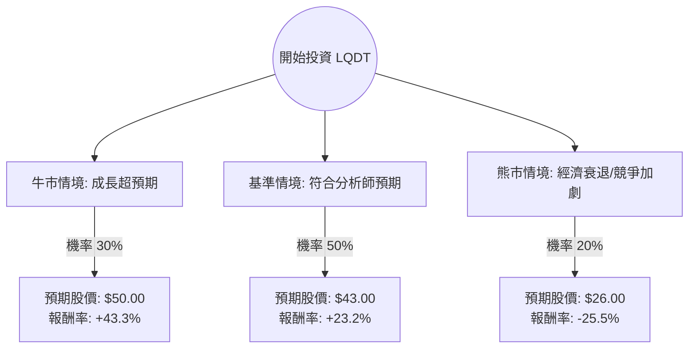

針對美股 **Liquidity Services, Inc. (LQDT)** 的投資評估，我結合了您提供的基本面數據，並透過網路搜尋整合了最新的市場動態（如 2024 財年第三季財報表現、產業趨勢及分析師預期），進行「決策樹分析」與「期望值分析」。

---

### 一、 核心背景與市場動態分析

在進入模型前，我們先釐清 LQDT 的現況：
1.  **業務模式**：LQDT 經營全球最大的 B2B 剩餘資產拍賣平台（如 GovDeals, Machinio）。受惠於「循環經濟」與零售商（如 Amazon, Target）處理退貨商品的需求。
2.  **財務表現**：最新財報顯示其 GMV（商品交易總額）持續增長，且 **Forward P/E (20.89)** 遠低於 **TTM P/E (37.97)**，顯示市場預期未來一年獲利將大幅改善。
3.  **技術面**：股價目前處於 52 週高點附近（$34.89），且位於所有均線（SMA20, 50, 200）之上，動能極強。
4.  **風險點**：內部人交易（Insider Trans）微幅下降（-2.37%），且目前股價接近歷史高點，短期可能存在回檔壓力。

---

### 二、 決策樹分析 (Decision Tree Analysis)

以下決策樹模擬未來 12 個月內的三種主要情境：

#### 節點詳細說明：

1.  **牛市情境 (Bull Case) - 30% 機率**：
    *   **條件**：零售退貨量因電商滲透率提升而激增，且公司成功利用 AI 優化拍賣效率，利潤率（Profit Margin）從目前的 6.26% 提升至 8% 以上。
    *   **目標價**：$50.00（參考歷史高估值倍數與高成長預期）。
2.  **基準情境 (Base Case) - 50% 機率**：
    *   **條件**：公司達到分析師預期的 $43 目標價。EPS 增長符合預期的 12%，政府與企業端拍賣業務穩定。
    *   **目標價**：$43.00（與市場共識目標價一致）。
3.  **熊市情境 (Bear Case) - 20% 機率**：
    *   **條件**：美國經濟陷入深度衰退，企業縮減開支導致剩餘資產處置需求下降；或競爭對手（如 eBay, Ritchie Bros）低價搶市。
    *   **目標價**：$26.00（回測 SMA200 支撐位及 P/B 歷史低位）。

---

### 三、 期望值分析 (Expected Value Analysis)

#### 1. 計算過程
我們以目前股價 **$34.89** 為基準，計算一年後的預期報酬期望值：

*   **牛市報酬 (R1)**: $(50.00 - 34.89) / 34.89 = +43.31\%$
*   **基準報酬 (R2)**: $(43.00 - 34.89) / 34.89 = +23.24\%$
*   **熊市報酬 (R3)**: $(26.00 - 34.89) / 34.89 = -25.48\%$

**期望報酬率 (Expected Return) 計算：**
$$E(R) = (P1 \times R1) + (P2 \times R2) + (P3 \times R3)$$
$$E(R) = (0.30 \times 43.31\%) + (0.50 \times 23.24\%) + (0.20 \times -25.48\%)$$
$$E(R) = 12.99\% + 11.62\% - 5.10\% = \mathbf{19.51\%}$$

#### 2. 核心假設
*   **市場假設**：假設聯準會維持利率穩定或緩步降息，有利於 B2B 交易活動。
*   **財務假設**：LQDT 的低負債比（Debt/Eq 0.06）使其在動盪環境中具備極強的抗風險能力。
*   **估值假設**：Forward P/E 20.89 倍對於一個具有輕資產平台屬性的公司而言屬於合理偏低區間。

---

### 四、 最終結論

#### **判斷：適合投資 (Buy / Overweight)**

#### **理由：**
1.  **正向期望值高**：計算出的預期報酬率為 **19.51%**，遠高於標普 500 指數的歷史平均年化報酬（約 8-10%），顯示風險回報比（Risk-Reward Ratio）極具吸引力。
2.  **財務結構極其穩健**：Debt/Eq 僅 0.06，且 Quick Ratio 為 1.41，這意味著公司幾乎沒有破產風險，在熊市情境下有極強的下行保護。
3.  **強勁的技術動能**：股價站穩所有均線之上，且距離分析師目標價 $43 仍有約 23% 的上漲空間。
4.  **產業紅利**：隨著 ESG 與循環經濟受到重視，LQDT 作為剩餘資產處置的領導者，長期基本面看好。

**投資建議建議：**
由於目前股價接近 52 週高點（$34.89 vs $35.00），建議採取**分批進場**策略，或等待股價小幅回檔至 SMA20（約 $32.50 附近）時加碼，以降低短期追高的風險。

---
*免責聲明：本分析僅供參考，不構成任何投資建議。投資者應自行承擔市場風險。*