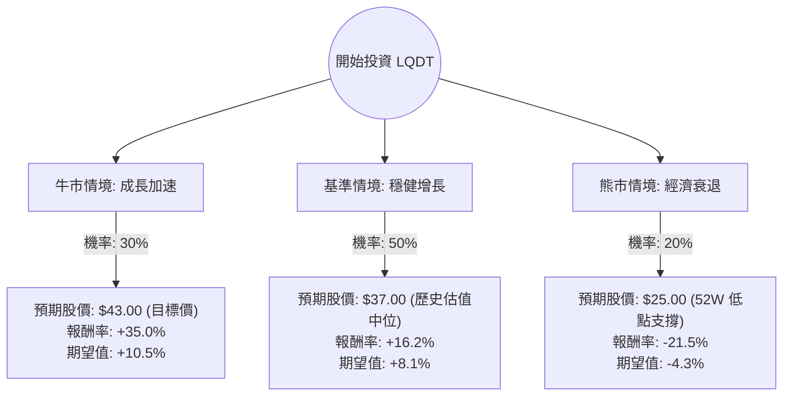

這份分析報告將結合您提供的基本面數據與最新的市場動態，利用**決策樹（Decision Tree）**與**期望值分析（Expected Value Analysis）**來評估 Liquidity Services, Inc. (LQDT) 的投資價值。

---

### 1. 最新市場動態與產業趨勢補充

根據最新資訊（截至 2024 年中）：
*   **核心業務：** LQDT 經營全球最大的 B2B 二手資產拍賣平台（如 GovDeals, AllSurplus）。其業務受益於「循環經濟」趨勢，企業與政府更傾向於透過拍賣轉售剩餘資產以實現永續目標。
*   **財務表現：** 最近一季財報顯示，其 **GMV（商品交易總額）** 持續增長，特別是在政府部門與零售退貨領域。雖然營收（Sales Q/Q）微幅下降，但淨利潤（EPS Q/Q）大幅增長 28.5%，顯示營運效率提升。
*   **市場環境：** 在高利率環境下，LQDT 的**低負債（Debt/Eq 0.06）**與高現金流（P/FCF 14.06）使其具備極強的抗風險能力。
*   **分析師預期：** 市場普遍看好其 Forward P/E（19.03）低於當前 P/E（34.59），預示未來一年盈利將顯著改善。

---

### 2. 決策樹分析 (Decision Tree)

以下為 LQDT 未來一年的投資決策樹模型：

---

### 3. 核心假設與計算過程

#### A. 核心假設
1.  **牛市情境 (30%)：** 零售退貨量因電商滲透率提升而激增，且政府部門數位轉型加速，LQDT 成功達到分析師目標價 $43。
2.  **基準情境 (50%)：** 公司維持目前的營運效率，Forward P/E 逐步兌現，股價回歸至 P/S 2.5x 左右的合理估值（約 $37）。
3.  **熊市情境 (20%)：** 全球經濟衰退導致企業資本支出萎縮，二手資產需求下降，股價回測 52 週低點附近的支撐位（約 $25）。

#### B. 期望值 (Expected Value, EV) 計算
期望值計算公式：$\sum (機率 \times 報酬率)$

1.  **牛市節點：** $0.30 \times 35.0\% = 10.5\%$
2.  **基準節點：** $0.50 \times 16.2\% = 8.1\%$
3.  **熊市節點：** $0.20 \times (-21.5\%) = -4.3\%$

**總體期望報酬率 = 10.5% + 8.1% - 4.3% = 14.3%**

---

### 4. 綜合評估與最終結論

#### 數據亮點分析：
*   **財務穩健性：** Debt/Eq 僅 0.06，幾乎沒有債務壓力，在當前高利率環境下極具優勢。
*   **盈利能力：** ROE 14.72% 表現優異，且 EPS Q/Q 增長強勁（28.5%），顯示利潤率正在擴張。
*   **估值：** Forward P/E 19.03 顯示目前的溢價（P/E 34.59）是基於對未來增長的預期，若增長兌現，目前股價並不昂貴。
*   **技術面：** 股價位於 SMA200 之上（+18.28%），長期趨勢偏多。

#### 潛在風險：
*   **成交量與流動性：** 市值約 9.8 億美元，屬於中小型股，股價波動可能較大。
*   **內部人交易：** Insider Trans 為 -1.83%，雖比例不高，但需留意內部人減持動向。

#### **最終結論：適合投資 (Buy)**

**理由：**
1.  **期望值為正：** 經過風險加權後的預期報酬率為 **14.3%**，優於多數穩健型投資標的。
2.  **風險回報比合理：** 下行風險（-21.5%）相對於上行潛力（+35%）受控，且發生極端負面情境的機率較低。
3.  **產業護城河：** LQDT 在政府與企業剩餘資產拍賣領域擁有強大的平台網路效應，且受益於循環經濟的長期政策紅利。
4.  **強勁資產負債表：** 極低的負債率為公司提供了極高的容錯率與未來併購擴張的空間。

**建議操作：**
建議在 $30 - $32 區間分批布局，首要目標價設為 $43，停損位可設在 $25（52 週低點附近）。