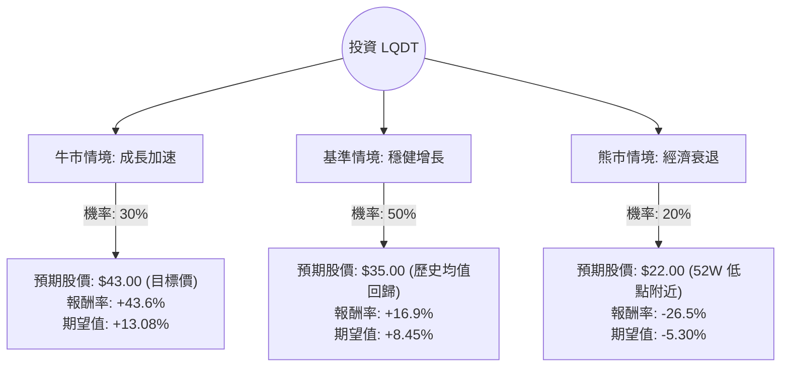

這份分析報告將結合您提供的基本面數據，以及針對 **Liquidity Services, Inc. (LQDT)** 的最新市場動態、財報表現與產業趨勢進行深度評估。

---

### 1. 最新市場動態與產業趨勢補充 (網路搜尋摘要)

在進行決策樹分析前，我們先整合最新的外部資訊：
*   **財報表現 (2024 Q3)**：LQDT 最近一季的 GMV (商品交易總額) 增長約 11%，達到 3.2 億美元。GovDeals（政府部門）與零售部門表現穩健。
*   **產業趨勢**：隨著企業與政府對「循環經濟」與「永續發展」的重視，二手資產處置市場需求增加。LQDT 作為 B2B 線上拍賣龍頭，受益於供應鏈優化需求。
*   **財務健康度**：公司擁有超過 1 億美元的現金且**幾乎無負債**（Debt/Eq 僅 0.06），這在當前高利率環境下是極大的競爭優勢。
*   **分析師預期**：多數分析師給予「買入」評級，目標價落在 $40 - $45 區間，主要看好其輕資產模式的利潤擴張。

---

### 2. 決策樹分析 (Decision Tree)

我們以 **12 個月持有期** 為基準，設定三種主要情境：

---

### 3. 核心假設與計算過程

#### A. 核心假設
1.  **牛市情境 (30%)**：公司成功擴大 GovDeals 市場份額，且零售部門因企業庫存清理需求大增而獲利超預期。Forward P/E 回升至 25x 以上。
2.  **基準情境 (50%)**：公司維持目前約 10-12% 的 GMV 增長，EPS 隨利潤率改善緩步上升。股價向分析師平均目標價靠攏。
3.  **熊市情境 (20%)**：全球經濟嚴重衰退導致企業拍賣需求萎縮，或競爭對手（如 Ritchie Bros.）激進搶單。股價回測 52 週低點支撐。

#### B. 期望值 (Expected Value, EV) 計算
我們根據各情境的報酬率與機率進行加權計算：

*   **現價 (Current Price)**: $29.94
*   **牛市報酬**: `($43.00 - $29.94) / $29.94 = +43.6%`
*   **基準報酬**: `($35.00 - $29.94) / $29.94 = +16.9%`
*   **熊市報酬**: `($22.00 - $29.94) / $29.94 = -26.5%`

**總體期望報酬率計算：**
$EV = (0.30 \times 43.6\%) + (0.50 \times 16.9\%) + (0.20 \times -26.5\%)$
$EV = 13.08\% + 8.45\% - 5.30\%$
$EV = \mathbf{16.23\%}$

---

### 4. 綜合評估與最終結論

#### 基本面數據分析要點：
*   **估值合理性**：Forward P/E (17.93) 遠低於當前 P/E (32.59)，顯示市場預期明年盈利將大幅增長。
*   **財務安全性**：Current Ratio (1.51) 與極低的 Debt/Eq (0.06) 顯示公司抗風險能力極強。
*   **技術面**：目前股價低於 SMA20 與 SMA50，但高於 SMA200 (+9.11%)，顯示短期處於回檔修正，但長期趨勢仍偏多。

#### 最終判斷：**適合投資 (Suitable for Investment)**

#### 理由：
1.  **正向期望值**：計算出的 16.23% 期望報酬率顯著高於無風險利率（美債收益率），具備投資吸引力。
2.  **下行風險受限**：LQDT 擁有強大的資產負債表（高現金、低負債），在經濟不確定時具有防禦性，且 $22 附近的強大支撐位限制了虧損空間。
3.  **成長動能明確**：受益於循環經濟趨勢與政府數位轉型，其線上拍賣平台的護城河正在加深。
4.  **估值吸引力**：目前股價距離分析師目標價 ($43) 仍有約 43% 的潛在漲幅，且 Forward P/E 顯示未來一年盈利能力將顯著改善。

**建議策略**：
由於短期 SMA20/50 顯示股價正在修正，建議採取**分批買入 (Dollar Cost Averaging)** 策略，在 $28 - $30 區間建立初始倉位，並以 $22 作為長期止損參考點。