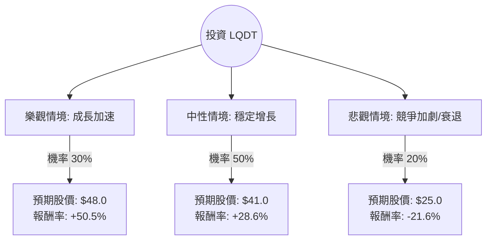

這份分析報告將結合您提供的基本面數據與最新的市場動態，利用**決策樹（Decision Tree）**與**期望值分析（Expected Value Analysis）**來評估 Liquidity Services, Inc. (LQDT) 的投資價值。

---

### 1. 市場動態與最新資訊補充 (Web Search Summary)

在進行模型分析前，我們先整合最新的市場資訊：
*   **業務模式**：LQDT 經營全球最大的政府與企業剩餘資產線上拍賣平台（如 GovDeals, AllSurplus）。其輕資產（Asset-light）模式使其在通膨環境下具有韌性。
*   **最新財報表現**：LQDT 近期財報顯示 GMV（商品交易總額）持續增長，特別是在政府部門與零售供應鏈領域。
*   **產業趨勢**：隨著企業持續優化供應鏈與政府預算緊縮，對於「資產變現」的需求增加，這對 LQDT 是利多。
*   **財務健康度**：負債比極低（Debt/Eq: 0.07），現金流充沛（P/FCF: 16.3），這讓公司在升息環境下具備極強的抗風險能力。
*   **分析師預期**：目標價設定在 $41.0，較目前市價（約 $31.89）有約 28.5% 的上漲空間。

---

### 2. 決策樹分析 (Decision Tree)

我們將未來一年的投資情境分為三種：**樂觀（Bull）**、**中性（Base）**、**悲觀（Bear）**。

#### 節點詳細說明：

1.  **樂觀情境 (Bull Case) - 30% 機率**：
    *   **假設**：公司成功擴大國際市場，且美國政府合約量超預期增長。EPS 增長率超過 20%。
    *   **預期股價**：給予 Forward P/E 30x，目標價約 **$48.0**。
    *   **預期報酬**：(48 - 31.89) / 31.89 = **50.5%**。

2.  **中性情境 (Base Case) - 50% 機率**：
    *   **假設**：符合分析師預期，GMV 穩定增長 10-15%，利潤率維持現狀。
    *   **預期股價**：參考分析師目標價 **$41.0**。
    *   **預期報酬**：(41 - 31.89) / 31.89 = **28.6%**。

3.  **悲觀情境 (Bear Case) - 20% 機率**：
    *   **假設**：宏觀經濟嚴重衰退導致企業拍賣活動停滯，或競爭對手（如 Ritchie Bros）強力入侵其核心市場。
    *   **預期股價**：回測至 52 週低點附近，約 **$25.0**。
    *   **預期報酬**：(25 - 31.89) / 31.89 = **-21.6%**。

---

### 3. 期望值計算 (Expected Value Analysis)

根據上述決策樹，我們計算投資 LQDT 的**期望報酬率 (Expected Return)**：

$$E(R) = \sum (P_i \times R_i)$$

*   **計算過程**：
    *   樂觀貢獻：$0.30 \times 50.5\% = 15.15\%$
    *   中性貢獻：$0.50 \times 28.6\% = 14.30\%$
    *   悲觀貢獻：$0.20 \times (-21.6\%) = -4.32\%$

*   **總期望報酬率**：
    $15.15\% + 14.30\% - 4.32\% = \mathbf{25.13\%}$

*   **期望價值 (以股價表示)**：
    $31.89 \times (1 + 25.13\%) = \mathbf{\$39.90}$

---

### 4. 核心假設與風險評估

1.  **財務穩健性**：LQDT 的 Debt/Eq 僅 0.07，且 Quick Ratio 為 1.29，這意味著即便在悲觀情境下，公司倒閉風險極低，下行風險有支撐。
2.  **估值合理性**：Forward P/E 為 21.82，相對於其 EPS Q/Q 20.5% 的增長，PEG 接近 1，顯示目前股價並未過度泡沫。
3.  **技術面支撐**：目前股價高於 SMA200 (16.67%)，顯示長期趨勢偏多，且距離 52 週高點仍有空間。
4.  **主要風險**：
    *   **成交量波動**：拍賣業務依賴於「剩餘資產」的產生，若經濟極度穩定，反而可能減少拍賣來源。
    *   **內部人交易**：數據顯示 Insider Trans 為 -0.94%，雖不顯著但需留意高管減持動向。

---

### 5. 最終結論

**判斷：適合投資 (Buy / Overweight)**

#### 理由：
1.  **正向期望值高**：經風險加權後的期望報酬率高達 **25.13%**，遠高於市場平均預期報酬。
2.  **防禦性強**：極低的負債比與健康的現金流（P/FCF 16.3）提供了強大的安全邊際（Margin of Safety）。
3.  **成長動能明確**：EPS Q/Q 增長 20.5% 且 Forward P/E 顯著低於現行 P/E，顯示市場預期未來獲利將改善。
4.  **分析師共識**：Recom 為 1.0（強力買進），且目標價 $41 具有高度共識。

**建議操作策略**：
目前股價 $31.89 處於 SMA20 附近，可考慮分批進場。若股價回落至 $28-$30 區間（中性偏悲觀邊界）則是更佳的加碼點。目標價設為 **$40.0 - $41.0**，停損點可設在 **$26.5**（跌破 SMA200 且接近 52 週低點）。