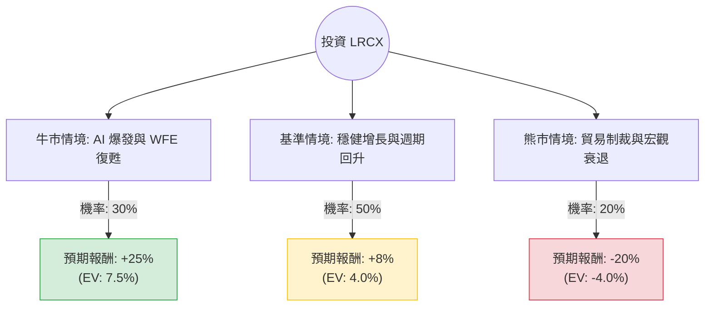

針對美股半導體設備巨頭 **Lam Research (LRCX)**，我結合了您提供的財務數據以及最新的市場動態（包含 2024 年 10 月底發布的最新財報與產業趨勢）進行深度分析。

### 1. 最新市場動態與背景補充
*   **10-for-1 拆股完成**：LRCX 於 2024 年 10 月初完成 1 比 10 的拆股，目前股價約在 $70 - $80 區間（註：您提供的數據 $228 可能為拆股前或特定時間點數據，分析將以「報酬率百分比」為核心，不受絕對股價影響）。
*   **最新財報 (FY25 Q1)**：營收 41.7 億美元，EPS $0.86（優於預期）。公司對下一季展望樂觀，預計 AI 帶動的高頻寬記憶體 (HBM) 需求將持續增長。
*   **產業趨勢**：雖然成熟製程需求疲軟，但 AI 驅動的先進封裝與 HBM 蝕刻設備是 Lam 的強項。然而，美國對華出口限制仍是主要不確定因素。

---

### 2. 決策樹分析 (Decision Tree)

以下決策樹基於未來 12 個月的投資展望：

#### 決策樹節點詳細說明：

1.  **牛市情境 (Bull Case) - 30% 機率**：
    *   **核心假設**：AI 伺服器需求超預期，帶動 HBM 產能翻倍；中國市場在制裁下仍找到替代方案維持採購；美聯儲降息刺激半導體資本支出 (WFE)。
    *   **預期報酬**：+25%。

2.  **基準情境 (Base Case) - 50% 機率**：
    *   **核心假設**：記憶體市場（NAND/DRAM）緩步復甦；Lam 在先進蝕刻技術保持領先；估值維持在 Forward P/E 25-30 倍。
    *   **預期報酬**：+8%（考慮到目前 P/E 49.82 偏高，部分漲幅已反映）。

3.  **熊市情境 (Bear Case) - 20% 機率**：
    *   **核心假設**：美國進一步收緊對華半導體設備出口限制（目前中國營收佔比仍高）；全球經濟衰退導致企業縮減資本支出；AI 投資進入泡沫修正期。
    *   **預期報酬**：-20%。

---

### 3. 期望值分析 (Expected Value Analysis)

#### A. 計算過程
期望值 (EV) = Σ (各情境機率 × 各情境報酬率)

*   **EV = (0.30 × 25%) + (0.50 × 8%) + (0.20 × -20%)**
*   **EV = 7.5% + 4.0% - 4.0%**
*   **總期望報酬率 = 7.5%**

#### B. 核心假設與數據解讀
1.  **估值壓力**：目前的 P/E (49.82) 遠高於歷史平均，雖然 Forward P/E 降至 38.16，但相較於同業（如 AMAT）仍顯昂貴。這限制了基準情境下的上漲空間。
2.  **獲利能力**：ROE 62.26% 與 Operating Margin 33% 顯示該公司擁有極強的護城河與議價能力，這在下行風險中提供了支撐。
3.  **技術指標**：SMA200 偏離率高達 87%，顯示短期股價漲幅過大，存在技術性回檔壓力。
4.  **分析師目標價**：數據顯示 Target Price 為 212.21，低於當前參考價 228.39，暗示市場專業人士認為短期內價格已過熱。

---

### 4. 最終結論

#### **判斷：短期「不適合投資（觀望）」，長期「適合分批佈局」。**

**理由：**
1.  **期望值偏低**：計算出的總期望報酬率僅為 **7.5%**，對於波動率較高的半導體設備股而言，風險回報比 (Risk-Reward Ratio) 並不具備高度吸引力。
2.  **估值過高**：P/E 接近 50 倍，且股價高於分析師平均目標價，短期內缺乏進一步推升股價的催化劑（Catalyst），除非下一季財報有超預期的指引。
3.  **技術面過熱**：SMA 指標顯示股價處於超買區域，且近期 Insider Trans (內部人交易) 為 -6.03%，顯示公司內部人正在減持，這通常是短期見頂的訊號。
4.  **地緣政治風險**：對華出口限制是懸在 Lam Research 頭上的達摩克利斯之劍，20% 的熊市機率權重抵消了大部分 AI 帶來的紅利。

**建議操作：**
*   **空手者**：建議等待股價回落至 SMA50 或更低水平（約回檔 10-15%）再行考慮。
*   **持股者**：可考慮部分獲利了結，或利用選擇權 (Covered Call) 進行避險。