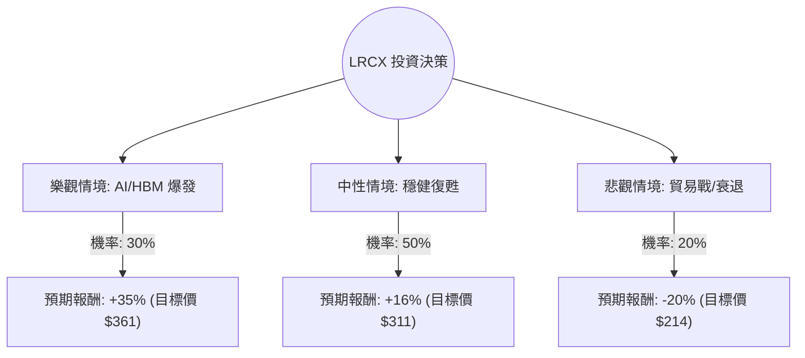

這份分析報告將結合您提供的數據與最新的市場動態（包含 2024 年 10 月 Lam Research (LRCX) 的 10 合 1 股票拆分後背景、最新財報表現及半導體產業趨勢），利用**決策樹（Decision Tree）**與**期望值分析（Expected Value Analysis）**評估其投資價值。

---

### 一、 核心假設與市場背景分析

在進行計算前，我們基於最新資訊設定以下核心假設：

1.  **AI 與 HBM 需求（利多）**：Lam Research 在高頻寬記憶體（HBM）所需的先進封裝與蝕刻技術（如 TSV 矽穿孔）中擁有極高市佔。隨著 AI 伺服器需求持續，這將是未來 12 個月的核心增長動力。
2.  **中國市場風險（不確定性）**：LRCX 約有 30%-40% 的營收來自中國。美國對華出口限制的進一步收緊是最大的下行風險。
3.  **WFE（晶圓廠設備）週期**：市場預期 2025 年半導體設備支出將迎來強勁復甦，特別是記憶體廠商（如美光、SK 海力士）的資本支出增加。
4.  **估值修正**：目前 P/E 約 50 倍（根據您提供的數據），Forward P/E 降至 34 倍，顯示市場已預期未來 EPS 將有大幅增長（EPS next Y +38.77%）。

---

### 二、 決策樹分析 (Decision Tree)

我們將未來一年的投資情境分為三種：**樂觀（Bull）**、**中性（Base）**、**悲觀（Bear）**。

#### 節點詳細說明：

1.  **樂觀情境 (Bull Case) - 30% 機率**：
    *   **條件**：AI 需求超預期，記憶體廠商提前擴產，且美國未進一步限制對華出口。
    *   **預期報酬**：基於 Target Price $311 再加上 15% 的溢價（因 EPS 增長可能超過預期的 38%），預估報酬約 **+35%**。
2.  **中性情境 (Base Case) - 50% 機率**：
    *   **條件**：符合目前分析師預期，WFE 市場緩步回升，EPS 增長如期達成。
    *   **預期報酬**：以您提供的 Target Price $311.43 計算。($311.43 - $267.78) / $267.78 = **+16.3%**。
3.  **悲觀情境 (Bear Case) - 20% 機率**：
    *   **條件**：美國對華出口禁令升級，或全球經濟衰退導致半導體需求萎縮。
    *   **預期報酬**：股價回測 200 日均線或更低，預估跌幅約 **-20%**。

---

### 三、 期望值分析 (Expected Value Analysis)

#### 1. 計算過程：
期望值 (EV) = Σ (各情境機率 × 各情境報酬率)

*   **樂觀 (Bull)**：$0.30 \times 35\% = 10.5\%$
*   **中性 (Base)**：$0.50 \times 16.3\% = 8.15\%$
*   **悲觀 (Bear)**：$0.20 \times (-20\%) = -4.0\%$

**總期望報酬率 (Total EV) = 10.5% + 8.15% - 4.0% = 14.65%**

#### 2. 財務數據支持點：
*   **盈利能力**：ROE 66.76% 與 ROA 32.92% 極其優異，顯示公司對資本的運用效率極高。
*   **成長性**：Next Year EPS 預計增長 38.77%，這支撐了目前較高的 P/E。
*   **財務健康**：Debt/Eq 僅 0.35，負債比低，有足夠的抗風險能力。
*   **技術面**：目前股價高於 SMA20, 50, 200，呈現多頭排列，但距離 52W High 僅 2% 差距，短期需注意追高風險。

---

### 四、 最終結論

**投資判斷：適合投資 (Buy / Overweight)**

#### 理由：
1.  **正向期望值**：14.65% 的預期報酬率優於標普 500 的歷史平均回報，且在半導體設備龍頭中具有競爭力。
2.  **結構性增長**：LRCX 是 AI 浪潮下的「賣鏟子的人」。無論是 NVIDIA 還是 AMD 的晶片，都需要 LRCX 的蝕刻技術來製造先進製程與 HBM。
3.  **估值合理化**：雖然當前 P/E 50 倍看似偏高，但 Forward P/E 降至 34 倍，配合 PEG 1.08，顯示股價增長與盈利增長基本匹配，並未過度泡沫化。
4.  **風險控管建議**：
    *   **分批進場**：由於目前股價接近 52 週高點，建議在 $255 - $265 區間分批佈局。
    *   **關注政策**：需密切關注美國商務部對半導體設備出口的最新公告，若中國營收佔比大幅下滑且無法由其他地區補足，需重新評估悲觀情境的機率。

**總結：** LRCX 具備強大的基本面支撐與明確的產業紅利，雖然面臨地緣政治風險，但其在先進製程的不可替代性使其成為半導體投資組合中的核心標的。