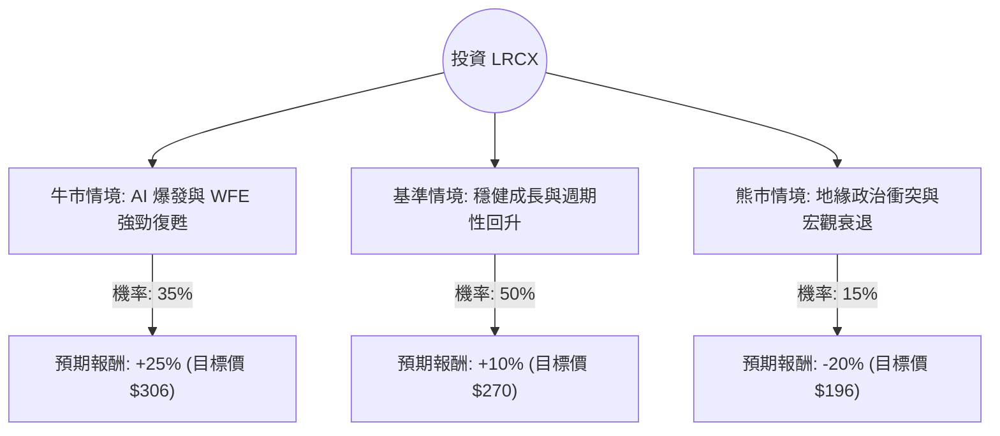

這份分析報告將結合您提供的財務數據與最新的市場動態（包含 2024 年 10 月底發布的最新財報資訊），利用**決策樹（Decision Tree）**與**期望值分析（Expected Value Analysis）**來評估 Lam Research (LRCX) 的投資價值。

---

### 一、 核心假設與市場背景分析

在建立決策樹之前，我們基於數據與最新資訊設定以下核心假設：

1.  **AI 與 HBM 需求（利多）**：Lam Research 在高頻寬記憶體（HBM）所需的先進封裝（如 TSV 矽穿孔技術）中擁有極高市佔。隨著 AI 伺服器需求持續，這將是未來一年的主要成長引擎。
2.  **晶圓廠設備（WFE）市場復甦（利多）**：半導體設備產業正處於週期性底部回升階段，預計 2025 年 WFE 支出將有雙位數成長。
3.  **中國市場風險（利空/不確定性）**：LRCX 約有 30%-40% 的營收來自中國。美國出口管制政策的收緊是最大的下行風險。
4.  **估值水平**：目前 P/E 約 50 倍，Forward P/E 約 35 倍。雖然處於歷史高位，但反映了市場對 2025 年 EPS 成長 31.7% 的預期。

---

### 二、 決策樹分析 (Decision Tree)

以下決策樹模擬未來 12 個月內 LRCX 可能面臨的三種主要情境：

#### 節點詳細說明：

1.  **牛市情境 (Bull Case) - 35% 機率**：
    *   **條件**：AI 需求超出預期，NAND 快閃記憶體市場大幅復甦，且美國對華制裁未進一步惡化。
    *   **預期報酬**：+25%。基於 EPS 成長超標及估值維持高位。
2.  **基準情境 (Base Case) - 50% 機率**：
    *   **條件**：符合目前分析師預期（EPS 成長約 30%），WFE 市場溫和復甦。
    *   **預期報酬**：+10%。接近分析師平均目標價 $278。
3.  **熊市情境 (Bear Case) - 15% 機率**：
    *   **條件**：美國發布更嚴厲的對華半導體設備禁令，或全球經濟陷入衰退導致資本支出縮減。
    *   **預期報酬**：-20%。估值修正至歷史平均水平（P/E ~20-25x）。

---

### 三、 期望值計算過程 (Expected Value Calculation)

我們將各情境的機率與預期報酬相乘，得出整體期望報酬率。

**計算公式：**
$$EV = (P_{Bull} \times R_{Bull}) + (P_{Base} \times R_{Base}) + (P_{Bear} \times R_{Bear})$$

**代入數值：**
*   $P_{Bull} = 0.35, R_{Bull} = 25\%$
*   $P_{Base} = 0.50, R_{Base} = 10\%$
*   $P_{Bear} = 0.15, R_{Bear} = -20\%$

**計算過程：**
1.  牛市貢獻：$0.35 \times 25\% = 8.75\%$
2.  基準貢獻：$0.50 \times 10\% = 5.00\%$
3.  熊市貢獻：$0.15 \times (-20\%) = -3.00\%$

**最終期望報酬率 (Total EV)：**
$$8.75\% + 5.00\% - 3.00\% = 10.75\%$$

---

### 四、 綜合評估與最終結論

#### 1. 數據面分析總結：
*   **盈利能力極強**：ROE 65.56% 與 ROA 30.14% 顯示該公司在同業中具有極高的資產利用效率與競爭護城河。
*   **成長動能明確**：EPS 下一年度預計成長 31.72%，這能有效消化目前較高的 P/E。
*   **財務穩健**：Current Ratio 2.26 且 Debt/Eq 僅 0.44，具備抵禦市場波動的財務韌性。

#### 2. 投資判斷：
**結論：適合投資 (建議：分批買入 / 逢低佈局)**

#### 3. 判斷理由：
1.  **正向期望值**：計算出的 10.75% 期望報酬率優於多數保守型投資工具，且在半導體上游設備商中表現穩健。
2.  **AI 基礎設施的剛需**：LRCX 是 HBM 生產中不可或缺的角色。只要 AI 趨勢不變，LRCX 的長期基本面就極為穩固。
3.  **技術面支撐**：目前股價位於 SMA200 之上（+77%），顯示長期趨勢強勁。雖然短期 P/E 偏高，但 Forward P/E (34.96) 顯示隨著獲利入帳，估值將趨於合理。
4.  **風險提示**：投資者需密切關注 **11 月美國大選後對華貿易政策** 的變化。若中國營收佔比被迫大幅下降，短期內股價可能回測 $200 附近的支撐位。

**建議操作策略：**
由於目前股價接近 52 週高點且 P/E 較高，建議不要一次性全倉投入，可採取**分批進場（Dollar-Cost Averaging）**策略，在股價回調至 SMA50 附近時增加部位。