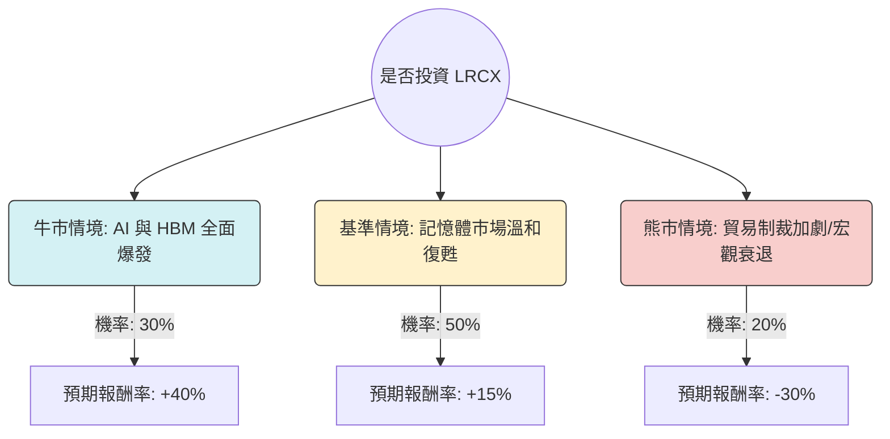

針對美股半導體設備巨頭 **Lam Research (LRCX)**，我們將結合當前的產業循環（記憶體復甦、AI 浪潮、中國市場禁令風險）進行「決策樹」與「期望值」分析。

---

### 一、 核心假設 (Core Assumptions)

在建立模型前，我們設定以下基於 2024-2025 年市場趨勢的假設：

1.  **市場趨勢**：AI 伺服器需求帶動高頻寬記憶體 (HBM) 需求噴發，LRCX 在蝕刻 (Etch) 與薄膜沉積 (Deposition) 領域具壟斷地位，直接受益。
2.  **財務狀況**：LRCX 擁有強大的自由現金流與庫藏股回購計畫，近期完成 10 拆 1 拆股，增加流動性。
3.  **產業循環**：WFE（晶圓製造設備）支出預計在 2025 年迎來強勁復甦。
4.  **地緣政治風險**：美國對華出口管制仍是最大變數，目前中國營收佔比約 30%-40%，具備高度不確定性。

---

### 二、 決策樹分析圖 (Decision Tree)

使用 Markdown 結構呈現投資 LRCX 的三種可能情境預測（預測期間：未來 12 個月）：

#### 決策樹節點詳細標示：

| 節點名稱 (情境) | 機率 (P) | 預期報酬 (R) | 說明 |
| :--- | :--- | :--- | :--- |
| **牛市 (Bull Case)** | 30% | +40% | HBM3e 需求超預期，加上 NAND 減產結束轉向擴產，營收創新高。 |
| **基準 (Base Case)** | 50% | +15% | WFE 支出按預期復甦，AI 增長抵銷中國通用設備需求下滑。 |
| **熊市 (Bear Case)** | 20% | -30% | 美國擴大對華半導體設備限制，且高利率環境導致企業資本支出萎縮。 |

---

### 三、 期望值分析與計算過程 (Expected Value Analysis)

期望值 (EV) 的計算公式為：
$$EV = \sum (P_i \times R_i)$$

#### 1. 各情境加權計算：
*   **牛市加權價值**：$30\% \times 40\% = 0.12$ (即 12%)
*   **基準加權價值**：$50\% \times 15\% = 0.075$ (即 7.5%)
*   **熊市加權價值**：$20\% \times (-30\%) = -0.06$ (即 -6%)

#### 2. 整體期望報酬率計算：
$$EV = 12\% + 7.5\% - 6\% = \mathbf{13.5\%}$$

#### 3. 計算解讀：
根據目前市場評價與產業成長性，投資 LRCX 的年度加權期望報酬率約為 **13.5%**。這高於美股標普 500 的長期平均年報酬率 (約 8-10%)。

---

### 四、 最終結論

#### **判斷：適合投資 (Buy / Overweight)**

#### **簡短理由：**
1.  **正向期望值**：13.5% 的期望報酬率顯示在考慮了「中國制裁」等極端負面因素後，該公司仍具備優於大盤的獲利潛力。
2.  **AI 技術護城河**：LRCX 在先進封裝與極細微間距蝕刻技術上的領先，使其成為 AI 基礎設施（特別是 HBM 記憶體）不可或缺的供應商。
3.  **週期性底部已過**：記憶體產業經歷 2023 年的低谷後，目前正處於上升週期的早期到中期，設備股通常會領先營收反應。
4.  **風險控管建議**：雖然期望值為正，但「熊市情境」有 -30% 的下行風險。建議採**分批買進**策略，並密切觀察美國商務部對半導體設備出口政策的最新公告。

---
**免責聲明：** *本分析僅供參考，不構成任何投資建議。投資人應自行評估風險並對投資行為負責。*