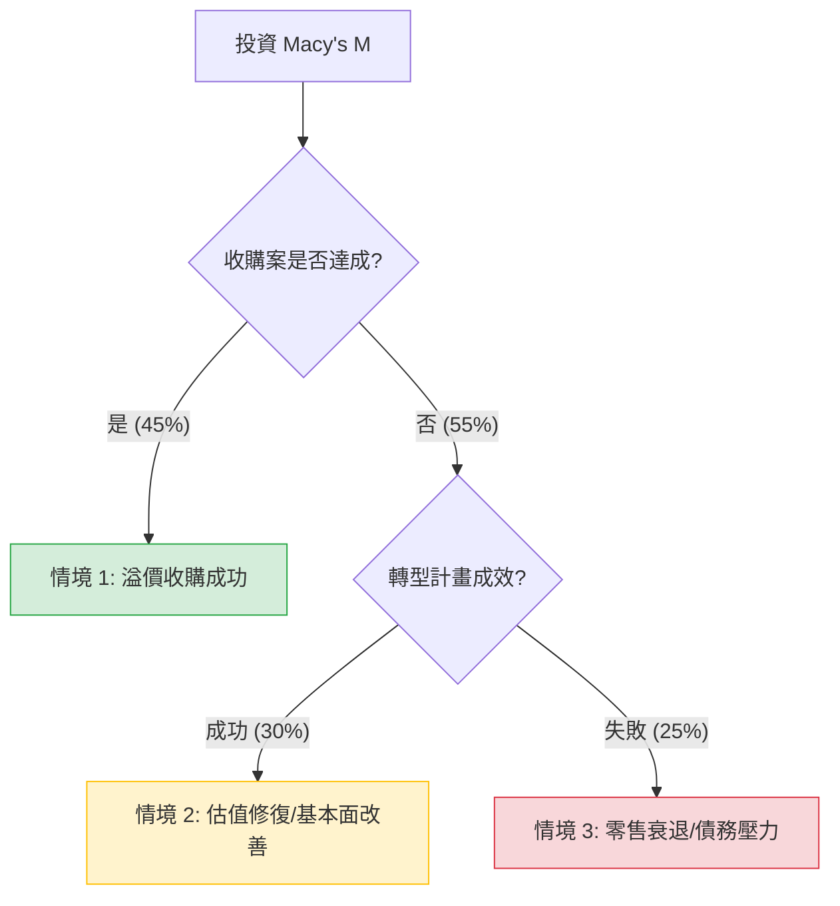

針對美股公司 **Macy's, Inc. (M)** 的投資評估，我結合了您提供的基本面數據以及最新的市場動態（包含收購進度、轉型計畫及零售環境）進行分析。

---

### 一、 市場現況與最新動態補充

1.  **收購案進展（核心催化劑）：**
    *   Arkhouse Management 與 Brigade Capital 已將收購報價提高至每股 **$24.00**。
    *   Macy's 董事會目前已開啟盡職調查（Due Diligence），並與收購方進行實質談判。這為股價提供了強大的下行支撐。
2.  **「嶄新篇章」轉型計畫（A Bold New Chapter）：**
    *   公司計畫在 2026 年前關閉約 150 家業績不佳的門市。
    *   資源將集中於獲利能力較高的 Bloomingdale's 和 Bluemercury 品牌。
3.  **財務壓力：**
    *   負債權益比（Debt/Eq）為 1.21，處於中高水準。
    *   EPS Q/Q 下跌 59.7%，顯示短期獲利能力受壓。
    *   P/S 僅 0.25，顯示市場對其營收估值極低，具備價值修復潛力。

---

### 二、 決策樹分析（Decision Tree Analysis）

以下是基於未來 6-12 個月可能發生的情境所構建的決策樹：

#### 節點詳細數據：

| 預測情境 | 發生機率 (P) | 預期目標價 | 預期報酬率 (R) | 期望值 (P * R) |
| :--- | :--- | :--- | :--- | :--- |
| **1. 收購成功** | 45% | $24.00 | +13.15% | +5.92% |
| **2. 轉型成功 (獨立營運)** | 30% | $22.50 | +6.08% | +1.82% |
| **3. 轉型失敗/收購破局** | 25% | $16.00 | -24.56% | -6.14% |
| **總計 (Total)** | **100%** | - | - | **+1.60%** |

---

### 三、 核心假設與計算過程

#### 1. 核心假設：
*   **收購情境 (45%)**：鑑於收購方已提高報價且公司開始配合調查，成功機率較高。目標價設定在報價 $24。
*   **轉型成功情境 (30%)**：若收購失敗，但 Macy's 成功縮減規模並提升利潤率，股價有望回升至分析師平均目標價 $21.6 ~ $23 區間。
*   **悲觀情境 (25%)**：若收購破局且高利率環境壓抑消費，股價可能回測 52 週低點附近的支撐位（約 $16）。
*   **當前股價基準**：$21.21。

#### 2. 期望值 (Expected Value) 計算：
$$EV = (0.45 \times 13.15\%) + (0.30 \times 6.08\%) + (0.25 \times -24.56\%)$$
$$EV = 5.92\% + 1.82\% - 6.14\% = \mathbf{1.60\%}$$

*註：此期望值尚未包含 3.43% 的股息收益。若計入股息，總預期回報約為 **5.03%**。*

---

### 四、 最終結論

#### **判斷：謹慎適合投資 (Cautious Buy / Hold)**

#### **理由：**
1.  **下行風險有底**：目前的收購報價（$24）遠高於現價（$21.21），這在短期內為股價提供了「安全墊」。即使收購未成，Macy's 的房產價值（Real Estate Value）也常被認為超過其市值。
2.  **估值極低**：P/S 0.25 和 Forward P/E 9.59 顯示該股已被嚴重低估，市場已反映了大部分零售業的利空。
3.  **股息吸引力**：3.43% 的股息率在等待收購或轉型期間提供了穩定的現金流補償。
4.  **技術面警訊**：短期 SMA20 與 SMA50 呈現負值，顯示近期動能偏弱，建議**分批進場**而非一次性重倉。

**風險提示：**
*   若收購案最終因融資問題或董事會強硬拒絕而徹底破局，股價短期內可能出現 20% 以上的劇烈回檔。
*   高債務比（Debt/Eq 1.21）在長期高利率環境下會侵蝕利潤。

**建議操作：**
適合尋求「價值修復」或「併購套利」的投資者。建議將倉位控制在合理範圍，並密切關注有關 Arkhouse 收購進度的官方公告。