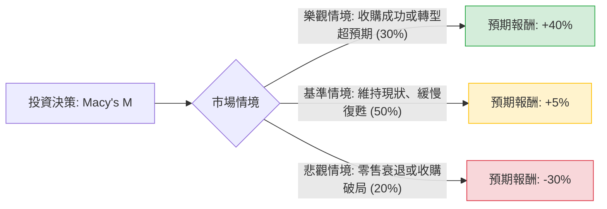

針對美股代號 **M**（梅西百貨，Macy's Inc.）目前的投資價值，以下結合**決策樹（Decision Tree）**與**期望值分析（Expected Value Analysis）**進行深入評估。

---

### 一、 核心假設與背景分析

在進行計算前，我們設定以下基於 2024 年市場環境的核心假設：

1.  **市場與產業趨勢**：
    *   **轉型計劃（A Bold New Chapter）**：梅西百貨正在關閉 150 家低效率門店，並專注於升級其餘門店及擴張高利潤的奢華品牌（Bloomingdale's, Bluemercury）。
    *   **收購傳聞**：市場持續有私募股權（如 Arkhouse 與 Brigade）的收購要約，潛在收購價約在 $24 - $25 區間。
    *   **宏觀經濟**：高利率環境壓抑非必要消費，美國經濟若軟著陸則有利零售。
2.  **財務假設**：
    *   當前股價約為 **$18.50**（以此為基準）。
    *   分紅穩定，年化殖利率約 3.5% - 4%。
3.  **時間維度**：未來 12 個月。

---

### 二、 決策樹模型 (Decision Tree)

使用 Markdown 結構化展示決策流程：

#### 節點詳細資訊表：

| 節點名稱 | 情境描述 | 機率 (P) | 預期報酬 (R) | 權重報酬 (P * R) |
| :--- | :--- | :--- | :--- | :--- |
| **樂觀情境** | 成功被以 $25 左右價格收購，或 150 門店關閉後利潤率大幅提升。 | 30% | +40% | +12.0% |
| **基準情境** | 收購未成但公司運營穩健，靠股息與小幅回購維持價值。 | 50% | +5% | +2.5% |
| **悲觀情境** | 消費者支出大幅萎縮，地產估值下降，收購團徹底離場。 | 20% | -30% | -6.0% |
| **合計** | **整體期望值 (EV)** | **100%** | **--** | **+8.5%** |

---

### 三、 計算過程與分析

#### 1. 期望值 (Expected Value, EV) 計算
期望值是將各情境的機率與其報酬相乘後加總：

$$EV = (P_{Bull} \times R_{Bull}) + (P_{Base} \times R_{Base}) + (P_{Bear} \times R_{Bear})$$
$$EV = (0.30 \times 0.40) + (0.50 \times 0.05) + (0.20 \times -0.30)$$
$$EV = 0.12 + 0.025 - 0.06 = 0.085$$
**最終期望報酬率 = 8.5%**

#### 2. 計算結果解讀
*   **正向預期**：在考慮了最壞情況（股價跌破 $13）的情境下，整體期望值仍為 **+8.5%**。這代表從概率論角度看，該投資具備正期望值。
*   **風險補償**：8.5% 的報酬率高於目前美債無風險利率（約 4.2% - 4.5%），顯示投資該股票能獲得一定的風險溢酬。

---

### 四、 最終結論

**評估判斷：適合投資（偏向價值投資/博弈收購機會）**

#### 判斷理由：
1.  **下行保護（Downside Protection）**：梅西百貨擁有龐大的房地產價值（紐約先驅廣場旗艦店等），即便零售業務受挫，其地產估值也為股價提供了地板支撐，降低了完全歸零的風險。
2.  **正期望值（Positive EV）**：8.5% 的期望報酬率在傳統零售業中屬優異，且主要動能來自「潛在收購」的期權價值。
3.  **轉型紅利**：公司目前的「大膽新篇章」計劃（A Bold New Chapter）正在精簡組織，這將顯著改善現金流。
4.  **投資建議**：
    *   **對象**：適合尋求低市盈率（Low P/E）與高股息，且願意承擔收購不確定性波動的投資者。
    *   **策略**：建議分批入場，並將倉位控制在 5% 以內，因為零售業受總體經濟衰退的影響較為直接。

**總結：基於決策樹分析，M 展現了不對稱的風險回報比（Upside 潛力大於 Downside 關鍵風險），目前處於具備吸引力的投資區間。**