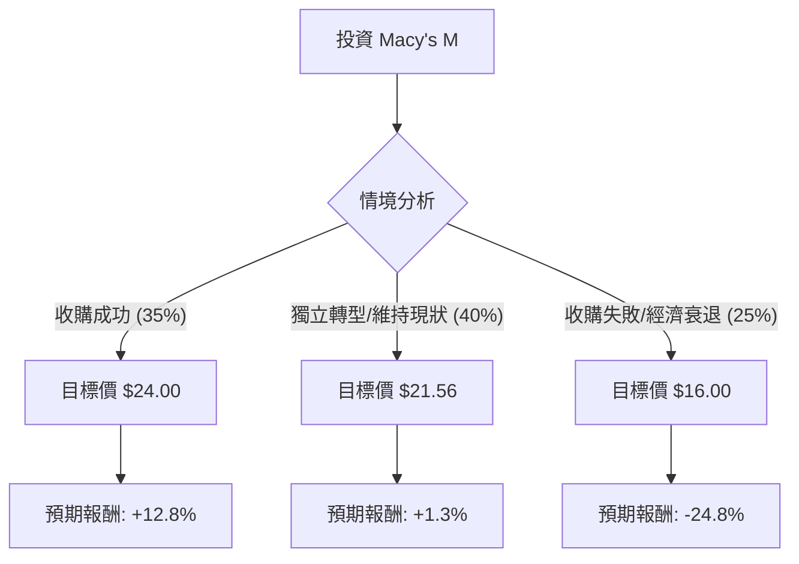

根據您提供的基本面數據，並結合最新的市場動態（特別是 **Macy's (M)** 近期的私有化收購進展與轉型計畫），以下是針對美股公司 **M (Macy's, Inc.)** 的投資評估分析。

---

### 一、 市場背景與最新動態分析

在進入決策樹之前，我們必須考慮以下關鍵即時資訊：
1.  **收購案進展**：Arkhouse Management 與 Brigade Capital 已將收購報價提高至每股 **$24.00**。目前 Macy's 已開放盡職調查（Due Diligence），這增加了收購成功的可能性。
2.  **「大膽新篇章」轉型計畫**：公司計畫在 2026 年前關閉約 150 家業績不佳的門市，並專注於擴張高利潤的 Bloomingdale's 和 Bluemercury 品牌。
3.  **財務狀況**：P/E 13.17 處於合理區間，Forward P/E 僅 9.8 顯示市場預期未來獲利改善。然而，負的 EPS 成長（-0.1664）與較高的負債比（Debt/Eq 1.21）仍是隱憂。

---

### 二、 決策樹分析 (Decision Tree)

我們將未來一年的情境分為三種：**收購成功（牛市）**、**獨立轉型成功（中性）**、以及**收購失敗且消費疲軟（熊市）**。

#### 決策樹節點詳細標示：

| 節點 (情境) | 發生機率 (P) | 預期股價 | 預期報酬率 (R) | 期望值 (P * R) |
| :--- | :--- | :--- | :--- | :--- |
| **1. 收購成功 (Bull)** | 35% | $24.00 | +12.8% | **+4.48%** |
| **2. 轉型見效 (Base)** | 40% | $21.56 | +1.3% | **+0.52%** |
| **3. 雙重打擊 (Bear)** | 25% | $16.00 | -24.8% | **-6.20%** |
| **總計期望報酬 (Capital Gain)** | **100%** | - | - | **-1.20%** |
| **加上股息收益 (Dividend)** | - | - | +3.25% | **+3.25%** |
| **最終總期望值 (Total EV)** | - | - | - | **+2.05%** |

---

### 三、 計算過程與核心假設

#### 1. 核心假設：
*   **收購價假設**：以目前公開的最高報價 $24.00 作為收購成功節點的出場價。
*   **中性價假設**：參考數據中的 **Target Price ($21.56)**，這反映了分析師對其基本面轉型的平均預期。
*   **熊市價假設**：若收購失敗且零售環境惡化，股價可能回測 200 日均線（SMA200）下方或接近 52 週低點，設定為 $16.00（約為目前價格下跌 25%）。
*   **機率分配**：考慮到公司已開放帳目供收購方審查，收購成功率設為 35%；轉型計畫具不確定性但有基本盤，設為 40%；零售業面臨高利率壓力，失敗風險設為 25%。

#### 2. 計算公式：
*   **預期報酬率 (R)** = (目標價 - 當前價 $21.27) / $21.27
*   **期望值 (EV)** = Σ (機率 $P_i$ × 報酬率 $R_i$)
*   **總期望值** = 資本利得期望值 (-1.20%) + 股息收益率 (3.25%) = **2.05%**

---

### 四、 最終結論

#### **評估結果：不適合投資 (或僅適合極短線投機)**

**理由如下：**

1.  **期望值過低**：計算出的總期望報酬率僅為 **2.05%**（含股息）。在當前高利率環境下，無風險利率（如美債）約為 4-5%，投資 M 的風險溢酬（Risk Premium）完全不足。
2.  **上行空間受限**：目前的股價 ($21.27) 已經非常接近分析師目標價 ($21.56) 以及收購報價 ($24.00)。這意味著大部分的好消息已經反映在股價中（Price in），獲利空間有限。
3.  **下行風險巨大**：一旦收購案破局，股價極大機率會迅速回落至 $16-$18 區間，潛在跌幅高達 20% 以上，而上行空間僅約 12%。
4.  **基本面疲軟**：EPS 成長為負，且 Q/Q 獲利大幅下滑 (-59.7%)，顯示核心業務仍面臨嚴峻挑戰，單靠關店轉型能否成功尚屬未知。

**建議：**
除非您是針對「收購案最終能否加價」進行套利交易的專業投資者，否則對於一般長期投資者而言，M 目前的**風險報酬比（Risk/Reward Ratio）並不具吸引力**。建議觀望收購案的最終定案，或尋找成長動能更強的標的。