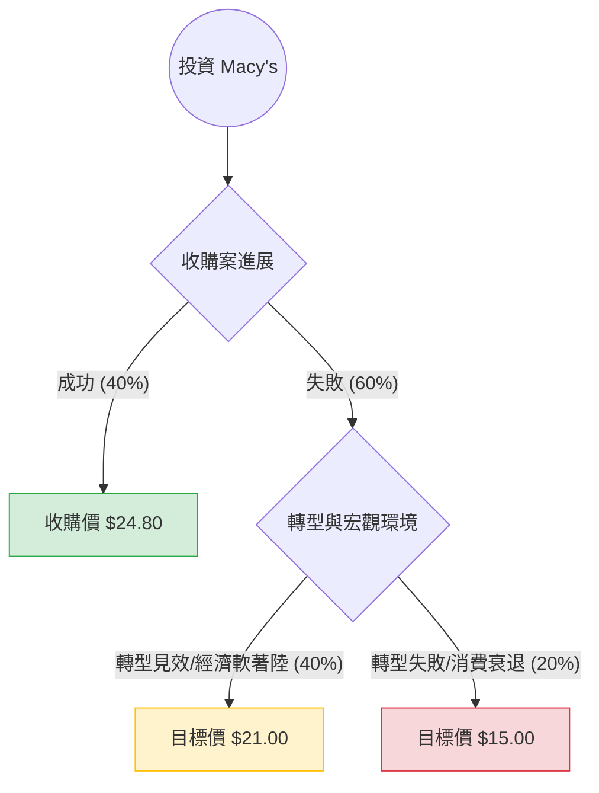

針對美股公司 **Macy's, Inc. (M)** 的投資評估，我結合了您提供的基本面數據以及最新的市場動態（包含收購進度、轉型計畫及零售產業趨勢）進行分析。

---

### 1. 最新市場動態與背景分析 (Context)

在進行決策樹分析前，必須納入以下關鍵即時資訊：
*   **私有化收購進度**：Arkhouse Management 與 Brigade Capital 目前提出的收購報價為每股 **$24.80**。Macy's 董事會已開放盡職調查（Due Diligence），這是目前股價最大的支撐與潛在催化劑。
*   **「新篇章」轉型計畫 (A Bold New Chapter)**：公司計畫在 2026 年前關閉約 150 家業績不佳的門市，並專注於高利潤的奢侈品業務（Bloomingdale's 和 Bluemercury）。
*   **財務表現**：最新財報顯示 EPS 優於預期，但營收受通膨影響略有下滑。P/E 僅 8.61，顯示市場對其長期成長性持懷疑態度，但資產價值（尤其是房地產）被低估。

---

### 2. 決策樹分析 (Decision Tree)

以下是基於未來 6-12 個月可能情境的決策樹：

#### 節點詳細說明：

| 情境節點 | 發生機率 | 預期股價 | 預期報酬率 (相較 $20.10) | 期望值貢獻 |
| :--- | :--- | :--- | :--- | :--- |
| **1. 收購成功 (Bull Case)** | 40% | $24.80 | +23.38% | +9.35% |
| **2. 收購失敗但轉型穩健 (Base Case)** | 40% | $21.00 | +4.48% | +1.79% |
| **3. 收購失敗且經濟衰退 (Bear Case)** | 20% | $15.00 | -25.37% | -5.07% |
| **總計 (Total)** | **100%** | **-** | **加權期望報酬率** | **+6.07%** |

---

### 3. 核心假設與計算過程

#### A. 核心假設：
1.  **收購機率 (40%)**：雖然買家積極，但融資環境與董事會最終定價仍有變數。
2.  **估值基礎**：
    *   **牛市**：以收購報價 $24.80 為準。
    *   **基準**：參考 P/E 回升至 9-10 倍，加上 3.67% 的股息支撐，股價維持在 $21 附近。
    *   **熊市**：若收購破局且零售數據惡化，股價可能回測 52 週低點區域（約 $15）。
3.  **財務健康度**：Current Ratio 1.49 顯示短期無流動性危機，但 Debt/Eq 1.07 顯示債務壓力尚存，限制了股價大幅噴發的空間。

#### B. 期望值 (Expected Value, EV) 計算：
$$EV = (P_1 \times R_1) + (P_2 \times R_2) + (P_3 \times R_3)$$
*   $P$ = 機率, $R$ = 報酬率
*   $EV = (0.4 \times 23.38\%) + (0.4 \times 4.48\%) + (0.2 \times -25.37\%)$
*   $EV = 9.35\% + 1.79\% - 5.07\% = \mathbf{6.07\%}$

---

### 4. 綜合評估與最終結論

#### 數據亮點分析：
*   **低估值**：P/S 僅 0.23，P/FCF 5.02，顯示公司產生現金流的能力極強，且股價相對於營收極其便宜。
*   **資產保護**：P/B 1.09 顯示股價幾乎等同於帳面價值，考慮到 Macy's 擁有的核心地段房地產（如紐約先驅廣場旗艦店），下行風險有實體資產支撐。
*   **技術面**：目前股價高於 SMA20, 50, 200，呈現多頭排列，短期動能（Perf Month 8.65%）強勁。

#### 最終判斷：**適合投資 (建議：分批買入 / 投機性持有)**

**理由：**
1.  **正向期望值**：計算出的期望報酬率為 **+6.07%**，且這尚未計入每年約 **3.67%** 的股息收益。
2.  **收購套利機會**：目前股價 ($20.10) 距離收購價 ($24.80) 仍有約 23% 的空間，提供了良好的風險回報比（Risk/Reward Ratio）。
3.  **下行風險受控**：即便收購失敗，Macy's 的低市盈率與高股息率也能吸引價值投資者進場墊高底部。
4.  **空頭擠壓潛力**：Short Float 高達 10.86%，一旦收購案有明確進展，極易引發軋空行情。

**風險提示：**
*   若收購案完全破局且無其他買家介入，股價短期內可能迅速回落至 $17-$18 區間。
*   高通膨若持續壓抑中產階級消費，將直接打擊其轉型計畫的成效。

**建議操作：**
適合尋求「價值修復」或「收購套利」的投資者。建議將停損設在 $17.50（跌破近期支撐線），目標價首看 $24.00。