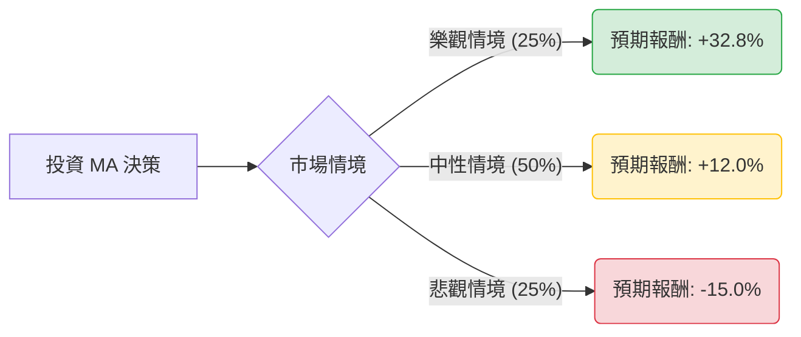

這份分析報告將結合您提供的基本面數據與最新的市場動態（如 2024 年 Q1 財報、Visa/Mastercard 刷卡費和解案、宏觀經濟趨勢），利用**決策樹（Decision Tree）**與**期望值分析（Expected Value Analysis）**評估 Mastercard (MA) 的投資價值。

---

### 一、 核心假設與市場背景分析

在建立決策樹之前，我們基於數據與最新資訊設定以下核心假設：

1.  **宏觀經濟環境**：美國經濟呈現「軟著陸」跡象，但高利率環境持續，消費者支出雖有韌性但增速放緩。
2.  **產業趨勢**：跨境旅遊（Cross-border travel）持續復甦，這是 MA 的高毛利增長引擎。
3.  **監管風險**：近期 Visa 與 Mastercard 達成約 300 億美元的刷卡費（Swipe Fees）和解協議，雖然限制了未來幾年的費率調升，但也消除了長期法律不確定性。
4.  **財務表現**：MA 的營業利益率（60.13%）與 ROE（210%）極高，顯示其強大的護城河與定價權。目前股價處於 52 週低點附近（$502.76），技術面呈現超賣（SMA200 以下）。

---

### 二、 決策樹分析 (Decision Tree)

我們將未來一年的投資情境分為三種：**樂觀（Bull）**、**中性（Base）**、**悲觀（Bear）**。

#### 節點詳細說明：

1.  **樂觀情境 (Bull Case) - 機率 25%**
    *   **描述**：全球旅遊完全爆發，跨境交易額超預期增長；聯準會開始降息刺激消費；增值服務（網路安全、數據分析）營收佔比大幅提升。
    *   **預期報酬**：達到分析師目標價 **$667.62**。
    *   **計算**：($667.62 - $502.76) / $502.76 = **+32.8%**

2.  **中性情境 (Base Case) - 機率 50%**
    *   **描述**：全球經濟溫和增長，刷卡費和解案對利潤影響輕微；EPS 增長符合預期（約 15%）；股價回歸均值（SMA200 附近）。
    *   **預期報酬**：考慮 Forward P/E 22x 與 EPS 增長，預估股價回升至 **$563**。
    *   **計算**：($563.00 - $502.76) / $502.76 = **+12.0%**

3.  **悲觀情境 (Bear Case) - 機率 25%**
    *   **描述**：美國陷入經濟衰退，失業率上升導致消費支出萎縮；監管機構進一步干預支付手續費；技術面跌破 52 週低點。
    *   **預期報酬**：股價回測支撐位約 **$427**（較現價下跌約 15%）。
    *   **計算**：**-15.0%**

---

### 三、 期望值計算 (Expected Value Calculation)

期望值 (EV) = Σ (各情境機率 × 各情境報酬率)

*   **樂觀情境貢獻**：0.25 × 32.8% = **8.2%**
*   **中性情境貢獻**：0.50 × 12.0% = **6.0%**
*   **悲觀情境貢獻**：0.25 × (-15.0%) = **-3.75%**

**總體期望報酬率 (Total EV) = 8.2% + 6.0% - 3.75% = 10.45%**

---

### 四、 綜合評估與數據解讀

1.  **估值面**：
    *   **Forward P/E (22.09)** 顯著低於 **Trailing P/E (30.29)**，顯示市場預期明年盈利將有大幅增長。
    *   **PEG (1.41)** 對於一家擁有壟斷地位且高利潤的公司來說，處於合理甚至偏低區間。
2.  **技術面**：
    *   目前股價低於 SMA20, 50, 200，且 Perf Year 為 -6.59%，顯示近期市場情緒極度悲觀。這通常是價值投資者的進場機會（逆向投資）。
3.  **財務面**：
    *   **Gross Margin (96.52%)** 與 **Oper. Margin (60.13%)** 極其強悍，代表公司對成本控制有絕對優勢。
    *   **ROE (210%)** 雖然受高槓桿（Debt/Eq 2.54）影響，但其 ROI (56.14%) 證明資金運用效率極高。

---

### 五、 最終結論

**判斷：適合投資 (Buy / Accumulate)**

#### 理由：
1.  **正向期望值**：經過風險加權後的預期報酬率為 **10.45%**，優於多數保守型投資工具。
2.  **安全邊際**：股價目前處於 52 週低點附近，且遠低於分析師平均目標價（$667.62），提供了較大的上行空間。
3.  **基本面穩健**：儘管面臨監管壓力，Mastercard 的雙寡頭壟斷地位並未動搖。跨境交易的復甦與數位支付的長期趨勢將持續支撐其 EPS 增長（預計明年增長 15.68%）。
4.  **技術性超賣**：目前的負面表現（Perf YTD -12.35%）更多反映了市場對宏觀經濟的擔憂，而非公司基本面惡化，是分批佈局的良機。

**建議策略**：
考慮到目前技術面仍疲軟，建議採取**分批進場（Dollar Cost Averaging）**策略，首批資金於 $500 附近建立基本倉位，若股價進一步回測 $480 支撐區可加碼。