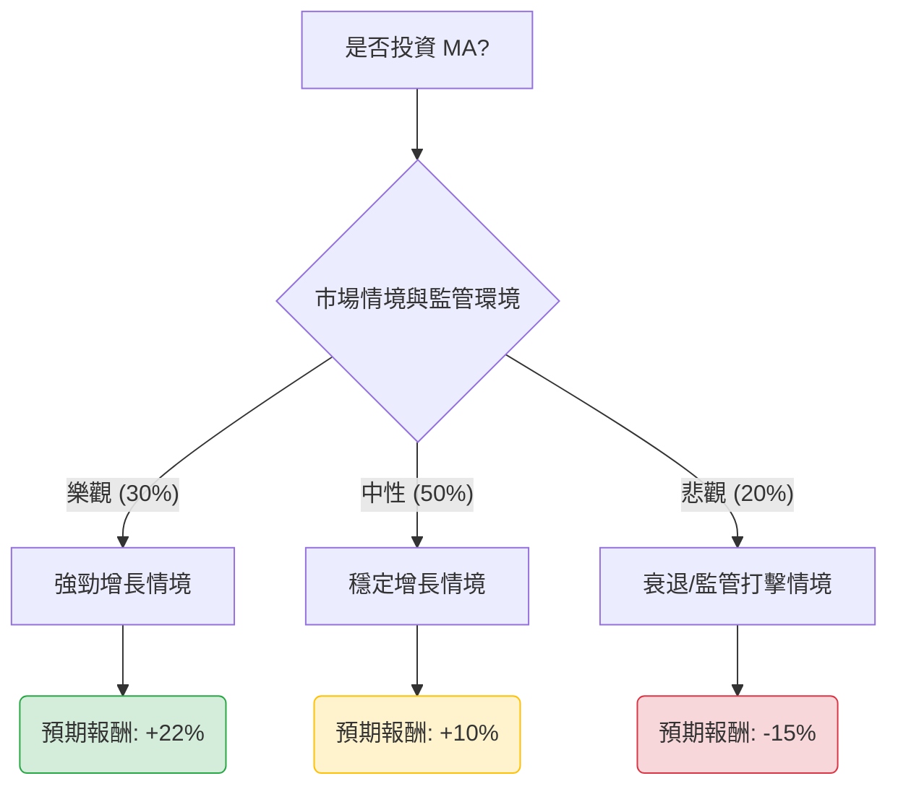

這份分析報告將針對 **Mastercard (MA)** 進行評估。Mastercard 作為全球支付龍頭之一，其商業模式具備高護城河（雙寡頭壟斷）、輕資產及高毛利的特性。

以下是基於 2024 年下半年市場現況、財務預測與行業趨勢所構建的決策樹與期望值分析。

---

### 一、 核心假設 (Core Assumptions)

在進行計算前，我們設定以下三個關鍵維度的假設：

1.  **市場環境 (Macro)**：
    *   **樂觀**：全球經濟軟著陸，跨境旅遊支出持續增長（MA 的高毛利來源），通膨溫和帶動名目交易額。
    *   **中性**：經濟低速增長，消費者支出穩健但受高利率環境壓抑。
    *   **悲觀**：全球經濟衰退，消費者縮減支出，失業率上升導致交易量大幅下滑。
2.  **財務表現 (Financials)**：
    *   MA 目前本益比 (P/E Ratio) 約在 35-38x 區間，預期淨利潤增長率為 12%-15%。
    *   持續進行大規模股票回購（每年約 2-3% 的增值貢獻）。
3.  **產業趨勢 (Industry)**：
    *   面臨監管挑戰（如美國《信用卡競爭法案》），可能壓低交換費（Interchange fees）。
    *   增值服務（Value-added services, 如數據安全與分析）增長強勁，抵消部分支付費率壓力。

---

### 二、 決策樹分析 (Decision Tree)

以下使用 Markdown 呈現投資 MA 一年期的預期報酬決策樹：

#### 決策樹節點詳細標示：

| 節點名稱 | 發生機率 (P) | 預期報酬 (R) | 計算說明 |
| :--- | :--- | :--- | :--- |
| **樂觀情境 (Bull)** | 30% | **+22%** | 跨境交易激增 + EPS 超出預期 + 估值倍數擴張。 |
| **中性情境 (Base)** | 50% | **+10%** | 業績符合財測 + 穩定回購 + 股息增長。 |
| **悲觀情境 (Bear)** | 20% | **-15%** | 經濟衰退 + 監管法案通過 + 估值修正 (P/E 降至 28x)。 |

---

### 三、 計算過程與期望值分析

#### 1. 期望值 (Expected Value, EV) 計算公式：
$$EV = \sum (Probability \times Expected Return)$$

#### 2. 計算步驟：
*   **樂觀貢獻**：$0.30 \times 22\% = 6.6\%$
*   **中性貢獻**：$0.50 \times 10\% = 5.0\%$
*   **悲觀貢獻**：$0.20 \times (-15\%) = -3.0\%$

#### 3. 最終期望值：
$$EV = 6.6\% + 5.0\% - 3.0\% = 8.6\%$$

---

### 四、 最終結論

#### **判斷：適合投資 (Suitable for Investment)**
*(註：此判斷基於長期配置角度，且適合尋求穩定增長的投資者)*

#### **核心理由：**

1.  **正向期望值 (EV = 8.6%)**：
    雖然當前 MA 的估值並不便宜（P/E 高於標普 500 平均），但其 8.6% 的預期報酬率仍具吸引力，尤其是在考慮到其極高的業務穩定性與護城河時。
2.  **跨境交易的剛性需求**：
    Mastercard 在跨境交易中具備近乎壟斷的定價權。隨著全球數位支付轉型持續，即便經濟增長放緩，現金轉為數位支付的結構性趨勢仍將支撐其營收。
3.  **資本回報策略**：
    MA 擁有強大的現金流產生能力，其持續的股票回購計畫在「中性」與「悲觀」情境下提供了有效的下行保護（Downside Protection）。
4.  **風險提示**：
    投資者需密切關注美國關於信用卡交換費的立法進度（Credit Card Competition Act）。若該法案超預期通過，悲觀情境的機率將從 20% 上調，屆時期望值可能降至無風險利率（約 4-5%）以下，則需重新評估。

---
**免責聲明：** 本分析僅供參考，不構成任何投資建議。投資美股具有風險，請根據個人風險承受能力進行決策。