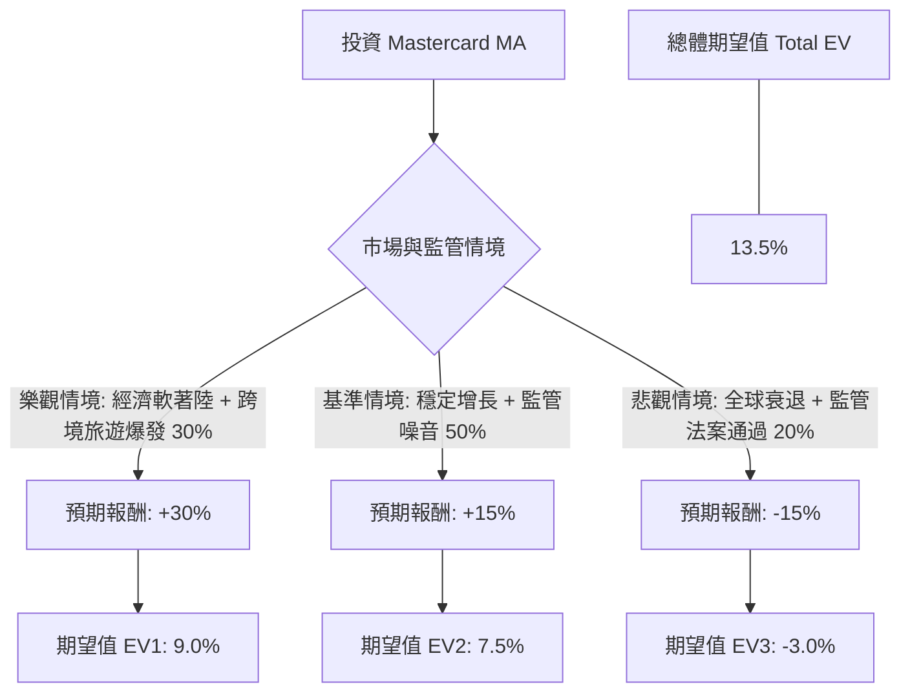

這份分析報告結合了您提供的基本面數據，以及針對 **Mastercard (MA)** 的最新市場動態、財報表現與產業趨勢進行的綜合評估。

---

### 一、 核心假設與市場背景分析

在建立決策樹之前，我們基於最新資訊設定以下核心假設：

1.  **財務表現 (Financials)**：MA 的毛利率高達 96.5%，營業利益率 60.1%，顯示其極強的定價權與規模經濟。EPS 預計明年增長 15.7%，PEG 為 1.48，估值尚屬合理區間。
2.  **宏觀環境 (Macro)**：全球跨境旅遊持續復甦（Cross-border volume），這對 MA 的高毛利業務至關重要。然而，高利率環境對消費者支出的壓抑是潛在風險。
3.  **產業趨勢 (Industry)**：數位支付轉型持續，但面臨監管壓力（如美國《信用卡競爭法案》）以及替代支付（如 A2A 支付、各國本土支付系統）的競爭。
4.  **技術面 (Technical)**：目前股價低於 SMA20、50、200，顯示短期處於修正波段，但距離分析師目標價 ($665.3) 仍有約 26% 的上行空間。

---

### 二、 決策樹分析 (Decision Tree)

以下使用 Markdown 繪製決策樹，評估未來一年的投資預期報酬。

#### 決策樹節點詳細標示：

1.  **樂觀情境 (Bull Case)**
    *   **機率**：30%
    *   **描述**：全球消費強勁，通膨受控，Mastercard 擴大 AI 防護服務收入，且美國監管法案擱置。
    *   **預期報酬**：+30% (股價趨向 $680+)
2.  **基準情境 (Base Case)**
    *   **機率**：50%
    *   **描述**：符合目前財測，EPS 增長約 15%，跨境交易穩定。市場維持目前的本益比水平。
    *   **預期報酬**：+15% (股價趨向 $605)
3.  **悲觀情境 (Bear Case)**
    *   **機率**：20%
    *   **描述**：美國通過法案強制路由競爭導致手續費下降，或全球經濟進入衰退導致消費萎縮。
    *   **預期報酬**：-15% (股價回測 $447 附近)

---

### 三、 期望值分析 (Expected Value Analysis) 計算過程

我們根據上述情境分配的機率與報酬率，計算投資 MA 的加權期望報酬：

*   **計算公式**：
    $EV = (P_{Bull} \times R_{Bull}) + (P_{Base} \times R_{Base}) + (P_{Bear} \times R_{Bear})$

*   **計算步驟**：
    1.  **樂觀貢獻**：$0.30 \times 30\% = 9.0\%$
    2.  **基準貢獻**：$0.50 \times 15\% = 7.5\%$
    3.  **悲觀貢獻**：$0.20 \times (-15\%) = -3.0\%$

*   **總體期望值 (Total EV)**：
    $9.0\% + 7.5\% - 3.0\% = \mathbf{13.5\%}$

---

### 四、 綜合評估與最終結論

#### 1. 數據亮點與隱憂
*   **優勢**：ROE (2.10) 與 ROI (0.56) 極高，顯示資本運用效率極佳。Forward P/E (23.25) 低於歷史平均，且低於目前的 P/E (31.86)，顯示市場預期獲利將增長。
*   **劣勢**：短期技術指標 (SMA) 全面轉弱，顯示目前市場情緒偏向觀望或修正。債務股本比 (Debt/Eq 2.54) 偏高，但在金融服務業中屬可控範圍。

#### 2. 最終判斷：**適合投資 (Suitable for Investment)**

#### 3. 理由總結：
1.  **正向期望值**：13.5% 的預期報酬率優於標普 500 的長期平均回報，且在基準情境下有穩健的獲利支撐。
2.  **強大的護城河**：Mastercard 與 Visa 構成的雙寡頭壟斷地位短期內難以撼動，其 60% 的營業利益率提供了極高的容錯空間。
3.  **估值吸引力**：目前股價 ($526.41) 較分析師平均目標價 ($665.3) 有顯著折價，且 Forward P/E 顯示未來一年獲利增長將稀釋目前的估值壓力。
4.  **建議策略**：由於短期技術面 (SMA20/50/200) 呈現負值，建議採取**「分批買入」**或**「待股價站回 SMA50」**後再行加碼，以規避短期的技術性修正風險。

**風險提示：** 需密切關注美國國會關於《信用卡競爭法案》的進度，若法案強制執行，可能導致基準情境向悲觀情境轉移。