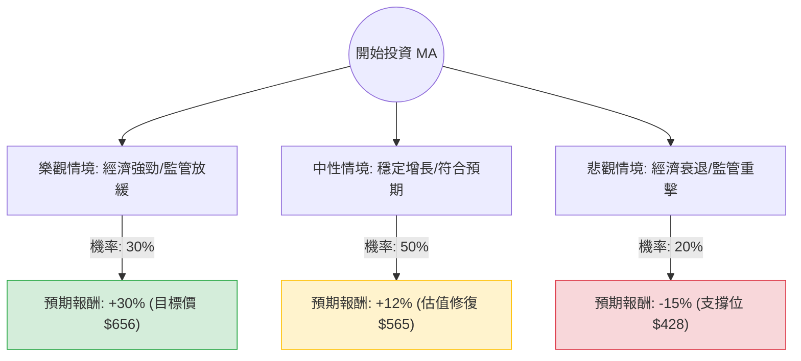

這份分析報告將結合您提供的基本面數據與最新的市場動態（截至 2024 年第四季），利用**決策樹（Decision Tree）**與**期望值分析（Expected Value Analysis）**評估 Mastercard (MA) 的投資價值。

---

### 一、 核心假設與市場背景分析

在構建決策樹前，我們先定義影響 MA 股價的三大核心變數：

1.  **宏觀經濟與消費支出（權重最高）**：Mastercard 的收入主要來自交易手續費。若全球經濟軟著陸，跨境旅遊與消費持續增長，對其有利。
2.  **監管壓力與政策風險**：美國《信用卡競爭法案》（Credit Card Competition Act）的潛在威脅，以及對交換費（Interchange fees）的持續審查。
3.  **增值服務與 AI 轉型**：MA 近年積極轉型為數據安全與服務商，這部分毛利極高（Gross Margin 達 96.5%），是推升估值的關鍵。

**當前數據亮點：**
*   **Forward P/E (22.24)** 低於歷史均值，顯示目前估值相對合理。
*   **Target Price ($656.94)** 較現價 ($504.17) 有約 **30%** 的潛在漲幅。
*   **ROE (210%)** 極高，顯示其資本運用效率極強。

---

### 二、 決策樹分析圖 (Decision Tree)

我們將未來一年的情境分為：**樂觀（Bull）**、**中性（Base）**、**悲觀（Bear）**。

---

### 三、 期望值計算過程

#### 1. 各情境參數設定與理由：

*   **樂觀情境 (Bull Case):**
    *   **機率：30%**
    *   **預期報酬：+30%**
    *   **理由：** 美國聯準會降息帶動消費熱潮，跨境交易量超預期增長，且 AI 驅動的防欺詐服務收入佔比提升。股價達到分析師目標價 $656。
*   **中性情境 (Base Case):**
    *   **機率：50%**
    *   **預期報酬：+12%**
    *   **理由：** 營收維持 10-15% 的穩定增長（符合 EPS next Y 15.6% 的預期）。監管雜音存在但未實質影響利潤。股價回升至歷史平均 P/E 水準。
*   **悲觀情境 (Bear Case):**
    *   **機率：20%**
    *   **預期報酬：-15%**
    *   **理由：** 全球經濟陷入衰退導致消費萎縮，或美國通過嚴厲的信用卡競爭法案強制降低手續費。股價回測 52 週低點並跌破支撐。

#### 2. 期望值 (Expected Value, EV) 計算：

$$EV = (P_{Bull} \times R_{Bull}) + (P_{Base} \times R_{Base}) + (P_{Bear} \times R_{Bear})$$

*   $EV = (0.30 \times 0.30) + (0.50 \times 0.12) + (0.20 \times -0.15)$
*   $EV = 0.09 + 0.06 - 0.03$
*   $EV = 0.12$ (即 **+12%**)

---

### 四、 綜合評估與最終結論

#### 1. 基本面數據補充分析：
*   **技術面：** 目前股價低於 SMA200 (-8.24%)，顯示短期內處於超跌或弱勢整理區間。這通常是長期投資者的分批進場點。
*   **財務健康：** 雖然 Debt/Eq (2.54) 偏高，但對於擁有強大現金流（P/FCF 26.59）的支付巨頭來說，債務風險受控。
*   **成長性：** PEG 為 1.41，對於一家護城河極深的龍頭公司而言，這屬於「合理偏便宜」的範圍。

#### 2. 投資判斷：

**結論：適合投資 (Buy / Overweight)**

**理由：**
1.  **期望值為正 (12%)**：即便考慮了 20% 的悲觀衰退情境，整體期望報酬率仍優於多數保守型資產。
2.  **高護城河與高利潤**：96.5% 的毛利率與 60% 的營業利益率，使其在通膨環境下具有極強的定價權。
3.  **估值吸引力**：目前股價相對於分析師目標價有顯著折價，且 Forward P/E 顯示未來一年增長潛力尚未完全反映在股價中。
4.  **技術面反彈機會**：股價目前低於 SMA200，提供了較好的安全邊際（Margin of Safety）。

**建議操作：**
由於目前處於 SMA200 以下，建議採取**分批進場**策略，以應對短期內可能因宏觀數據波動帶來的下行風險，長期持有以獲取其穩定的 EPS 增長紅利。