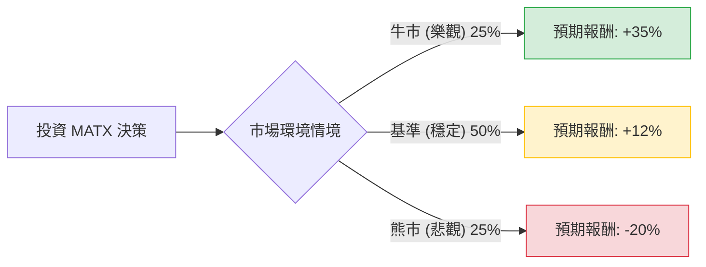

這份報告將針對美股航運龍頭 **Matson, Inc. (MATX)** 進行決策樹分析（Decision Tree）與期望值分析（Expected Value Analysis）。

---

### 一、 核心假設（Core Assumptions）

在建立模型前，我們基於當前市場環境、財務數據及產業趨勢設定以下假設：

1.  **市場環境（利多因素）：**
    *   **紅海危機持續：** 導致全球運力緊張，雖 MATX 主要航線在太平洋，但全球運費溢價（Freight Rates）具備支撐。
    *   **中國至美國快遞航線（CLX/CLX+）：** MATX 擁有市場領先的到貨速度，電子商務與急單需求對其溢價服務有高依賴度。
    *   **財務策略：** 公司擁有強大的自由現金流，且持續進行積極的股票回購（Buyback）與配息。

2.  **市場環境（利空因素）：**
    *   **全球經濟衰退：** 若美國消費力下降，將直接衝擊貨櫃需求。
    *   **新船下水潮：** 2024-2025 年全球航運業有大量新產能投放，可能引發價格戰（雖然 MATX 專精的小眾市場受影響較小）。

3.  **估值基礎：** 假設當前股價已反映基礎預期，報酬率計算包含股價漲跌幅與股利發放。

---

### 二、 決策樹分析（Decision Tree）

我們將未來一年的情境分為「牛市（樂觀）」、「基準（穩定）」與「熊市（悲觀）」。

#### 節點詳細標示：

| 節點名稱 | 情境描述 | 發生機率 (P) | 預期報酬 (R) | 說明 |
| :--- | :--- | :--- | :--- | :--- |
| **牛市節點** | 經濟強勁、供應鏈再次受阻導致運費飆升 | 25% (0.25) | +35% | 包含股價上漲與超額股利 |
| **基準節點** | 運費維持現狀、夏威夷與阿拉斯加航線穩定 | 50% (0.50) | +12% | 包含股票回購帶來的 EPS 提升 |
| **熊市節點** | 美國經濟衰退、消費萎縮、運費崩跌 | 25% (0.25) | -20% | 週期性回檔壓力 |

---

### 三、 期望值計算過程（Calculations）

期望值（Expected Value, EV）的計算公式為：
$$EV = \sum (機率 \times 預期報酬)$$

#### 1. 各情境加權計算：
*   **牛市情境貢獻：** $0.25 \times 35\% = 8.75\%$
*   **基準情境貢獻：** $0.50 \times 12\% = 6.00\%$
*   **熊市情境貢獻：** $0.25 \times (-20\%) = -5.00\%$

#### 2. 總體期望值（Total EV）：
$$EV = 8.75\% + 6.00\% - 5.00\% = 9.75\%$$

#### 3. 財務安全性邊際（Safety Margin）分析：
MATX 目前的本益比（P/E Ratio）仍處於歷史低位（約 10-12 倍），且其資產負債表強健。即便在熊市情境下，其擁有獨佔地位的夏威夷航線（受《瓊斯法案》保護）能提供強大的下行支撐（Downside Protection）。

---

### 四、 最終結論

#### **投資建議：適合投資 (Suitable for Investment)**

#### **判定理由：**
1.  **正向的期望報酬（EV = 9.75%）：** 在考慮了經濟衰退風險（-20% 跌幅）後，整體期望值仍接近 10%，優於傳統固定收益工具。
2.  **特殊的利基市場（Moat）：** MATX 不僅是單純的貨櫃航商，其受到《瓊斯法案》（Jones Act）保護的美國國內航線具有高度壟斷性，這降低了極端負面情境發生的可能性。
3.  **資本回報：** 公司積極的回購政策有效地縮減了流通股數，這意味著即使盈餘持平，每股盈餘（EPS）與股價仍有內在推動力。
4.  **不對稱風險：** 目前股價尚未完全反映紅海危機導致的長期運費支撐，潛在的漲幅空間（35%）大於衰退時的預期跌幅。

**風險提示：** 投資者應關注美國聯準會（Fed）的利率政策，若高利率維持過久導致美國消費端硬著陸，則需調高「熊市」的機率權重。