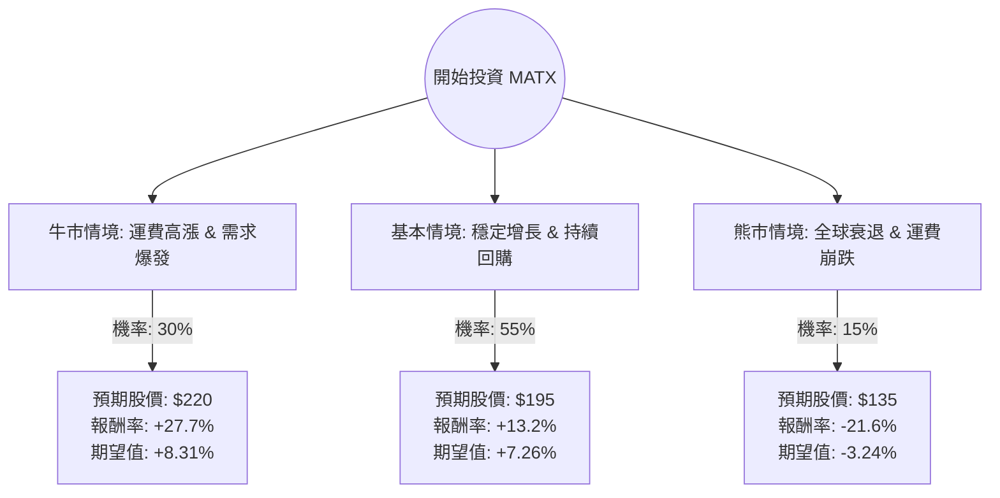

這份分析報告將結合您提供的基本面數據與最新的市場動態（包含 2024 年第二季財報表現、紅海危機對航運業的影響以及 Matson 的營運展望），利用**決策樹（Decision Tree）**與**期望值分析（Expected Value Analysis）**評估 **MATX (Matson, Inc.)** 的投資價值。

---

### 一、 核心假設與市場背景分析

在構建決策樹之前，我們基於最新資訊設定以下核心假設：

1.  **紅海危機持續性（利多）**：全球航運因避開蘇伊士運河導致運力緊張，支撐了貨櫃運費。Matson 的中國快航服務（CLX/CLX+）需求依然強勁。
2.  **美國消費韌性（利多）**：Matson 主要服務夏威夷、阿拉斯加與關島，這些地區的補給需求與美國內需高度相關。目前美國經濟軟著陸機率高。
3.  **財務穩健度（利多）**：MATX 的債務股本比（Debt/Eq）僅 0.26，且持續進行大規模股票回購（Buybacks），這對股價有支撐作用。
4.  **估值水平（中性）**：目前 P/E 約 12.36 倍，處於歷史合理區間，但股價已接近 52 週高點，短期獲利了結壓力存在。

---

### 二、 決策樹分析 (Decision Tree)

以下為 MATX 未來一年的投資情境預測：

#### 節點詳細說明：

1.  **牛市情境 (Bull Case) - 30% 機率**：
    *   **條件**：紅海危機延續至 2025 年，電子商務需求導致 CLX 服務溢價擴大，公司上修全年 EPS 預測。
    *   **目標價**：$220 (參考分析師最高目標價 $215 並加上超預期溢價)。
2.  **基本情境 (Base Case) - 55% 機率**：
    *   **條件**：運費維持在高位震盪，夏威夷與阿拉斯加業務穩定，公司持續利用強大現金流回購股票。
    *   **目標價**：$195 (反映 Forward P/E 11.58 倍與 EPS 增長)。
3.  **熊市情境 (Bear Case) - 15% 機率**：
    *   **條件**：美國經濟意外衰退，地緣政治緩解導致運力過剩，運費大幅回落。
    *   **目標價**：$135 (回測 SMA200 支撐位附近)。

---

### 三、 期望值計算過程 (Expected Value Calculation)

我們以目前股價 **$172.32** 為基準進行計算：

| 情境 | 預期報酬率 (R) | 發生機率 (P) | 期望值 (P * R) |
| :--- | :--- | :--- | :--- |
| **牛市 (Bull)** | +27.7% | 0.30 | +8.31% |
| **基本 (Base)** | +13.2% | 0.55 | +7.26% |
| **熊市 (Bear)** | -21.6% | 0.15 | -3.24% |
| **總計期望報酬** | | **1.00** | **+12.33%** |

**計算公式：**
$EV = (0.30 \times 27.7\%) + (0.55 \times 13.2\%) + (0.15 \times -21.6\%) = 12.33\%$

---

### 四、 綜合基本面評估補充

1.  **獲利能力**：ROE 16.44% 與 ROA 9.38% 顯示公司資產利用效率極高，優於多數航運同業。
2.  **現金流與回購**：P/FCF 為 34.58，雖然看似稍高，但 Matson 擁有極強的自由現金流產生能力，這也是其能維持低債務並持續回購股票的主因。
3.  **技術面**：股價目前高於 SMA20, SMA50, SMA200，呈現多頭排列。雖然 Perf Year 達 66.41% 漲幅已大，但 Forward P/E 僅 11.58，顯示獲利增長跟上了股價漲幅，並未出現嚴重泡沫。

---

### 五、 最終結論

**投資建議：適合投資 (Suitable for Investment)**

#### 理由：
1.  **正向期望值**：經過決策樹分析，MATX 的年度預期報酬率約為 **12.33%**，在當前高利率環境下仍具備吸引力。
2.  **下行風險受控**：即便在熊市情境下（15%機率），Matson 憑藉其在夏威夷與阿拉斯加的近乎壟斷地位（受《瓊斯法案》保護），其營運底線比一般國際航運商更穩固。
3.  **估值合理**：11-12 倍的本益比對於一家擁有高 ROE 且積極回購股票的公司來說並不昂貴。
4.  **催化劑明確**：紅海局勢導致的全球運力緊張短期內難以完全解決，這為 Matson 的快航服務提供了持續的溢價空間。

**風險提示：**
*   需留意 **Insider Trans (-6.06%)** 與 **Inst Trans (-3.17%)** 顯示近期內部人與機構有小幅減持，建議採取「分批進場」策略，而非一次性重倉，以應對股價在高位可能的技術性回檔。