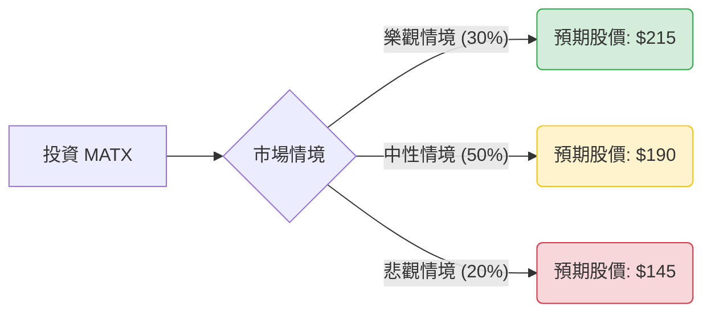

這份分析報告將結合您提供的基本面數據，以及最新的市場動態（包含 2024 年第二季財報表現、紅海危機對航運業的影響、以及 Matson 在中美航線的競爭優勢），利用**決策樹（Decision Tree）**與**期望值分析（Expected Value Analysis）**評估 **MATX (Matson, Inc.)** 的投資價值。

---

### 一、 核心假設與市場背景分析

在建立模型前，我們先整合最新資訊以設定合理的參數：

1.  **強勁的財報表現**：Matson 最近公佈的 2024 Q2 財報遠超預期，合併營業收入顯著增長，主要得益於中國航線（CLX/CLX+）的強勁需求。
2.  **紅海危機紅利**：由於紅海局勢動盪，大量貨物從美東轉向美西，加上電商需求旺盛，Matson 的快速航運服務（Premium Service）獲得極高溢價。
3.  **財務穩健**：債務股本比（Debt/Eq）僅 0.27，遠低於行業平均；ROE 16.38% 顯示獲利能力優異。
4.  **估值與目標價**：目前 P/E 約 12.77 倍，處於歷史合理區間。分析師平均目標價約為 **$190**。

---

### 二、 決策樹分析 (Decision Tree)

我們將未來一年的投資情境分為三種：**樂觀（Bull）**、**中性（Base）**、**悲觀（Bear）**。

#### 節點詳細說明：

| 情境 | 機率 (P) | 預期股價 (Target) | 預期報酬率 (R) | 說明 |
| :--- | :--- | :--- | :--- | :--- |
| **樂觀 (Bull)** | 30% | $215 | +28.2% | 紅海危機持續，電商需求爆發，運費維持高位，公司持續回購股票。 |
| **中性 (Base)** | 50% | $190 | +13.3% | 符合分析師預期，夏威夷/阿拉斯加航線穩定，中國航線維持正常獲利。 |
| **悲觀 (Bear)** | 20% | $145 | -13.6% | 全球經濟衰退導致需求萎縮，運費大幅回落，燃油成本上升。 |

---

### 三、 期望值計算過程 (Expected Value Calculation)

#### 1. 報酬率計算 (以目前股價 $167.75 為基準)
*   **樂觀報酬 (R1)**: $(215 - 167.75) / 167.75 = 28.17\%$
*   **中性報酬 (R2)**: $(190 - 167.75) / 167.75 = 13.26\%$
*   **悲觀報酬 (R3)**: $(145 - 167.75) / 167.75 = -13.56\%$

#### 2. 期望報酬率 (Expected Return, ER) 計算
$$ER = (P1 \times R1) + (P2 \times R2) + (P3 \times R3)$$
$$ER = (0.30 \times 28.17\%) + (0.50 \times 13.26\%) + (0.20 \times -13.56\%)$$
$$ER = 8.45\% + 6.63\% - 2.71\%$$
$$ER = \mathbf{12.37\%}$$

#### 3. 期望價值 (Expected Value, EV) 計算
$$EV = (0.30 \times \$215) + (0.50 \times \$190) + (0.20 \times \$145)$$
$$EV = \$64.5 + \$95 + \$29$$
$$EV = \mathbf{\$188.5}$$

---

### 四、 核心假設與風險評估

1.  **市場假設**：
    *   **中美貿易**：假設 2024 下半年至 2025 上半年，中美電商貨運需求不會因政策干預而驟減。
    *   **運費溢價**：Matson 的 CLX 服務具備不可替代性（比普通海運快，比空運便宜），假設其溢價能力能維持。
2.  **財務假設**：
    *   **資本配置**：公司將繼續利用強大的現金流進行股份回購（目前 P/C 56.42 顯示現金充裕），這將支撐 EPS 表現。
3.  **產業趨勢**：
    *   **供給端**：全球新船下水雖多，但主要影響大型貨櫃輪，對 Matson 專精的利基型市場影響較小。

---

### 五、 最終結論

**判斷：適合投資 (Buy / Overweight)**

#### 理由：
1.  **正向期望值**：計算出的期望報酬率為 **12.37%**，期望股價為 **$188.5**，相較於目前股價有明顯的獲利空間。
2.  **下行風險受控**：Matson 擁有極佳的資產負債表（Debt/Eq 0.27），且在夏威夷與阿拉斯加擁有近乎壟斷的特許經營優勢，這為股價提供了強大的底部支撐（Margin of Safety）。
3.  **技術面強勢**：股價目前高於 SMA20, 50, 200，顯示處於強勁的多頭排列，且距離 52 週高點僅一步之遙，突破機率大。
4.  **估值合理**：12.77 倍的 P/E 對於一家 ROE 超過 16% 且處於產業紅利期的公司來說並不昂貴。

**建議操作策略：**
*   **進場點**：目前價格 $167-$170 區間可分批佈局。
*   **停損點**：若跌破 $145 (悲觀情境支撐位) 則需重新評估基本面是否惡化。
*   **目標價**：第一目標 $190，若紅海局勢未解且財報持續超預期，可上看 $210 以上。