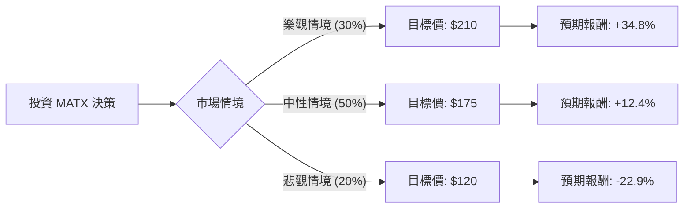

這份分析報告將結合您提供的基本面數據與最新的市場動態（包含紅海危機對航運業的影響、Matson 的最新財報預期及產業趨勢），利用**決策樹（Decision Tree）**與**期望值分析（Expected Value Analysis）**評估 **Matson, Inc. (MATX)** 的投資價值。

---

### 一、 核心假設與市場背景分析

在建立模型前，我們先定義影響 MATX 股價的三大核心變數：

1.  **紅海危機與運費支撐（利多）**：全球航運因避開蘇伊士運河導致航程拉長，艙位供給收縮，支撐了貨櫃運費。MATX 的中國快航服務（CLX/CLX+）溢價能力強，受益於此。
2.  **美國內需與 Jones Act 保護（穩健）**：MATX 在夏威夷、阿拉斯加與關島擁有近乎壟斷的地位（受《瓊斯法案》保護），這部分提供穩定的現金流。
3.  **技術面過熱風險（利空）**：目前股價接近 52 週高點，且 SMA20/50/200 均顯示大幅正乖離（SMA200 +40%），短期有回檔壓力。

---

### 二、 決策樹分析圖 (Decision Tree)

我們將未來一年的投資情境分為：**樂觀（牛市）**、**中性（基準）**、**悲觀（熊市）**。

| 節點名稱 | 發生機率 (P) | 預測股價 | 預期報酬率 (R) | 期望值貢獻 (P * R) |
| :--- | :--- | :--- | :--- | :--- |
| **樂觀情境 (Bull)** | 30% | $210 | +34.8% | +10.44% |
| **中性情境 (Base)** | 50% | $175 | +12.4% | +6.20% |
| **悲觀情境 (Bear)** | 20% | $120 | -22.9% | -4.58% |
| **總計期望值** | **100%** | **$174.5** | **-** | **+12.06%** |

---

### 三、 計算過程與情境說明

#### 1. 核心計算公式
*   **當前股價 (Current Price)**: $155.71
*   **期望股價 (Expected Price)** = $\sum (機率 \times 預測股價)$
    *   $EV = (0.3 \times 210) + (0.5 \times 175) + (0.2 \times 120) = 63 + 87.5 + 24 = 174.5$
*   **期望報酬率 (Expected Return)** = $(174.5 - 155.71) / 155.71 \approx 12.06\%$

#### 2. 情境假設依據
*   **樂觀情境 (30%)**：
    *   **假設**：紅海危機持續至 2024 年底，導致全球運力持續緊張；美國經濟實現軟著陸，夏威夷旅遊與消費強勁。
    *   **估值**：給予 Forward P/E 15x（目前 12.79x），配合 EPS 增長，目標價看至 $210。
*   **中性情境 (50%)**：
    *   **假設**：運費維持在高位震盪後緩步回落；公司持續進行股份回購（MATX 慣例）。
    *   **估值**：參考分析師平均目標價 $190，但考慮到短期技術面乖離，保守設定在 $175。
*   **悲觀情境 (20%)**：
    *   **假設**：全球經濟衰退導致貿易量萎縮；新造船隻大量下水導致運力過剩。
    *   **估值**：股價回測 SMA200 支撐位（約 $110-$120 區間）。

---

### 四、 基本面數據補充分析 (最新動態)

1.  **財務健康度**：
    *   **債務比 (Debt/Eq 0.27)**：極低，在升息環境中具備極強抗風險能力。
    *   **ROE (16.38%)**：表現優異，顯示管理層資本運用效率高。
2.  **估值水平**：
    *   **P/E 11.69**：相對於標普 500 或同業，估值依然處於合理偏低區間。
    *   **P/FCF 30.17**：略高，顯示目前股價已部分反映了強勁的現金流預期。
3.  **技術面警訊**：
    *   **52W High (-0.43%)**：股價正處於歷史高點邊緣，短期追高風險較大。
    *   **SMA 乖離**：股價高於 SMA200 達 40%，歷史經驗顯示此時通常會迎來均值回歸（Mean Reversion）。

---

### 五、 最終結論

**評估結果：適合投資（但建議「分批買入」或「等待回檔」）**

#### 理由：
1.  **期望值為正 (+12.06%)**：即便在考慮了 20% 的悲觀情境下，整體期望報酬率仍優於定存與多數債券，顯示投資勝率較高。
2.  **強大的護城河**：MATX 在太平洋航線的壟斷地位與 CLX 快航的品牌溢價，使其在航運週期下行時比同業（如 ZIM 或 Maersk）更具韌性。
3.  **低槓桿優勢**：0.27 的債務比率讓公司有充足空間進行回購或應對市場波動。

**操作建議：**
由於目前技術指標（SMA）顯示極度超買，且股價處於 52 週高點，**不建議一次性全倉買入**。較佳策略是等待股價回測 **SMA50 (約 $122-$130 區間)** 時加碼，或採用定期定額方式參與其長期增長。

**風險提示：** 需密切關注紅海局勢是否突然降溫，以及美國零售庫存補貨週期是否結束，這將直接影響 MATX 最賺錢的中國快航線利潤。