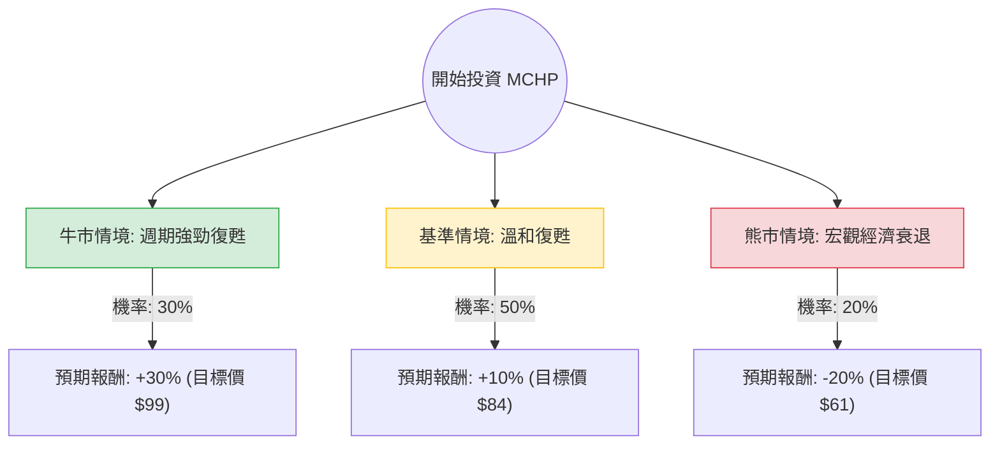

這份分析報告將結合您提供的基本面數據與最新的市場動態（如半導體週期、工業/汽車需求、庫存去化進度），利用**決策樹（Decision Tree）**與**期望值（Expected Value）**模型，評估 Microchip Technology (MCHP) 的投資價值。

---

### 1. 核心假設與市場背景分析

在建立模型前，我們先整合基本面與最新市場資訊：

*   **週期性底部已現：** MCHP 主要產品為微控制器 (MCU) 與類比晶片。過去一年受工業與汽車市場庫存調整影響，營收大幅下滑（Sales Q/Q -2.01%，EPS Q/Q -82%）。但最新財報顯示庫存去化已接近尾聲。
*   **高成長預期：** 數據顯示 **EPS next Y_% 達 71.04%**，且 **PEG 僅 0.73**。這代表市場預期明年將迎來強勁的週期性復甦。
*   **技術面強勢：** 股價目前（$76.20）極度接近 52 週高點（$77.20），且位於 SMA20/50/200 之上，顯示短期動能極強。
*   **估值壓力：** Forward P/E 達 29.4 倍，處於歷史相對高位，反映市場已提前反應復甦預期。

---

### 2. 決策樹分析 (Decision Tree)

我們以 **12 個月** 為投資期限，設定三種可能情境：

#### 節點詳細說明：

| 情境節點 | 發生機率 (P) | 預期報酬 (R) | 說明 |
| :--- | :--- | :--- | :--- |
| **牛市情境 (Bull)** | 30% | +30% | AI 帶動邊緣運算需求，汽車/工業庫存去化超預期，EPS 成長超過 71%。 |
| **基準情境 (Base)** | 50% | +10% | 符合分析師預期（Target Price $81.04 略微上修），穩健復甦，股息維持。 |
| **熊市情境 (Bear)** | 20% | -20% | 高利率環境持續壓抑工業支出，汽車市場需求萎縮，復甦延後至 2026。 |

---

### 3. 期望值計算 (Expected Value Analysis)

期望值 (EV) 計算公式：
$EV = (P_{Bull} \times R_{Bull}) + (P_{Base} \times R_{Base}) + (P_{Bear} \times R_{Bear})$

**計算過程：**
1.  **牛市貢獻：** $0.30 \times 30\% = 9\%$
2.  **基準貢獻：** $0.50 \times 10\% = 5\%$
3.  **熊市貢獻：** $0.20 \times (-20\%) = -4\%$

**總期望報酬率：**
$9\% + 5\% - 4\% = \mathbf{10\%}$

**期望股價 (12個月)：**
$76.20 \times (1 + 10\%) = \mathbf{83.82}$

---

### 4. 綜合評估與核心假設

#### 財務面優勢：
*   **PEG 0.73：** 考慮到明年 71% 的 EPS 成長，目前的估值並不昂貴。
*   **現金流與股利：** 雖然目前 ROE 為負，但 P/FCF 為 53.89，且具備 2.42% 的殖利率，提供了一定的下檔保護。

#### 風險因素：
*   **負債比：** Debt/Eq 0.81 雖不算極高，但在半導體下行週期末端仍需關注利息支出。
*   **利潤率暫時受損：** Profit Margin (-5.77%) 顯示目前仍處於虧損或損益兩平邊緣，復甦的「速度」是關鍵。

---

### 5. 最終結論

**投資建議：適合投資 (Buy / Overweight)**

#### 理由：
1.  **正向期望值：** 經過風險加權後的期望報酬率為 **10%**，優於無風險利率及多數成熟工業股。
2.  **週期性拐點：** MCHP 屬於典型的週期股，目前正處於「業績最差、預期最亮眼」的轉折點。EPS next Y 的高成長預期是股價最強的支撐。
3.  **技術面支撐：** 股價已突破所有均線（SMA20/50/200），顯示法人資金已開始提前佈局復甦行情。
4.  **估值合理：** 雖然 P/E 看似高，但 PEG < 1 顯示成長性尚未被完全定價。

**操作建議：**
由於目前股價接近 52 週高點（$76.20），建議採取**分批進場**策略。若股價回測 $70 - $72（SMA 支撐區）將是極佳的加碼點。目標價設定在 **$84 - $90** 區間。

---
*免責聲明：本分析僅供參考，不構成任何投資建議。投資者應自行承擔市場風險。*