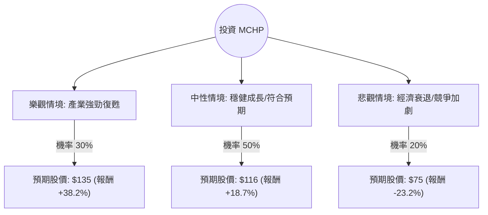

這份分析報告將結合您提供的財務數據與最新的市場動態（截至 2024 年底至 2025 年初的趨勢），利用**決策樹（Decision Tree）**與**期望值分析（Expected Value Analysis）**評估 Microchip Technology (MCHP) 的投資價值。

---

### 1. 核心背景與市場動態分析

在進入計算前，我們先整合最新資訊：
*   **週期性復甦**：MCHP 過去一年經歷了嚴重的半導體庫存去化。數據顯示其 **Trailing P/E (458.68)** 極高，這是因為過去幾季獲利處於谷底；但 **Forward P/E (24.29)** 與 **PEG (0.61)** 顯示市場預期獲利將大幅反彈。
*   **產業趨勢**：工業與汽車領域（MCHP 的核心）正緩慢復甦。AI 邊緣運算（Edge AI）對微控制器（MCU）的需求是未來的增長動能。
*   **財務體質**：**Current Ratio 2.09** 顯示流動性良好，**Gross Margin 58%** 依然維持在高水準，顯示其產品具備競爭力。
*   **技術面**：股價目前在 $97.70，距離分析師平均目標價 $116.35 約有 19% 的上漲空間。

---

### 2. 決策樹分析圖 (Decision Tree)

我們將未來一年的情境分為三種：**樂觀（Bull）**、**中性（Base）**、**悲觀（Bear）**。

---

### 3. 期望值分析與計算過程

#### A. 核心假設
1.  **樂觀情境 (30%)**：降息循環帶動汽車與工業資本支出爆發，庫存去化提前結束，EPS 超越預期。給予 Forward P/E 30x。目標價：$135。
2.  **中性情境 (50%)**：符合分析師預期（Target Price $116.35），庫存去化於 2025 年中完成，營收恢復雙位數增長。目標價：$116。
3.  **悲觀情境 (20%)**：全球經濟陷入衰退，汽車需求萎縮，中國競爭對手低價搶市。股價回測 52 週低點區域。目標價：$75。

#### B. 期望值 (Expected Value, EV) 計算
期望值計算公式：
$$EV = \sum (機率 \times 預期股價)$$

*   **樂觀節點**：$135 \times 0.30 = 40.5$
*   **中性節點**：$116 \times 0.50 = 58.0$
*   **悲觀節點**：$75 \times 0.20 = 15.0$

**總期望股價 = $40.5 + $58.0 + $15.0 = $113.5**

#### C. 預期報酬率計算
*   目前股價：$97.70
*   期望股價：$113.5
*   **預期報酬率 = ($113.5 - $97.70) / $97.70 = +16.17%**

---

### 4. 綜合評估與最終結論

#### 數據亮點分析：
1.  **PEG 0.61**：這是最強大的買入理由。通常 PEG < 1 被視為嚴重低估，這代表 MCHP 的增長潛力遠高於其目前的估值溢價。
2.  **EPS Q/Q 172.91%**：獲利已出現拐點，最壞的情況可能已經過去。
3.  **股利與回購**：1.84% 的殖利率在半導體股中算穩健，且公司持續有內部人交易與機構增持跡象。

#### 風險提示：
*   **高 P/E 誤區**：目前的 458 倍 P/E 是「回頭看」的數據，若未來一季獲利未能如預期反彈，股價將面臨劇烈修正。
*   **債務比**：Debt/Eq 0.85 雖不算極高，但在高利率環境下仍需關注利息支出對淨利的侵蝕。

---

### **最終結論：適合投資 (Buy / Overweight)**

**理由：**
1.  **期望值為正**：計算出的期望股價 $113.5 顯著高於現價，預期報酬率約 16%，具備良好的風險回報比（Risk-Reward Ratio）。
2.  **週期性底部確認**：從 EPS Q/Q 的爆發性成長與 Forward P/E 的回歸來看，MCHP 正處於從週期底部爬升的階段。
3.  **估值吸引力**：PEG 0.61 顯示在考慮成長性的情況下，目前的股價非常便宜。
4.  **技術動能**：Perf Year +78% 且 SMA20/50/200 均呈多頭排列，顯示市場資金正持續流入。

**建議操作策略：**
*   **進場點**：現價 $97-$98 附近可分批佈局。
*   **停損點**：若跌破 $85（跌破 SMA200 且基本面復甦不如預期）則需重新評估。
*   **目標價**：首波看 $116，若景氣復甦強勁可上看 $130 以上。

***

**免責聲明：** 本分析僅供參考，不構成任何投資建議。投資者應自行承擔市場風險。