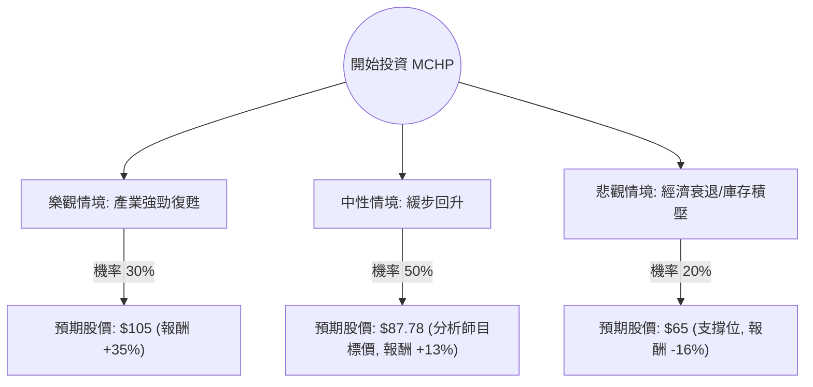

這份分析報告將結合您提供的基本面數據與最新的市場動態（截至 2024 年底至 2025 年初的產業趨勢），利用**決策樹（Decision Tree）**與**期望值分析（Expected Value Analysis）**評估 Microchip Technology (MCHP) 的投資價值。

---

### 一、 市場背景與核心假設

在進行定量分析前，我們先整合最新的市場資訊：
1.  **產業週期：** 半導體成熟製程（MCU、類比晶片）正處於庫存去化週期的尾聲。MCHP 過去幾季營收受壓，但數據顯示 **EPS next Y 預期增長 70.09%**，顯示市場預期 2025 年將迎來強勁復甦。
2.  **財務健康：** 雖然目前 ROE 為負（-1.09%），反映了短期獲利低谷，但 **PEG 僅 0.7**，暗示相對於未來的增長潛力，目前的股價被低估。
3.  **技術面：** 股價位於 SMA200 之上（+17.36%），且距離 52 週高點僅差約 6.7%，顯示動能正在轉強。
4.  **宏觀因素：** 降息循環有利於 MCHP 主要的工業與汽車客戶降低融資成本，進而帶動需求。

---

### 二、 決策樹分析 (Decision Tree)

我們將未來一年的投資情境分為三種：**樂觀（強勁復甦）**、**中性（穩健回升）**、**悲觀（需求疲軟）**。

#### 節點詳細說明：

1.  **樂觀情境 (Bull Case) - 30% 機率：**
    *   **假設：** AI 邊緣運算需求爆發，汽車與工業自動化庫存去化超預期，公司毛利回升至 60% 以上。
    *   **預期報酬：** 股價突破歷史高點，達到約 $105。
2.  **中性情境 (Base Case) - 50% 機率：**
    *   **假設：** 符合目前分析師預期，EPS 增長如期兌現，市場給予 Forward P/E 29 倍的合理估值。
    *   **預期報酬：** 達到目標價 $87.78。
3.  **悲觀情境 (Bear Case) - 20% 機率：**
    *   **假設：** 全球經濟衰退導致汽車銷量下滑，庫存去化延遲至 2026 年。
    *   **預期報酬：** 股價回測 52 週區間中下緣，約 $65。

---

### 三、 期望值計算 (Expected Value Analysis)

我們以目前股價 **$77.73** 為基準進行計算。

#### 1. 各情境預期收益率 (Return)
*   **樂觀：** $(105 - 77.73) / 77.73 = +35.08\%$
*   **中性：** $(87.78 - 77.73) / 77.73 = +12.93\%$
*   **悲觀：** $(65 - 77.73) / 77.73 = -16.38\%$

#### 2. 期望值 (EV) 計算公式
$$EV = (P_{Bull} \times R_{Bull}) + (P_{Base} \times R_{Base}) + (P_{Bear} \times R_{Bear})$$

*   $EV = (0.30 \times 35.08\%) + (0.50 \times 12.93\%) + (0.20 \times -16.38\%)$
*   $EV = 10.52\% + 6.47\% - 3.28\%$
*   **$EV = 13.71\%$**

#### 3. 考慮股息的總期望報酬
MCHP 提供 **2.34%** 的股息率。
*   **總期望報酬 (Total EV) = 13.71% + 2.34% = 16.05%**

---

### 四、 核心假設與風險評估

1.  **增長假設：** 核心假設建立在 **EPS next Y % (70.09%)** 的高成長性能否兌現。若下季財報顯示訂單出貨比 (Book-to-Bill Ratio) 低於 1，此假設需下修。
2.  **估值假設：** Forward P/E 29.17 倍在半導體板塊中屬於中等偏高，這反映了市場已提前反應復甦預期。
3.  **風險點：** 
    *   **Insider Trans (-2.18%)** 與 **Inst Trans (-2.04%)** 顯示內部人士與機構近期有小幅減持，需警惕短期回檔。
    *   **Debt/Eq (0.82)** 債務水平尚可，但需關注利息支出對淨利的侵蝕。

---

### 五、 最終結論

**判斷：適合投資 (Suitable for Investment)**

#### 理由：
1.  **正向期望值：** 經過風險加權後的期望報酬率為 **16.05%**（含股息），優於標普 500 指數的長期平均回報。
2.  **極具吸引力的 PEG：** **PEG 0.7** 顯示股價尚未完全反映明年 70% 的 EPS 增長潛力，具備「價值成長」雙重屬性。
3.  **週期底部反轉：** 雖然 ROE 目前為負，但 Sales Q/Q 已出現 15.59% 的增長，且股價站穩 SMA200，技術面與基本面同步出現轉折訊號。
4.  **下行風險可控：** 即使在悲觀情境下，MCHP 作為全球 MCU 龍頭，其穩定的股息與市場地位提供了較強的防禦性。

**建議策略：**
目前股價 $77.73 接近 52 週高點，建議採取**分批買入**策略。若股價回測 SMA50 (約 $72-$73 區間) 將是更佳的切入點。目標價設定在 **$87.78**，並以 **$68** (52W Range 中位數下方) 作為長期止損位。