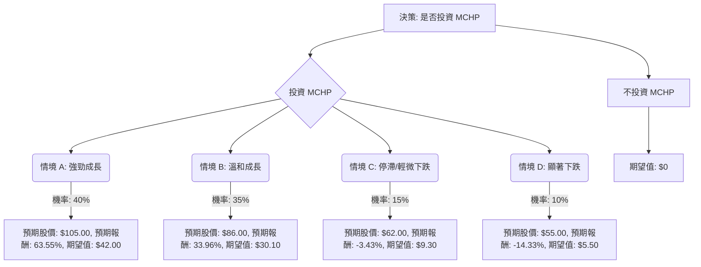

# MCHP 投資評估：決策樹分析與期望值分析

根據對美股公司 MCHP (Microchip Technology Inc.) 的基本面數據、最新新聞、財報、市場動態及產業趨勢的綜合評估，以下將透過決策樹分析與期望值分析，判斷其目前是否適合投資。

## 決策樹分析 (Decision Tree Analysis)

### 決策點：是否投資 MCHP

*   **目前股價 (Close):** $64.20

### 節點說明與計算

*   **決策點：是否投資 MCHP**
    *   這是初始決策，我們將評估「投資 MCHP」與「不投資 MCHP」的期望值。

*   **選擇 1: 投資 MCHP (目前股價: $64.20)**
    *   **情境節點：市場與公司表現**
        *   **情境 A: 強勁成長 (Favorable Market & Strong MCHP Execution)**
            *   **預測情境名稱:** 半導體市場需求旺盛 (AI、汽車電子、資料中心)，MCHP 成功抓住成長機會，營收和利潤大幅增長，市場給予更高估值。
            *   **對應的機率 (Probability):** 40%
            *   **預期股價 (Expected Price):** $105.00 (基於分析師高目標價及產業樂觀預期)
            *   **預期報酬 (Expected Return):** ($105.00 - $64.20) / $64.20 = 63.55%
            *   **期望值 (Expected Value):** 0.40 * $105.00 = $42.00
        *   **情境 B: 溫和成長 (Neutral Market & Moderate MCHP Execution)**
            *   **預測情境名稱:** 半導體市場穩健成長，MCHP 表現符合預期，營收和利潤溫和增長，達到分析師平均目標價。
            *   **對應的機率 (Probability):** 35%
            *   **預期股價 (Expected Price):** $86.00 (接近分析師平均目標價 $86.00 - $87.68)
            *   **預期報酬 (Expected Return):** ($86.00 - $64.20) / $64.20 = 33.96%
            *   **期望值 (Expected Value):** 0.35 * $86.00 = $30.10
        *   **情境 C: 停滯/輕微下跌 (Unfavorable Market & Weak MCHP Execution)**
            *   **預測情境名稱:** 宏觀經濟放緩，半導體需求不如預期，MCHP 面臨庫存壓力或競爭加劇，股價小幅下跌或持平。
            *   **對應的機率 (Probability):** 15%
            *   **預期股價 (Expected Price):** $62.00 (略低於目前股價)
            *   **預期報酬 (Expected Return):** ($62.00 - $64.20) / $64.20 = -3.43%
            *   **期望值 (Expected Value):** 0.15 * $62.00 = $9.30
        *   **情境 D: 顯著下跌 (Highly Unfavorable Market & Very Weak MCHP Execution)**
            *   **預測情境名稱:** 嚴重的宏觀經濟衰退，半導體產業大幅下滑，MCHP 營運遭受重創，股價跌至分析師低目標價或更低。
            *   **對應的機率 (Probability):** 10%
            *   **預期股價 (Expected Price):** $55.00 (低於分析師最低目標價 $60.00)
            *   **預期報酬 (Expected Return):** ($55.00 - $64.20) / $64.20 = -14.33%
            *   **期望值 (Expected Value):** 0.10 * $55.00 = $5.50

*   **選擇 2: 不投資 MCHP**
    *   **期望值 (Expected Value):** $0 (假設不投資則無損益，或將資金投入無風險資產，此處簡化為0以進行直接比較)

## 期望值分析 (Expected Value Analysis)

### 核心假設

1.  **市場趨勢 (Semiconductor Industry & Macro)**:
    *   **半導體產業成長動能強勁**：全球半導體產業預計在2025年將實現11%至18%的顯著成長，主要受惠於人工智慧 (AI)、汽車電子（特別是電動車）、資料中心和物聯網 (IoT) 等終端應用需求的推動。MCHP 在汽車、資料中心和連接性等高成長市場的策略性佈局，使其有望從中受益。
    *   **宏觀經濟存在不確定性**：儘管半導體產業前景樂觀，但全球宏觀經濟環境的潛在惡化、地緣政治緊張以及汽車和工業領域的潛在需求放緩，仍可能對公司業績構成壓力。
2.  **公司財務表現 (MCHP Financials)**:
    *   **近期表現優於預期**：MCHP 在2026財年第三季度 (Q3 FY2026) 的每股盈餘 (EPS) 和營收均超出分析師預期，並給出了積極的2026財年第四季度 (Q4 FY2026) 財測，預計營收和 EPS 將持續增長。
    *   **分析師普遍看好**：多數華爾街分析師給予 MCHP「買入」或「溫和買入」評級，平均12個月目標價介於 $86.00 至 $87.68 之間，顯示出約 34% 至 36% 的潛在上漲空間。
    *   **產品創新與市場拓展**：MCHP 積極投資於下一代微控制器、汽車晶片、擴展 Trust Platform 安全解決方案以及 BZPACK mSiC 電源模組，以抓住電動車和工業自動化等市場需求。公司還與 Hyundai 建立了戰略合作夥伴關係。
    *   **風險因素**：公司面臨庫存水平上升（201天庫存）、毛利率壓力以及 32 位元 MCU 市場潛在的市佔率流失等挑戰。高負債水平 (Debt/Eq: 0.82) 也是一個持續的關注點。此外，內部人士交易顯示有淨賣出活動。
3.  **股價波動性**：MCHP 的 Beta 值為 1.45，表明其股價波動性高於市場平均水平，這增加了投資風險。

### 計算過程

1.  **投資 MCHP 的總期望股價 (Expected Value of Investing in MCHP)**
    *   情境 A 期望值: $42.00
    *   情境 B 期望值: $30.10
    *   情境 C 期望值: $9.30
    *   情境 D 期望值: $5.50

    **投資 MCHP 的總期望股價 = $42.00 + $30.10 + $9.30 + $5.50 = $86.90**

2.  **不投資 MCHP 的期望值**
    *   期望值: $0

### 3. 淨期望收益 (Net Expected Gain)

*   **淨期望收益 = 投資 MCHP 的總期望股價 - 目前股價**
    *   = $86.90 - $64.20 = $22.70

*   **預期報酬率 = (淨期望收益 / 目前股價) * 100%**
    *   = ($22.70 / $64.20) * 100% = **35.36%**

## 最終結論

根據決策樹分析和期望值分析，投資 MCHP 的總期望股價為 **$86.90**。相較於目前股價 $64.20，這代表每股預期有 $22.70 的潛在收益，或約 **35.36%** 的預期報酬率。

因此，根據目前的數據和分析，**MCHP 目前適合投資**。

**簡短理由:**
MCHP 所在的半導體產業受惠於 AI、汽車電子和資料中心等趨勢，具有強勁的成長動能。公司近期財報表現優於預期，並給出積極的財測。MCHP 積極佈局高成長市場，並獲得多數分析師的「買入」評級和顯著的目標價上漲空間。儘管存在宏觀經濟不確定性、庫存管理和高負債等風險，但綜合考量下，其預期報酬率顯著高於不投資的選項，顯示出良好的投資潛力。