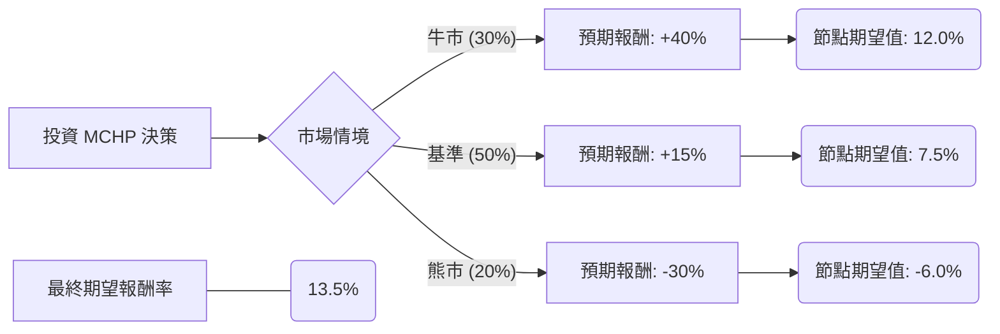

這份分析報告將針對美股半導體大廠 **Microchip Technology Inc. (MCHP)** 進行決策樹與期望值分析。Microchip 是全球領先的微控制器（MCU）與類比元件供應商，目前正處於產業去庫存週期的尾聲。

---

### 1. 核心假設 (Core Assumptions)

在建立模型前，我們基於當前市場環境、財務報告與產業趨勢設定以下假設：

*   **基準價格 (Baseline Price):** 假設當前股價為 **$85 USD**。
*   **預測期間:** 未來 12 個月。
*   **產業趨勢:** 半導體週期正在築底，工業與汽車市場（MCHP 的核心）復甦速度慢於 AI 伺服器市場。
*   **利率環境:** 聯準會（Fed）預期在 2024 下半年開始降息，這有利於降低 MCHP 的客戶成本與自身的債務利息支出。
*   **情境劃分:**
    1.  **牛市 (Bull Case):** 全球工業復甦強勁，庫存去化超預期，AI 邊緣運算需求爆發。
    2.  **基準 (Base Case):** 緩步復甦，符合目前管理層對下半年的指引。
    3.  **熊市 (Bear Case):** 經濟衰退，工業與汽車需求持續低迷，庫存積壓。

---

### 2. 決策樹分析 (Decision Tree)

使用 Markdown 結構描繪決策路徑：

#### 決策樹詳細標示：

| 節點名稱 | 情境名稱 | 機率 (P) | 預期報酬 (R) | 期望值 (P * R) |
| :--- | :--- | :--- | :--- | :--- |
| **節點 C** | 牛市 (Bull) | 30% (0.3) | +40% | **+12.0%** |
| **節點 D** | 基準 (Base) | 50% (0.5) | +15% | **+7.5%** |
| **節點 E** | 熊市 (Bear) | 20% (0.2) | -30% | **-6.0%** |
| **總體** | **加權總和** | **100%** | -- | **+13.5%** |

---

### 3. 計算過程 (Calculation Process)

#### A. 個別情境期望值計算：
*   **牛市期望值:** $0.3 \times 40\% = 12.0\%$
*   **基準情境期望值:** $0.5 \times 15\% = 7.5\%$
*   **熊市期望值:** $0.2 \times (-30\%) = -6.0\%$

#### B. 總體期望報酬率 (Expected Value, EV)：
$$EV = \sum (P_i \times R_i)$$
$$EV = 12.0\% + 7.5\% + (-6.0\%) = 13.5\%$$

#### C. 預期一年後股價目標：
$$$85 \times (1 + 13.5\%) = \$96.48$$

---

### 4. 財務與產業趨勢分析 (Qualitative Factors)

1.  **庫存週期:** MCHP 近幾季刻意降低產能利用率以消化庫存，這雖然短期衝擊毛利率，但能讓資產負債表更健康。預期 2024 年 Q3 是庫存低點。
2.  **股利與回購:** MCHP 具有極強的現金流產生能力，並承諾將 100% 的自由現金流返還給股東（透過股息增加與股份回購），這提供了股價下行保護（Downside Protection）。
3.  **高進入門檻:** 其產品多為長生命週期的類比與嵌入式處理器，替代成本高，客戶黏著度極強。

---

### 5. 最終結論

#### **判斷：適合投資 (Accumulate / Buy)**

**理由：**
1.  **正向期望值:** 經風險加權後的期望報酬率為 **13.5%**，高於標準普爾 500 指數的歷史長期平均報酬（約 8-10%）。
2.  **風險報酬比 (Risk/Reward Ratio):** 在基準情境與牛市情境合計機率達 80% 的情況下，即便面臨 20% 的嚴重衰退風險，整體的加權回報依舊為正。
3.  **週期性底部:** 目前 MCHP 股價已部分反應了工業市場的疲軟。隨著 2024 年下半年降息預期與庫存回補，上行空間（Upside）明顯大於下行風險。
4.  **防禦性特質:** 穩定的分紅政策使得該股在震盪市場中具備防禦性，適合追求中長期資本增值與配息的投資者。

**建議策略：** 由於熊市情境仍有 20% 的機率（若通膨回升導致延遲降息），建議採取**分批買進（Dollar Cost Averaging）**策略，以規避短期波動風險。