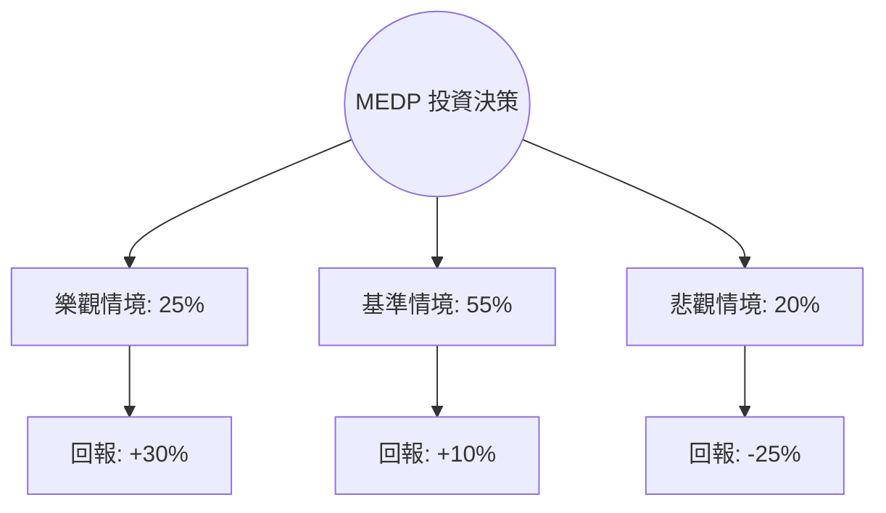

# Medpace Holdings Inc (MEDP) 量化投資分析報告

作為量化投資分析師，針對 **MEDP** 的評估核心在於其作為中型臨床研究機構（CRO）在生物技術融資週期中的槓桿效應。以下是基於概率思考的決策模型分析。

---

### 1. 核心驅動因素與風險 (Drivers & Risks)

#### **關鍵催化劑 (Catalysts)**
1.  **生物技術融資環境回暖 (Biotech Funding Recovery)**：MEDP 專注於中小型生物技術公司。隨著聯準會進入降息週期，市場風險偏好提升，小型生技公司的融資難度降低，將直接轉化為 MEDP 的新訂單與積壓訂單（Backlog）轉化率。
2.  **高效率的營運槓桿與利潤率保持**：MEDP 擁有高於同業的營業利潤率（~21%）與極高的 ROE（162%）。若其全方位服務模式（Full-service model）能持續吸引客戶並維持低取消率，其 EPS 增長將持續超越市場預期。
3.  **股份回購與資本配置**：公司具備強勁的自由現金流（P/FCF 22.84），歷史上透過積極回購減少流通股數，這在增長放緩期能有效支撐 EPS 與股價。

#### **主要風險點 (Risks)**
1.  **客戶集中度與信用風險**：其客戶多為依賴外部融資的早期生技公司。若宏觀經濟陷入衰退或融資窗口關閉，訂單取消（Cancellations）風險將激增。
2.  **估值倍數壓縮**：目前 Forward P/E 約 30 倍，處於歷史中高位。若營收增速（Sales Q/Q 17.2%）放緩至 10% 以下，市場可能對其進行估值修正。
3.  **人才競爭與成本通膨**：CRO 行業高度依賴臨床研究助理（CRA）。若勞動力成本上升速度超過合約調價速度，毛利率（目前 27.76%）將面臨壓力。

---

### 2. 情境設定與機率賦予 (Scenario Modeling)

基於未來 12 個月的宏觀環境與 MEDP 業務特性，設定以下三種互斥情境：

#### **樂觀情境 (Bull Case)**
*   **發生條件**：聯準會降息超預期，XBI（生技 ETF）大幅反彈；MEDP 訂單取消率維持在歷史低位，且新簽約額（Net Bookings）連續兩季超預期。
*   **預估機率**：25%
*   **目標價格與預期回報**：**$752 (+30%)**。基於 Forward P/E 35x 與 EPS 增長 20%。

#### **基準情境 (Base Case)**
*   **發生條件**：生物技術融資環境平穩修復；公司維持 15-18% 的營收增長，利潤率保持穩定。
*   **預估機率**：55%
*   **目標價格與預期回報**：**$636 (+10%)**。基於 Forward P/E 30x（均值回歸）與市場共識 EPS。

#### **悲觀情境 (Bear Case)**
*   **發生條件**：經濟硬著陸導致生技融資枯竭；主要臨床項目失敗導致大規模訂單取消；估值倍數因增長失速壓縮至 22x。
*   **預估機率**：20%
*   **目標價格與預期回報**：**$434 (-25%)**。考慮到 52 週低點附近的支撐位與估值下修。

---

### 3. 期望值計算與決策樹 (EV Calculation & Decision Tree)

#### **決策樹結構**

#### **總期望值計算**
*   **EV** = (0.25 * 0.30) + (0.55 * 0.10) + (0.20 * -0.25)
*   **EV** = 0.075 + 0.055 - 0.050 = **0.08 (8.0%)**

#### **風險回報比分析**
*   **上行潛力**：30% (Bull)
*   **下行空間**：25% (Bear)
*   **風險回報比**：1.2 : 1。雖然期望值為正，但盈虧比並非極度不對稱，顯示目前股價已部分反映增長預期。

---

### 4. 決策總結 (Decision Summary)

| 情境 | 發生機率 (%) | 預期報酬率 (%) | 關鍵驅動/觸發因素 |
| :--- | :--- | :--- | :--- |
| **樂觀 (Bull)** | 25% | +30% | 融資環境大好、訂單轉化加速、估值擴張 |
| **基準 (Base)** | 55% | +10% | 業務穩健增長、符合市場預期、回購支撐 |
| **悲觀 (Bear)** | 20% | -25% | 融資枯竭、訂單取消率飆升、估值壓縮 |
| **整體期望值** | **100%** | **+8.0%** | **加權平均預期回報** |

**最終結論：**
1.  **投資建議**：**持有 (Hold) / 逢低買入 (Buy on Dips)**
2.  **核心邏輯**：MEDP 是一家基本面極其強韌的公司（ROE 與 ROI 驚人），其 8% 的期望值在當前高估值美股環境中具備防禦性。然而，由於風險回報比僅為 1.2，且當前股價接近歷史高點，不建議在此位置重倉追高，應等待回調至 SMA200 附近或融資數據進一步確認後再行加碼。
3.  **風控建議**：若股價跌破 **$490**（跌幅約 15%，接近悲觀情境觸發點），或財報顯示 **訂單取消率（Cancellation Rate）連續兩季上升**，應視為基本面惡化訊號，執行止損或減碼。

【結束指令】