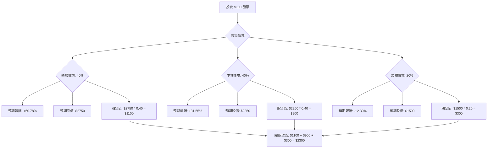

根據對美股公司 MercadoLibre (MELI) 的決策樹分析與期望值分析，並參考其基本面數據及最新市場資訊，以下是評估結果：

### **核心假設**

1.  **市場趨勢 (Market Trends)**：
    *   **拉丁美洲電商市場持續增長**：拉丁美洲的電商市場預計在 2024 年增長 6.55% 至 1,947 億美元，並在 2024-2028 年間以 8.50% 的複合年增長率 (CAGR) 增長。到 2027 年，電商交易量可能達到 1 兆美元，2024 年同比增長 25%。 2024 年至 2028 年間，線上零售銷售的複合年增長率預計為 11%。
    *   **金融科技 (Fintech) 領域蓬勃發展**：拉丁美洲的金融科技生態系統正在爆炸式增長，2017 年至 2024 年間，新創公司數量增長了 340%。 該增長主要由龐大的未受銀行服務或銀行服務不足的人口、數位化普及以及支持性法規推動。 儘管 2024 年金融科技融資有所下降，但 2025 年強勁反彈。
    *   **競爭加劇**：來自 Temu、Shein 等中國電商平台以及 Amazon 等全球巨頭的競爭日益激烈，但 MELI 憑藉其本地專業知識和整合生態系統有望維持市場地位。

2.  **財務表現 (Financial Performance)**：
    *   **強勁的營收和盈利增長**：MELI 在 2024 年第一季度營收和盈利均超出預期，營收同比增長 36% (按固定匯率計算增長 94%)，每股收益同比增長 70.8%。
    *   **主要市場表現優異**：巴西和墨西哥的電商 (商品交易總額 GMV 同比增長約 30%) 和金融科技 (Mercado Pago 總支付額 TPV 同比增長 173%) 業務表現強勁。
    *   **阿根廷市場挑戰**：阿根廷的宏觀經濟逆風和比索貶值對業績產生負面影響，導致電商交易量減少和運輸成本上升。
    *   **持續投資**：MELI 持續在物流基礎設施 (Mercado Envíos)、會員計畫 (MELI+) 和信用卡業務上進行大量投資，並計劃在 2026 年向巴西投資 110 億美元。

3.  **產業趨勢 (Industry Trends)**：
    *   **數位支付普及**：拉丁美洲的帳戶對帳戶支付 (如巴西的 Pix) 增長速度快於信用卡，數位錢包也日益重要。
    *   **AI 整合**：金融科技公司越來越多地採用 AI 技術，MELI 也正在將 AI 深度整合到其服務中。

### **決策樹分析**

**當前股價 (Current Stock Price)**: $1710.37

**決策點 (Decision Node)**: 投資 MELI 股票

### **情境與計算過程**

**1. 樂觀情境 (Optimistic Scenario)**
*   **情境描述**：MELI 在拉丁美洲的電商和金融科技領域持續取得顯著市場份額，尤其在巴西和墨西哥。物流、會員計畫 (MELI+) 和信貸產品的強勁執行推動用戶採用和變現加速。主要市場的宏觀經濟狀況保持良好，阿根廷挑戰的影響進一步減輕。分析師的共識目標價得以實現或超越。
*   **機率 (Probability)**：40%
*   **預期股價 (Expected Stock Price)**：$2750
    *   此價格參考了分析師的平均共識目標價 ($2,512.73 - $2,751.67) 的較高區間，以及最高目標價 ($3,000 - $3,500)。
*   **預期報酬 (Expected Return)**：($2750 - $1710.37) / $1710.37 = 60.78%
*   **期望值 (Expected Value)**：$2750 \* 0.40 = $1100

**2. 中性情境 (Neutral Scenario)**
*   **情境描述**：MELI 的增長與市場趨勢保持一致，但面臨日益激烈的競爭和一些宏觀經濟波動。電商和金融科技的增長持續，但速度較樂觀情境更為溫和。由於持續投資，盈利能力改善穩定但不明顯。股價徘徊在分析師目標價的較低區間或略有上漲。
*   **機率 (Probability)**：40%
*   **預期股價 (Expected Stock Price)**：$2250
    *   此價格介於當前股價和分析師平均目標價之間，也高於分析師的最低目標價 ($1,827 - $2,100)。
*   **預期報酬 (Expected Return)**：($2250 - $1710.37) / $1710.37 = 31.55%
*   **期望值 (Expected Value)**：$2250 \* 0.40 = $900

**3. 悲觀情境 (Pessimistic Scenario)**
*   **情境描述**：拉丁美洲出現嚴重的宏觀經濟逆風 (例如：衰退、高通膨、貨幣貶值)，嚴重影響消費者支出。來自全球和本地競爭對手的競爭加劇導致市場份額流失或價格壓力。監管變化或營運問題 (例如：信貸組合惡化) 對 MELI 的金融科技部門產生負面影響。盈利未達預期，分析師評級被下調。
*   **機率 (Probability)**：20%
*   **預期股價 (Expected Stock Price)**：$1500
    *   此價格低於當前股價 ($1710.37) 和 52 週低點 ($1593.21)，反映了重大挑戰下的潛在跌幅。
*   **預期報酬 (Expected Return)**：($1500 - $1710.37) / $1710.37 = -12.30%
*   **期望值 (Expected Value)**：$1500 \* 0.20 = $300

### **整體期望值計算**

整體期望值 = (樂觀情境期望值) + (中性情境期望值) + (悲觀情境期望值)
整體期望值 = $1100 + $900 + $300 = $2300

### **最終結論**

根據上述決策樹分析和期望值計算，MELI 股票的整體期望值為 **$2300**。

由於整體期望值 ($2300) 顯著高於當前股價 ($1710.37)，這表明 MELI **適合投資**。

**簡短理由**：
MELI 在拉丁美洲電商和金融科技市場的領導地位、強勁的營收和盈利增長、持續的戰略投資以及分析師普遍看好的前景，使其具有可觀的潛在上升空間。儘管存在阿根廷宏觀經濟挑戰和日益激烈的競爭等風險，但這些風險在悲觀情境中已被考慮，且整體期望值仍顯示出正向的投資回報。