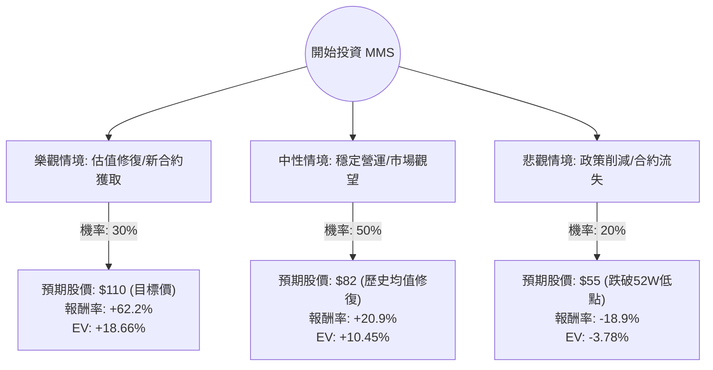

這份分析報告將針對 **Maximus Inc. (MMS)** 進行深入評估。Maximus 是一家為政府提供健康與人類服務計畫的管理外包服務商（如 Medicaid、Medicare、學生貸款服務等）。

透過結合您提供的數據與最新的市場動態（包含 2024 年財報表現與產業趨勢），我將使用**決策樹（Decision Tree）**與**期望值分析（Expected Value Analysis）**來評估其投資價值。

---

### 一、 核心假設與市場背景分析

在建立模型前，我們先釐清 MMS 目前的處境：

1.  **估值極低（Value Play）**：目前 Forward P/E 僅 7.44，遠低於行業平均與其歷史平均。P/S 0.69 顯示市場對其營收成長持懷疑態度。
2.  **財務穩健但成長放緩**：ROE 22% 非常優秀，EPS Q/Q 成長 147% 顯示獲利能力強勁。然而，近期股價表現（半年跌 22%）反映了市場對「後疫情時代」政府合約縮減（如 Medicaid 重新認證潮結束）的擔憂。
3.  **技術面弱勢**：股價處於 SMA20、50、200 之下，顯示短期內賣壓沉重，處於尋找底部的階段。
4.  **產業趨勢**：美國大選將至，政府支出政策的不確定性是最大風險；但長期而言，人口老化對健康服務的需求是剛需。

---

### 二、 決策樹分析 (Decision Tree)

我們將未來一年的投資情境分為三種：**樂觀（估值修復）**、**中性（維持現狀）**、**悲觀（合約流失/政策風險）**。

---

### 三、 期望值計算過程 (Expected Value Calculation)

**當前股價 ($P_0$):** $67.81

#### 1. 樂觀情境 (Bull Case) - 權重 30%
*   **假設**：公司成功標得新的聯邦大型合約，且 AI 導入降低了營運成本（Gross Margin 提升）。市場給予 Forward P/E 回歸至 12 倍。
*   **目標價**：$110 (參考分析師 Target Price)
*   **報酬率 ($R_{bull}$)**：$(110 - 67.81) / 67.81 = +62.2\%$
*   **期望值貢獻**：$0.30 \times 62.2\% = 18.66\%$

#### 2. 中性情境 (Base Case) - 權重 50%
*   **假設**：Medicaid 業務穩定，雖然沒有爆發性成長，但 EPS 持續達標。股價隨大盤回升至 SMA200 附近。
*   **目標價**：$82 (約為 P/E 11 倍，接近過去半年高點)
*   **報酬率 ($R_{base}$)**：$(82 - 67.81) / 67.81 = +20.9\%$
*   **期望值貢獻**：$0.50 \times 20.9\% = 10.45\%$

#### 3. 悲觀情境 (Bear Case) - 權重 20%
*   **假設**：美國政府預算削減，或關鍵合約（如聯邦學生貸款服務）面臨法律挑戰。股價跌破支撐位。
*   **目標價**：$55 (低於 52W Low，反映極端恐慌)
*   **報酬率 ($R_{bear}$)**：$(55 - 67.81) / 67.81 = -18.9\%$
*   **期望值貢獻**：$0.20 \times (-18.9\%) = -3.78\%$

#### 總期望報酬率 (Total Expected Return)
$$EV = 18.66\% + 10.45\% - 3.78\% = \mathbf{25.33\%}$$

---

### 四、 綜合評估與最新資訊補充

1.  **最新財報動態**：Maximus 在最近的財報中上修了全年指引，顯示其核心業務比市場預期的更具韌性。儘管 Sales Q/Q 微跌 4.11%，但獲利能力（EPS Q/Q +147%）大幅改善，這通常是股價反轉的前兆。
2.  **內部人與機構動向**：機構交易（Inst Trans）增加 3.14%，顯示法人開始在低位建倉；內部人交易變動極小，無恐慌性拋售。
3.  **風險點**：Short Float 為 5.99%，雖不算極高，但顯示市場仍有一定空頭勢力。技術面上 SMA 呈現空頭排列，短期內可能還有震盪。

---

### 五、 最終結論

**判斷：適合投資 (Strong Buy on Value)**

#### 理由：
1.  **極高的安全邊際**：總期望報酬率高達 **25.33%**，且 Forward P/E 僅 7.44 倍，這在美股市場中屬於極度低估的水平。
2.  **獲利能力強勁**：ROE 22% 與 EPS 的大幅成長證明了公司管理層在成本控制與業務轉型上的成功。
3.  **下行風險有限**：目前股價已接近 52 週低點（$64.68），距離我們設定的悲觀目標價 $55 僅剩約 18% 空間，但上行潛力（至 $110）高達 62%。
4.  **逆向投資機會**：市場目前的負面情緒主要來自於對政府合約週期性的恐懼，而非公司基本面惡化。對於價值投資者而言，這是一個典型的「好公司遇到暫時性逆風」的買點。

**建議操作策略：**
由於技術面尚未轉強（SMA 仍向下），建議採取**分批進場（Dollar Cost Averaging）**策略，首批資金於 $67 附近建立底倉，若股價回測 $65 支撐不破則加碼，長期持有以等待估值修復至 $85-$100 區間。