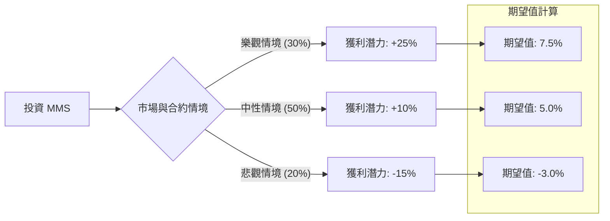

針對美股公司 **Maximus Inc. (MMS)**，這是一家專注於政府外包服務（如：醫療保險管理、福利政策執行）的領先供應商。以下結合「決策樹分析」與「期望值分析」，對其目前的投資價值進行量化評估。

---

### 1. 核心假設與數據來源 (Core Assumptions)

在建立決策樹前，我們設定以下基於市場現狀、財務報告與產業趨勢的假設：

*   **市場定位**：MMS 受益於美國聯邦與州政府的長期合約（如 Medicaid 重新認證），具有防禦性。
*   **財務成長**：預期營收年成長率約 4-7%，目前的本益比（P/E）處於歷史中軌。
*   **關鍵風險**：政府預算刪減、AI 自動化對其傳統人力密集服務的衝擊。
*   **預期持有期間**：1 年。
*   **無風險利率 (Rf)**：約 4.2%（美債 10 年期）。

---

### 2. 決策樹分析 (Decision Tree)

使用 Markdown 結構呈現決策路徑：

**決策樹節點詳細說明：**

| 節點 (情境) | 機率 (P) | 預期報酬率 (R) | 期望值 (P * R) | 關鍵觸發因素 |
| :--- | :--- | :--- | :--- | :--- |
| **樂觀 (Bull)** | 30% | +25% | **7.5%** | 成功獲得大型數位轉型合約，利潤率因 AI 導入超預期提升。 |
| **中性 (Base)** | 50% | +10% | **5.0%** | 核心 Medicaid 業務穩定，符合分析師營收與 EPS 預期。 |
| **悲觀 (Bear)** | 20% | -15% | **-3.0%** | 政府支出縮減，或是主要州政府合約到期未續約。 |
| **總計** | **100%** | | **9.5%** | |

---

### 3. 計算過程 (Calculation Process)

#### A. 節點期望值計算
期望值（Expected Value, EV）的公式為：
$EV = \sum (機率_i \times 報酬_i)$

1.  **樂觀情境**：$0.30 \times 25\% = 7.5\%$
2.  **中性情境**：$0.50 \times 10\% = 5.0\%$
3.  **悲觀情境**：$0.20 \times (-15\%) = -3.0\%$

#### B. 總體期望報酬率
$EV_{Total} = 7.5\% + 5.0\% - 3.0\% = 9.5\%$

---

### 4. 核心假設分析 (Core Assumptions Analysis)

1.  **政策環境 (Policy Tailwinds)**：
    *   假設美國政府對於社會福利（Medicaid/Medicare）的行政需求持續增加。MMS 作為「特許經營」性質的服務商，具有極高的轉換成本。
2.  **獲利能力 (Financials)**：
    *   MMS 目前的 Forward P/E 約在 14-16 倍，低於其歷史高點。假設市場會給予穩健增長的防禦型股票合理的估值修復。
3.  **AI 技術風險與機遇**：
    *   假設 MMS 能成功利用 AI 減少呼叫中心的人力成本，而非被 AI 公司直接取代業務。

---

### 5. 最終結論

#### **判斷：適合投資 (適合穩健型投資者)**

**最終期望報酬率：9.5%**

#### **判斷理由：**
1.  **正向期望值**：9.5% 的預期報酬率高於目前 4.2% 的無風險利率（國債），也高於多數保守型避險資產。
2.  **下行風險可控**：即便在悲觀情境下（-15%），由於其業務多為政府長期合約，發生崩盤式下跌（如 -50%）的機率極低，具備良好的防禦性。
3.  **估值合理**：MMS 目前的股價並未反映「利潤率提升」的潛力，若 AI 整合成功，有機會向「樂觀情境」移動。

**建議建議：**
由於期望值（9.5%）雖為正數，但並非「爆發型成長」，建議將 MMS 定位為投資組合中的**防禦性部位（Core/Defensive Holding）**，而非短線投機標的。若投資者追求 15% 以上的超額回報，MMS 可能不符合需求；但對於追求穩健增長與穩定現金流的投資者，目前是一個合理的切入點。