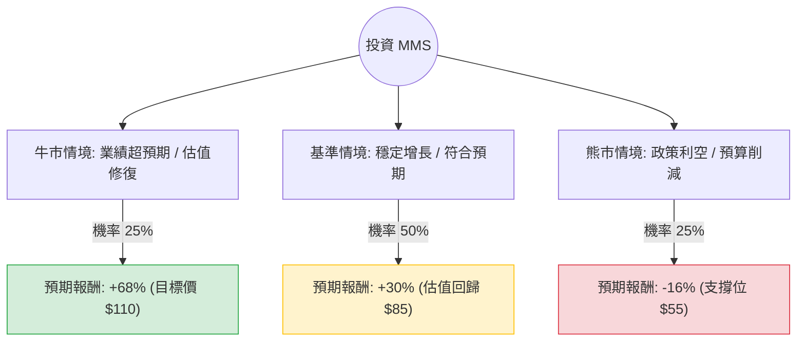

這份分析報告將針對 **Maximus Inc. (MMS)** 進行深入評估。Maximus 是一家主要為政府提供健康與人類服務計畫（如 Medicaid、Medicare、學生貸款服務等）的外包服務商。

根據您提供的數據與最新的市場動態（包含 2024 年 8 月發布的 Q3 財報與市場趨勢），以下是詳細的決策樹與期望值分析。

---

### 一、 市場動態與基本面補充資訊

1.  **最新財報表現**：Maximus 在 2024 年 8 月公佈的 Q3 財報表現強勁，營收與 EPS 均超出預期。公司上調了全年指引（Guidance），預計營收將達到 52.5 億至 53.5 億美元。
2.  **核心增長動能**：
    *   **Medicaid Redetermination（醫保資格重新審核）**：這是近期主要的營收驅動因素，雖然這波高峰可能在 2025 年放緩，但公司已成功轉向更高利潤的臨床服務。
    *   **聯邦合約**：與美國聯邦政府的長期合約（如 CMS 聯絡中心）提供了穩定的現金流。
3.  **風險因素**：
    *   **政治風險**：2024 年美國大選可能導致政府支出政策變動。
    *   **債務水平**：Debt/Eq 為 0.97，雖然可控，但在高利率環境下仍需關注利息支出。
    *   **技術面**：股價近期表現疲軟（SMA200 為 -19.7%），顯示市場對其長期增長持續性存疑。

---

### 二、 決策樹分析 (Decision Tree)

以下決策樹模擬未來一年的投資情境：

---

### 三、 期望值分析與計算過程

#### 1. 核心假設
*   **現價 ($P_0$)**：$65.47
*   **牛市情境 (Bull Case)**：公司成功轉型高利潤臨床業務，且聯邦合約續約順利。P/E 回升至歷史平均 15x。目標價參考分析師預測的 **$110**。
*   **基準情境 (Base Case)**：業績符合指引，Medicaid 業務平穩過渡。Forward P/E 從極低的 7.18x 修復至約 10-11x。預估股價約 **$85**。
*   **熊市情境 (Bear Case)**：美國大選後政府預算大幅削減，或主要合約流失。股價跌破 52 週低點，下探 **$55**。

#### 2. 報酬率計算 (Return, $R$)
*   $R_{Bull} = (110 - 65.47) / 65.47 = +68.0\%$
*   $R_{Base} = (85 - 65.47) / 65.47 = +29.8\%$
*   $R_{Bear} = (55 - 65.47) / 65.47 = -16.0\%$

#### 3. 期望值計算 (Expected Value, $EV$)
$$EV = (P_{Bull} \times R_{Bull}) + (P_{Base} \times R_{Base}) + (P_{Bear} \times R_{Bear})$$
$$EV = (0.25 \times 0.68) + (0.50 \times 0.298) + (0.25 \times -0.16)$$
$$EV = 0.17 + 0.149 - 0.04 = 0.279$$

**最終期望報酬率：27.9%**

---

### 四、 綜合評估與最終結論

#### 1. 數據亮點分析
*   **極低估值**：Forward P/E 僅 7.18，遠低於標普 500 平均水平，具備極高的安全邊際。
*   **高盈利能力**：ROE 達 22.09%，顯示公司利用股東權益創造利潤的能力極強。
*   **現金流穩定**：P/FCF 為 16.35，對於一家政府服務承包商來說，現金流健康且具備派息能力（殖利率 1.88%）。
*   **成長性**：EPS Q/Q 增長 147.42%，顯示營運效率正在大幅提升。

#### 2. 潛在風險
*   **技術面空頭**：股價目前處於 SMA20, 50, 200 之下，短期內可能仍有賣壓，需分批進場。
*   **政策依賴**：營收高度依賴政府合約，政治環境的劇烈變動是最大變數。

#### 3. 最終結論：**適合投資 (Strong Buy on Value)**

**理由：**
1.  **期望值極高**：27.9% 的預期報酬率遠高於市場平均，且下行風險（-16%）相對於上行潛力（+68%）具有極佳的盈虧比。
2.  **估值錯置**：市場目前給予 MMS 的 Forward P/E (7.18) 接近週期底部，這通常反映了過度悲觀的預期，而財報數據顯示基本面依然強勁。
3.  **防禦屬性**：在經濟不確定性增加時，政府外包服務通常具有較強的抗週期性。

**建議操作策略：**
由於目前技術面呈現空頭排列（SMA 指標均為負），建議採取**分批買入（Dollar Cost Averaging）**策略，首批資金可在 $60-$65 區間建立基礎倉位，若股價站回 SMA50 則可加碼。