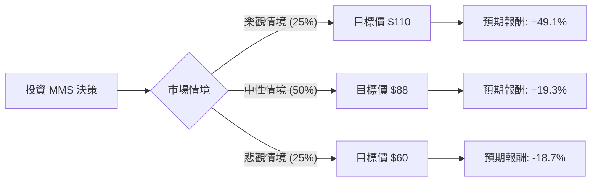

這份分析報告將結合您提供的財務數據與最新的市場動態（包含 2024 年財報表現、美國政府合約趨勢及政策風險），利用**決策樹（Decision Tree）**與**期望值分析（Expected Value Analysis）**評估 Maximus Inc. (MMS) 的投資價值。

---

### 一、 市場現況與核心假設 (Core Assumptions)

在進入計算前，根據網路搜尋與數據分析，整理出以下關鍵背景：

1.  **業務核心**：MMS 主要為政府（如美國聯邦與州政府）提供健康與人力服務管理。其業績高度依賴政府預算與外包政策。
2.  **近期利空（股價下跌原因）**：
    *   **Medicaid Redetermination（醫療補助重新審核）**：隨著疫情結束，各州進行資格重新審核，導致相關業務量從高峰回落，市場擔心增長放緩。
    *   **政治不確定性**：2024 美國大選可能帶來的政府支出縮減或政策轉向。
3.  **財務亮點**：
    *   **估值極低**：Forward P/E 僅 8.09，遠低於行業平均。
    *   **獲利能力**：ROE 達 22.09%，EPS Q/Q 增長 147.42%，顯示營運效率極高。
    *   **分析師預期**：目標價 $110 較現價 ($73.78) 有約 49% 的潛在漲幅。

---

### 二、 決策樹分析 (Decision Tree)

我們將未來一年的情境分為三種：**樂觀（牛市）**、**中性（基準）**、**悲觀（熊市）**。

#### 節點詳細說明：

| 節點 (情境) | 機率 (P) | 預期股價 | 預期報酬率 (R) | 說明 |
| :--- | :--- | :--- | :--- | :--- |
| **樂觀 (Bull)** | 25% | $110 | +49.1% | 聯邦新合約（如 IRS, VA）超預期，Medicaid 業務穩定，估值修復至歷史均值。 |
| **中性 (Base)** | 50% | $88 | +19.3% | 業績符合預期，雖然 Medicaid 增長放緩，但獲利能力維持，股價回升至 SMA200 以上。 |
| **悲觀 (Bear)** | 25% | $60 | -18.7% | 美國政府預算大幅削減，核心合約流失，股價跌破 52W 低點。 |

---

### 三、 期望值計算 (Expected Value Calculation)

期望值 (EV) 是將各情境的報酬率乘以其發生機率的總和。

**計算公式：**
$EV = (P_{Bull} \times R_{Bull}) + (P_{Base} \times R_{Base}) + (P_{Bear} \times R_{Bear})$

**計算過程：**
1.  **樂觀貢獻**：$0.25 \times 49.1\% = 12.275\%$
2.  **中性貢獻**：$0.50 \times 19.3\% = 9.65\%$
3.  **悲觀貢獻**：$0.25 \times (-18.7\%) = -4.675\%$

**總期望報酬率：**
$12.275\% + 9.65\% - 4.675\% = \mathbf{17.25\%}$

---

### 四、 綜合評估與分析

#### 1. 財務數據支持
*   **價值面**：P/E 11.23 與 Forward P/E 8.09 顯示該股目前處於「極度低估」區間。P/S 0.75 對於一家高 ROE 的服務型公司來說非常便宜。
*   **成長面**：EPS Q/Q 增長 147.42% 非常強勁，抵銷了 Sales Q/Q 微跌 4.11% 的擔憂，顯示公司正在優化成本結構（Oper. Margin 10.78%）。
*   **技術面**：SMA20/50/200 全數為負，且近期跌幅較大（Month -24.66%），顯示短期動能極弱，目前屬於「接掉下來的刀子」，需要耐心。

#### 2. 核心風險
*   **債務比**：Debt/Eq 0.97 接近 1，在當前高利率環境下有一定利息壓力，但 Quick Ratio 2.34 顯示短期流動性無虞。
*   **政策依賴**：MMS 的營收幾乎全部來自政府，政治環境的變動是最大的黑天鵝。

---

### 五、 最終結論

**判斷：適合投資 (Buy / Long-term Value)**

#### 理由：
1.  **期望值為正且具吸引力**：計算出的年度預期報酬率為 **17.25%**，遠高於市場平均預期。
2.  **安全邊際高**：目前的 Forward P/E 僅 8 倍，即便在悲觀情境下（股價跌至 $60），其估值也已反映了大部分利空。
3.  **基本面穩健**：高 ROE (22%) 與強勁的 EPS 增長證明了公司的護城河與經營能力。
4.  **逆向投資機會**：股價近期因 Medicaid 正常化而過度反應（近一個月跌 24%），這為價值投資者提供了良好的切入點。

**建議操作：**
由於技術面（SMA）仍呈空頭排列，建議採取**分批買進（Dollar Cost Averaging）**策略，以規避短期內可能進一步下探的風險，目標價設定在分析師共識的 **$110**。

---
*免責聲明：本分析僅供參考，不構成投資建議。投資股票具有風險，請根據個人風險承受能力做出決策。*