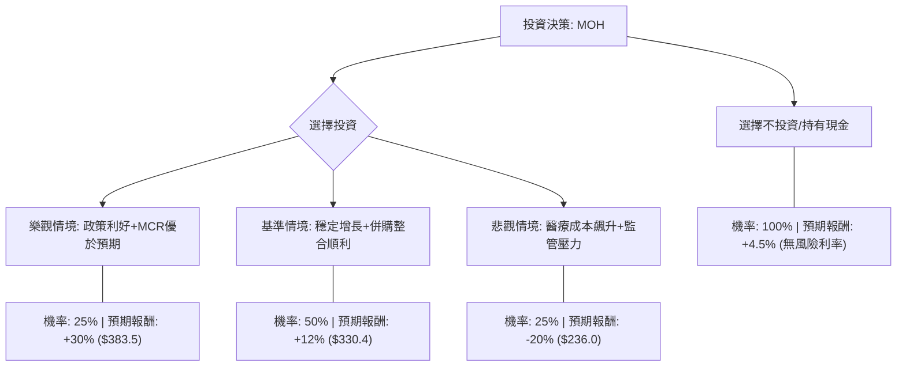

這份報告將針對 **Molina Healthcare (MOH)** 進行投資評估。MOH 主要經營政府資助的醫療保健計劃（Medicaid 與 Medicare），目前的市場環境受醫療成本比例（MCR）波動與政策風險影響較大。

---

### 1. 核心假設 (Core Assumptions)

在進行決策樹分析前，我們基於當前市場數據與財務預測（截至 2024 年 Q3）設定以下假設：

*   **當前股價：** 約 $295 USD。
*   **估值基準：** 預期前瞻本益比（Forward P/E）約 12x-14x。
*   **市場趨勢：** 
    1. **Medicaid 重新審查（Redetermination）：** 州政府審核資格導致會員流失，但每人平均收入可能提高。
    2. **醫療成本比例 (MCR)：** 受手術需求增加影響，MCR 是否能穩定在 88% 以下是關鍵。
    3. **併購成長：** MOH 擅長收購表現不佳的計劃並提高利潤。
*   **分析週期：** 12 個月。

---

### 2. 決策樹分析（Decision Tree）

我們將決策分為「投資」與「不投資（持有現金）」兩大路徑，並針對投資路徑設定三種情境：**樂觀（Bull）**、**基準（Base）**、**悲觀（Bear）**。

#### 節點詳細說明：

| 節點 (情境) | 發生機率 (P) | 預期報酬率 (R) | 預期股價目標 | 說明 |
| :--- | :--- | :--- | :--- | :--- |
| **樂觀情境 (Bull)** | 25% | +30% | $383.5 | 州政府費率補償優於預期，醫療成本意外下降。 |
| **基準情境 (Base)** | 50% | +12% | $330.4 | 符合財報預期，併購案順利挹注營收。 |
| **悲觀情境 (Bear)** | 25% | -20% | $236.0 | 聯邦資金削減，醫療需求爆發導致虧損。 |

---

### 3. 期望值計算過程 (Calculations)

#### (1) 投資 MOH 的總期望報酬率 (Expected Return, ER)
$ER = (P_{Bull} \times R_{Bull}) + (P_{Base} \times R_{Base}) + (P_{Bear} \times R_{Bear})$

*   $ER = (0.25 \times 0.30) + (0.50 \times 0.12) + (0.25 \times -0.20)$
*   $ER = 0.075 + 0.06 - 0.05$
*   $ER = 0.085$ (即 **8.5%**)

#### (2) 預期股價期望值 (Expected Value, EV)
$EV = (0.25 \times 383.5) + (0.50 \times 330.4) + (0.25 \times 236.0)$

*   $EV = 95.875 + 165.2 + 59.0$
*   $EV = \$320.075$

#### (3) 機會成本比較
*   **投資 MOH 期望值：** 8.5%
*   **不投資（美國國債/貨幣基金）：** ~4.5% (無風險利率)
*   **風險溢酬 (Risk Premium)：** 8.5% - 4.5% = **4.0%**

---

### 4. 最終結論

#### **判斷：適合投資 (慎重買入)**

#### **理由：**
1.  **正向期望值：** 經機率加權後的預期報酬率為 **8.5%**，高於目前的無風險利率（約 4.5%）。這顯示即便在考慮了 25% 的悲觀情況下，該投資仍具備統計學上的獲利優勢。
2.  **估值安全邊際：** 目前 MOH 的 P/E 約 12-13 倍，處於歷史區間的中低位，基準情境（+12%）實現的可能性較高。
3.  **產業護城河：** 雖然 Medicaid 重新審查帶來波動，但 MOH 的管理能力在同業中（如 Centene, Humana）相對穩健，且其專注於政府標案的特性使其具備長期抗週期性。

#### **投資建議建議：**
由於風險溢酬僅 4.0%，且悲觀情境下有 20% 的潛在跌幅，建議**採取分批進場策略**。若股價回落至 $280 以下，期望值將進一步提升，屆時投資價值更具吸引力。

---
**風險提示：** 本分析僅基於決策樹模型，未考量突發性的美國大選政策變動或聯邦健保法律的大幅修改。投資者應自行負擔市場風險。