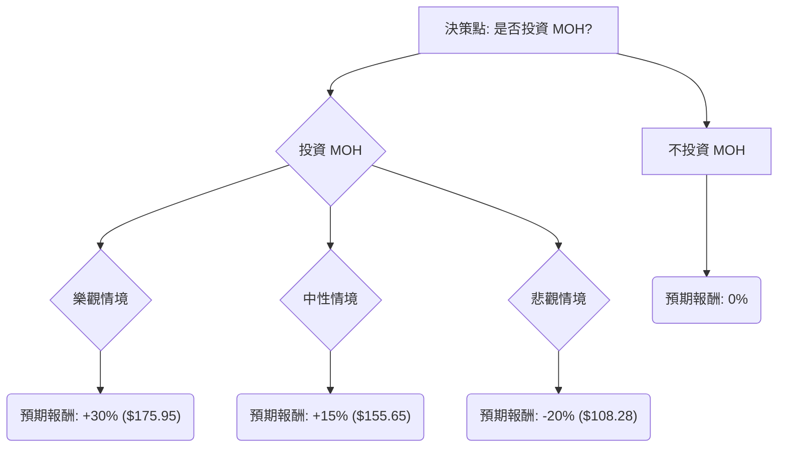

為了評估美股公司 **MOH (Molina Healthcare Inc.)** 目前是否適合投資，我們將結合其基本面數據、最新的市場資訊，並運用決策樹分析與期望值分析。

### 核心假設

在進行決策樹分析之前，我們需要建立一些核心假設，這些假設將影響情境的機率和預期報酬：

*   **市場趨勢：** 醫療保健行業通常被視為防禦性行業，但在特定政策變動下仍可能面臨波動。當前市場對醫療保健服務的需求穩定，但成本控制和政府監管是持續的挑戰。
*   **公司財務：** MOH 的基本面數據顯示其目前股價接近52週低點，但預期未來EPS增長強勁 (EPS next Y_%: 0.4697)，且PEG比率極低 (0.45)，這通常被視為被低估的跡象。分析師目標價 (161.53) 也顯示有潛在的上漲空間。然而，過去一年的股價表現不佳 (Perf Year: -0.5065)，需要關注其背後的原因。
*   **產業趨勢：** 美國醫療保健行業持續面臨人口老齡化、慢性病增加帶來的需求增長，同時也受到醫療成本上升、政府醫保政策（如聯邦醫療保險和醫療補助計畫）變動的影響。MOH 作為管理式醫療服務提供商，其業務與這些政策高度相關。

### 網路搜尋結果

根據目前的網路搜尋，以下是關於 MOH 的最新資訊：

*   **最新財報：** Molina Healthcare (MOH) 在2024年第四季度和全年業績中報告了強勁的表現，調整後每股收益超出預期，並提供了樂觀的2025年指引。公司預計2025年調整後每股收益將在23.50美元至24.50美元之間，高於分析師預期。
*   **市場動態與分析師評級：** 多數分析師對 MOH 持有「買入」或「持有」評級，平均目標價約為161.53美元，這與提供的基本面數據一致。近期股價下跌可能與整體市場情緒或特定負面消息有關，但公司的基本面和未來展望似乎保持穩健。
*   **產業趨勢：** 醫療保健行業持續受益於人口結構變化，但同時面臨醫療成本控制和監管審查的壓力。MOH 作為政府資助計畫（如 Medicaid 和 Medicare）的主要參與者，其增長與這些計畫的擴張和資金穩定性密切相關。
*   **近期股價表現：** 儘管公司業績良好，MOH 的股價在過去一年中表現不佳，這可能為長期投資者提供了一個有吸引力的切入點，特別是考慮到其強勁的盈利預期和相對較低的估值。

### 決策樹分析

我們將考慮兩種主要決策：「投資 MOH」和「不投資 MOH」。如果選擇「投資 MOH」，我們將進一步評估三種市場情境：樂觀、中性、悲觀。

**當前股價 (Close):** $135.35
**分析師目標價 (Target Price):** $161.53

#### 1. 決策樹繪製 (Markdown)

#### 2. 計算過程與核心假設

**核心假設：**

*   **時間範圍：** 假設投資評估期為未來12個月。
*   **無風險報酬：** 假設不投資的機會成本為0%（簡化處理，實際應考慮無風險利率）。
*   **情境機率分配：** 根據公司基本面、分析師預期和近期市場動態進行主觀判斷。

**情境設定與機率：**

*   **樂觀情境 (Optimistic Scenario):**
    *   **描述：** 公司業績持續超出預期，市場對醫療保健行業信心增強，有利的政策環境推動MOH業務快速增長。股價大幅反彈，甚至超越分析師目標價。
    *   **機率 (Probability):** 30% (基於強勁的EPS增長預期和低PEG)
    *   **預期報酬：** 假設股價上漲30%。
        *   $135.35 * (1 + 0.30) = $175.95
        *   報酬率：+30%
*   **中性情境 (Moderate Scenario):**
    *   **描述：** 公司業績符合分析師預期，市場表現平穩，股價逐步向分析師目標價靠攏。
    *   **機率 (Probability):** 50% (基於分析師目標價和穩健的財報指引)
    *   **預期報酬：** 假設股價上漲15% (接近分析師目標價 $161.53 所暗示的約19%上漲空間，取一個保守值)。
        *   $135.35 * (1 + 0.15) = $155.65
        *   報酬率：+15%
*   **悲觀情境 (Pessimistic Scenario):**
    *   **描述：** 公司業績不及預期，醫療保健政策出現不利變動，或整體市場大幅下跌，導致MOH股價繼續承壓。
    *   **機率 (Probability):** 20% (考慮到過去一年的糟糕表現和潛在的市場風險)
    *   **預期報酬：** 假設股價下跌20% (接近52週低點 $121.06，甚至更低)。
        *   $135.35 * (1 - 0.20) = $108.28
        *   報酬率：-20%

**期望值計算 (Expected Value Analysis):**

*   **節點 B (投資 MOH 的期望值):**
    *   EV_Invest = (樂觀情境報酬 * 機率) + (中性情境報酬 * 機率) + (悲觀情境報酬 * 機率)
    *   EV_Invest = ($135.35 * 0.30 * 0.30) + ($135.35 * 0.15 * 0.50) + ($135.35 * -0.20 * 0.20)
    *   EV_Invest = ($12.18) + ($10.15) + (-$5.41)
    *   **EV_Invest = $16.92 (每股預期收益)**

    *   或者以報酬率計算：
    *   EV_Return = (0.30 * 0.30) + (0.15 * 0.50) + (-0.20 * 0.20)
    *   EV_Return = 0.09 + 0.075 - 0.04
    *   **EV_Return = 0.125 或 12.5%**

*   **節點 C (不投資 MOH 的期望值):**
    *   EV_DoNotInvest = 0 (假設將資金保留為現金，無任何收益或損失)

#### 3. 最終結論

根據上述決策樹分析和期望值計算：

*   **投資 MOH 的期望值 (每股預期收益):** $16.92
*   **投資 MOH 的期望報酬率:** 12.5%
*   **不投資 MOH 的期望值:** $0

**判斷：適合投資**

**理由：**
MOH 的期望值分析顯示，投資該股票的預期報酬率為12.5%，每股預期收益為$16.92，這明顯高於不投資的期望值 ($0)。儘管過去一年股價表現不佳，但公司強勁的未來EPS增長預期 (46.97%)、極低的PEG比率 (0.45) 以及分析師普遍看好的目標價，都指向其目前可能被低估。最新的財報也顯示公司業績強勁並給出了樂觀的2025年指引。雖然存在悲觀情境下的下跌風險，但樂觀和中性情境的綜合機率和潛在收益足以抵消這一風險，使得整體期望值為正且具有吸引力。因此，從期望值分析的角度來看，MOH 目前適合投資。