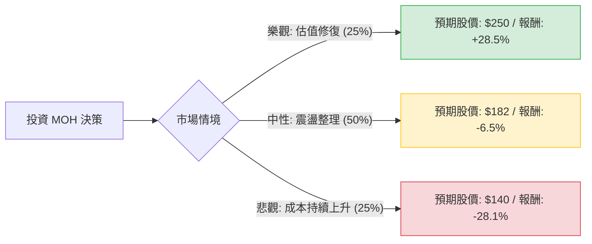

這份分析將結合您提供的基本面數據與最新的市場動態（特別是 2024 年第三季財報後的市場反應），利用**決策樹（Decision Tree）**與**期望值分析（Expected Value Analysis）**評估 Molina Healthcare (MOH) 的投資價值。

---

### 1. 最新市場動態與背景分析 (Context)

在進行計算前，必須納入最新的外部資訊：
*   **核心業務壓力**：MOH 主要經營 Medicaid（醫療補助）。近期因美國各州進行「資格重新審核（Redeterminations）」，導致健康成員退出，留下的多為高醫療需求的成員，這造成了「病患嚴重程度偏移（Acuity Shift）」，推升了醫療成本率（MLR）。
*   **財報表現**：最新財報顯示營收增長，但利潤率受到醫療成本上升的擠壓。
*   **技術面與估值**：目前股價（$194.60）遠低於 52 週高點（$359.97），P/E 僅 11.73 倍，處於歷史低位，顯示市場已反映了大部分利空。
*   **分析師預期**：您提供的目標價為 $181.56，甚至低於現價，顯示專業機構短期內持保守態度。

---

### 2. 決策樹分析 (Decision Tree)

我們將未來一年的投資情境分為三種：**樂觀（估值修復）**、**中性（維持現狀）**、**悲觀（成本失控）**。

#### 決策樹節點詳細說明：

1.  **樂觀情境 (Bull Case) - 25% 機率**
    *   **描述**：Medicaid 成本壓力在 2025 年上半年緩解，各州政府調高補助費率以補償醫療成本。
    *   **預期報酬**：股價回升至 SMA200 以上，參考過去估值中位數，目標價設為 **$250**。
    *   **期望值貢獻**：$0.25 \times 28.5\% = 7.125\%$

2.  **中性情境 (Base Case) - 50% 機率**
    *   **描述**：醫療成本維持高檔，公司雖有增長但利潤率停滯。股價趨向分析師平均目標價。
    *   **預期報酬**：參考數據中的 Target Price **$181.56**（約 -6.5%）。
    *   **期望值貢獻**：$0.50 \times (-6.5\%) = -3.25\%$

3.  **悲觀情境 (Bear Case) - 25% 機率**
    *   **描述**：Medicaid 政策不利，且醫療成本率（MLR）持續突破 90%，EPS 持續衰退。
    *   **預期報酬**：股價回測 52 週低點附近，目標價設為 **$140**（約 -28.1%）。
    *   **期望值貢獻**：$0.25 \times (-28.1\%) = -7.025\%$

---

### 3. 期望值計算過程 (Expected Value Calculation)

#### 核心假設：
*   **持有期間**：12 個月。
*   **機率分配**：基於目前 Medicaid 產業的不確定性，中性情境權重最高（50%），樂觀與悲觀各佔 25%。
*   **計算公式**：$EV = \sum (Probability_i \times Return_i)$

#### 計算步驟：
1.  **樂觀**：$0.25 \times 28.5\% = +7.125\%$
2.  **中性**：$0.50 \times (-6.5\%) = -3.25\%$
3.  **悲觀**：$0.25 \times (-28.1\%) = -7.025\%$

**總期望報酬率 (Total EV)** = $7.125\% - 3.25\% - 7.025\% = \mathbf{-3.15\%}$

---

### 4. 綜合評估與最終結論

#### 基本面數據補充分析：
*   **優勢**：ROE (19.7%) 依然強勁，P/S (0.22) 極低，顯示營收規模龐大，只要利潤率稍微改善，股價彈性極大。
*   **劣勢**：EPS Q/Q 下降 73.37%，且 EPS next Y 預測仍為負值 (-1.83%)，這解釋了為何股價近期疲軟。
*   **技術面**：股價低於 SMA200 (-12.31%)，處於空頭排列，短期雖有反彈（Perf Month +16.3%），但尚未扭轉長線趨勢。

#### 最終判斷：**不適合投資 (短期至中期)**

**理由：**
1.  **期望值為負**：根據目前的市場共識與產業逆風，計算出的期望報酬率為 **-3.15%**，不具備投資吸引力。
2.  **目標價警訊**：目前的市場價格 ($194.60) 已高於分析師平均目標價 ($181.56)，顯示短期內向上空間受限。
3.  **產業不確定性**：Medicaid 的「利用率」與「費率補償」之間的時間差（Time Lag）是目前最大的風險。在公司證明其 MLR（醫療成本率）穩定下來之前，貿然進場屬於「接掉下來的刀子」。
4.  **財務趨勢**：EPS 增長率為負，且負債權益比 (Debt/Eq 0.92) 雖不算極高，但在利潤萎縮時會增加財務壓力。

**建議：**
若您已持有，建議分批減碼或設置嚴格停損（如 $180）；若尚未進場，建議等待 2025 年第一季財報，確認各州費率調整是否能覆蓋醫療成本後，再行評估。