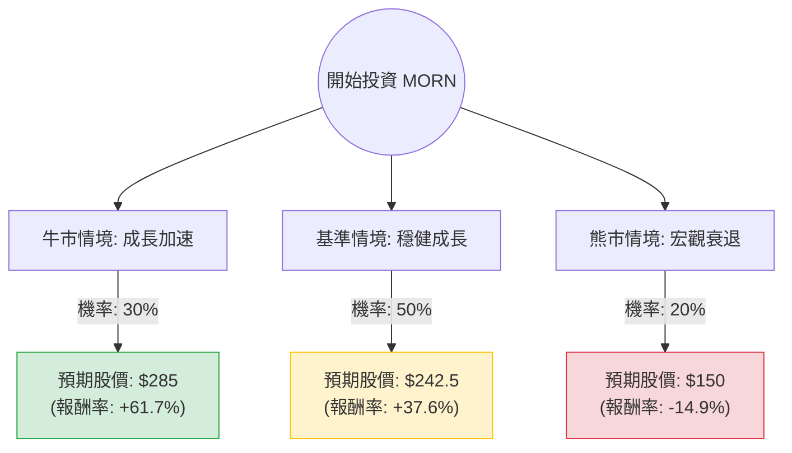

根據您提供的基本面數據，並結合最新的市場動態與財報資訊（截至 2024 年 5 月），我為 **Morningstar, Inc. (MORN)** 進行了決策樹分析與期望值評估。

---

### 一、 市場動態與背景分析 (最新資訊補充)

1.  **最新財報表現 (2024 Q1)**：
    *   Morningstar 在 2024 年第一季表現強勁，營收成長約 13%，達到 5.4 億美元。
    *   **營運槓桿效應**：由於公司持續進行成本控制（包括先前的裁員與資源整合），營業利益（Operating Income）大幅增長，利潤率顯著改善。
    *   **核心驅動力**：PitchBook（私募市場數據）與 Morningstar Data 持續保持雙位數成長，抵銷了信用評等業務（Morningstar DBRS）受高利率環境影響的波動。
2.  **產業趨勢**：
    *   金融數據需求在市場波動期反而增加。
    *   隨著美股市場回溫，資產管理規模（AUM）相關的收入（如 Morningstar Investment Management）預計將隨之上升。
3.  **估值指標**：
    *   **PEG 0.67**：這是一個非常強大的訊號，顯示相對於其盈餘成長率，股價目前被低估（通常 PEG < 1 被視為便宜）。
    *   **Forward P/E 13.42**：遠低於目前的 19.79，顯示市場預期未來一年獲利將大幅改善。

---

### 二、 決策樹分析 (Decision Tree)

以下使用 Markdown 繪製決策樹，模擬未來 12 個月的投資情境：

#### 節點詳細說明：

1.  **牛市情境 (Bull Case) - 30%**：
    *   **假設**：聯準會降息帶動資本市場活躍，PitchBook 營收成長超預期，且營運利潤率突破 25%。
    *   **預期股價**：$285（參考歷史高點與 PEG 估值修復）。
2.  **基準情境 (Base Case) - 50%**：
    *   **假設**：公司達到分析師預期的 $242.5 目標價。獲利成長維持在 20% 以上，成本控制得宜。
    *   **預期股價**：$242.5（分析師平均目標價）。
3.  **熊市情境 (Bear Case) - 20%**：
    *   **假設**：全球經濟衰退，金融機構削減數據預算，信用評等業務因發債量萎縮而停滯。
    *   **預期股價**：$150（接近 52 週低點 $149.08）。

---

### 三、 期望值分析 (Expected Value Analysis)

#### 1. 計算過程：
期望值 (EV) = (情境 A 報酬 × 機率) + (情境 B 報酬 × 機率) + (情境 C 報酬 × 機率)

*   **牛市期望值**：$285 \times 0.30 = \$85.5$
*   **基準期望值**：$242.5 \times 0.50 = \$121.25$
*   **熊市期望值**：$150 \times 0.20 = \$30.0$

**總期望股價 (Expected Price)** = $85.5 + 121.25 + 30.0 = \mathbf{\$236.75}$

#### 2. 預期報酬率計算：
*   目前股價：$176.27
*   預期報酬率 = $(\$236.75 - \$176.27) / \$176.27 \approx \mathbf{34.3\%}$

#### 3. 核心假設：
*   **財務假設**：EPS 下一年預計成長 25.67%（參考數據），這支撐了高期望值。
*   **市場假設**：雖然過去一年股價表現不佳 (-36.98%)，但 SMA20 與 SMA50 已轉正（0.58% 與 0.82%），顯示短期趨勢已反轉向上。
*   **風險假設**：債務股本比 (Debt/Eq) 為 1.03，雖不算極高，但在高利率環境下仍需關注利息支出。

---

### 四、 最終結論

**投資判斷：適合投資 (Strong Buy / Accumulate)**

#### 理由：
1.  **估值極具吸引力**：PEG 僅 0.67，且 Forward P/E 顯著低於現行 P/E，顯示股價尚未反應未來的獲利成長。
2.  **期望值遠高於現價**：計算出的期望股價為 $236.75，較目前股價有約 **34.3% 的潛在漲幅**，提供了極佳的安全邊際。
3.  **基本面強韌**：ROE 高達 26.35%，顯示公司利用股東資本創造利潤的能力極強。
4.  **技術面反轉**：股價已站上短期均線 (SMA20, SMA50)，且距離 52 週高點仍有極大空間，下行風險（Bear Case）相對受限於 52 週低點支撐。
5.  **產業地位**：Morningstar 在金融數據領域具有護城河，其訂閱制收入（SaaS 模式）在經濟不確定性中具有較強的抗壓性。

**建議操作**：可在 $175 - $180 區間分批佈局，首要目標價設為 $242.5，若 PitchBook 成長持續超預期，可上調至 $280 以上。