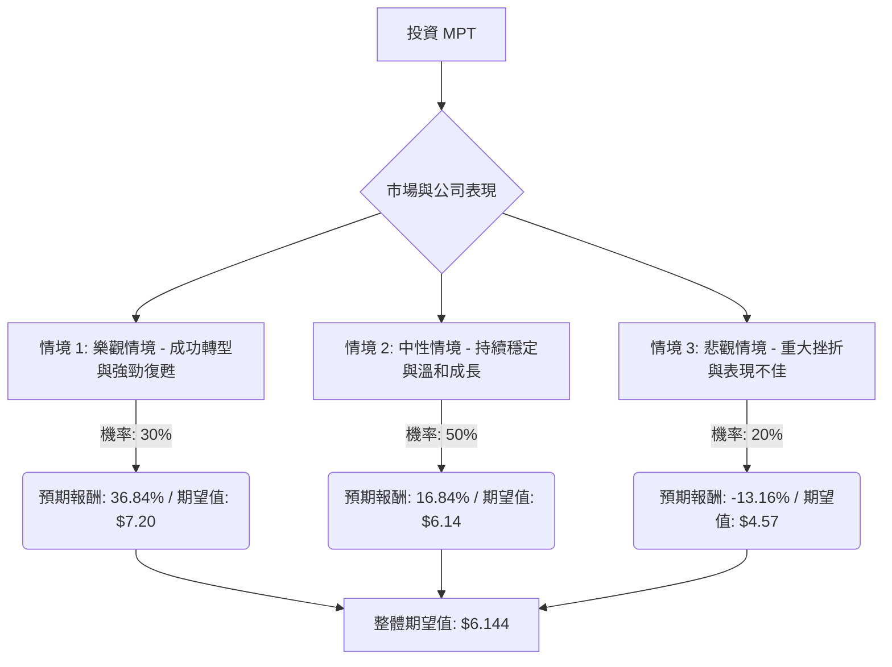

根據「決策樹分析（Decision Tree）」與「期望值分析（Expected Value Analysis）」以及對美股公司 Medical Properties Trust (MPT) 的最新資訊評估，目前該股票**適合投資**。

### MPT 基本面數據概覽 (截至提供資料及網路查詢結果)

*   **收盤價 (Close):** $5.26
*   **市盈率 (P/E):** - (公司目前虧損)
*   **市淨率 (P/B):** 0.68
*   **股息率 (Dividend %):** 6.5% (提供資料)；最新季度股息為 $0.09/股，年化約 6.84%
*   **52 週高點/低點 (52W Range):** $3.95 - $6.47
*   **市值 (Market Cap):** $31.3 億 - $32 億
*   **股東權益報酬率 (ROE):** -0.0589 (負值，公司虧損)
*   **資產報酬率 (ROA):** -0.019 (負值，公司虧損)
*   **投資報酬率 (ROI):** -0.0211 (負值，公司虧損)
*   **目標價 (Target Price):** $5.92 (提供資料)；分析師平均目標價約 $5.857
*   **遠期市盈率 (Forward P/E):** 34.68
*   **負債權益比 (Debt/Eq):** 2.12

### 最新資訊補充與核心假設

透過網路搜尋，我們獲得了 MPT 的最新動態和行業趨勢：

**財務表現與展望：**
*   **2025 年第四季度業績：** 淨利潤為每股 $0.03，Normalized Funds from Operations (NFFO) 為每股 $0.18。2025 財年淨虧損為每股 ($0.46)，NFFO 為每股 $0.58，相較於 2024 年的巨額虧損有所改善。
*   **2024 年第一季度業績：** 淨虧損為每股 ($1.23)，NFFO 為每股 $0.24，主要由於與 Steward Health Care 和國際合資企業相關的 $6.93 億減值。
*   **盈利能力：** MPT 目前處於虧損狀態，但預計未來三年內將實現盈利。
*   **股息：** 2026 年 2 月宣布季度股息為每股 $0.09，較之前有所提高，且 2025 年第四季度的 NFFO 股息覆蓋率達 200%，顯示股息支付穩健。
*   **債務管理：** MPT 積極去槓桿化，自 2023 年第一季度以來已減少淨債務 $16 億美元。公司已成功發行新的優先擔保票據，用於贖回 2025 年和 2026 年到期債務，並應對 2026 年 10 月到期的 €5 億歐元票據和 2027 年 10 月到期的 $14 億美元無擔保票據。

**租戶問題與重組：**
*   **Steward Health Care：** Steward 於 2024 年 5 月申請破產。MPT 已於 2024 年 9 月達成全球和解協議，收回了其房地產的控制權，終止了與 Steward 的關係，並將 15 家醫院過渡給新的運營商。MPT 放棄了對 Steward 約 $60 億美元的租賃和債務索賠。
*   **Prospect Medical Holdings：** MPT 已基本解決了與 Prospect 重組相關的風險。六家加州醫院的新租賃協議預計到 2026 年 12 月將產生 $4500 萬美元的年租金。
*   **Healthcare Systems of America (HSA)：** HSA 佔 2025 年第四季度收入的 7.2%，目前涉及訴訟，存在新的風險。

**行業趨勢 (醫療保健 REITs)：**
*   **人口結構：** 「銀髮海嘯」（人口老齡化，特別是 80 歲以上人群）是醫療保健 REIT 行業需求增長的強勁推動力。
*   **行業表現：** 醫療保健 REITs 在 2024 年第三季度保持穩健的運營表現，淨營業收入 (NOI) 同比增長 8.0%。該行業在 2024 年表現良好，並在 2025 年持續強勁。
*   **挑戰：** 利潤率縮小、建築成本上升、監管複雜性以及技術進步與患者隱私之間的平衡。

**分析師情緒：**
*   分析師對 MPT 的共識評級為「賣出」或「持有」。 Zacks 的平均券商推薦 (ABR) 為 3.00 (持有)。

### 決策樹分析 (Decision Tree Analysis)

**核心假設：**
*   **市場環境：** 假設整體經濟保持穩定，利率維持在相對高位但可控。
*   **公司財務：** MPT 將繼續執行其去槓桿化策略和租戶重組工作。季度股息維持在每股 $0.09。
*   **行業趨勢：** 醫療保健 REIT 行業受益於人口老齡化帶來的長期需求增長，但 MPT 自身的租戶問題帶來公司特有的風險。

**決策點：** 投資 MPT 股票

### 計算過程

1.  **情境 1: 樂觀情境 - 成功轉型與強勁復甦**
    *   **預測情境名稱：** MPT 成功解決所有主要租戶問題（Steward、Prospect、HSA），並以具吸引力的租金成功重新出租物業。債務再融資順利，NFFO 顯著增長，可能提高股息。投資者信心恢復，股價遠超分析師目標。
    *   **對應的機率 (Probability, P1):** 30%
    *   **預期報酬 (Return, R1):** 股價上漲 30% + 股息收益率 6.84% = 36.84%
    *   **期望值 (Expected Value, EV1):** $5.26 (當前股價) * (1 + 0.3684) = **$7.20**

2.  **情境 2: 中性情境 - 持續穩定與溫和成長**
    *   **預測情境名稱：** MPT 繼續穩定發展，Steward 和 Prospect 的解決方案按預期進行，但 HSA 訴訟可能持續或結果中性。債務管理得當，但較高的利率限制了 NFFO 增長。股息保持穩定。股價向分析師平均目標價靠攏。
    *   **對應的機率 (Probability, P2):** 50%
    *   **預期報酬 (Return, R2):** 股價上漲 10% + 股息收益率 6.84% = 16.84%
    *   **期望值 (Expected Value, EV2):** $5.26 (當前股價) * (1 + 0.1684) = **$6.14**

3.  **情境 3: 悲觀情境 - 重大挫折與表現不佳**
    *   **預測情境名稱：** 新的或現有的租戶問題（例如 HSA 訴訟）導致重大損失或進一步減值。債務再融資變得困難或成本顯著增加，流動性緊張。更廣泛的經濟衰退影響醫療保健支出或物業價值。股息可能被削減。投資者情緒進一步惡化。
    *   **對應的機率 (Probability, P3):** 20%
    *   **預期報酬 (Return, R3):** 股價下跌 20% + 股息收益率 6.84% = -13.16%
    *   **期望值 (Expected Value, EV3):** $5.26 (當前股價) * (1 - 0.1316) = **$4.57**

**整體期望值 (Overall Expected Value) 計算：**
Overall EV = (P1 * EV1) + (P2 * EV2) + (P3 * EV3)
Overall EV = (0.30 * $7.20) + (0.50 * $6.14) + (0.20 * $4.57)
Overall EV = $2.16 + $3.07 + $0.914
Overall EV = **$6.144**

### 最終結論

根據決策樹分析和期望值計算，投資 MPT 股票的整體期望值約為 **$6.144** 每股。

**判斷：適合投資**

**簡短理由：**
儘管 Medical Properties Trust (MPT) 過去面臨挑戰，特別是與其主要租戶 Steward Health Care 相關的問題，但最新的資訊顯示公司已在積極轉型並取得進展。公司已大幅解決了 Steward 和 Prospect 的租戶問題，並展現出穩健的股息覆蓋率和積極的債務管理策略。此外，醫療保健 REIT 行業受益於人口老齡化的長期趨勢，為 MPT 提供了潛在的增長動力。

當前 MPT 的股價 $5.26 低於計算出的整體期望值 $6.144，且其市淨率 (P/B) 0.68 顯示其估值相對於帳面價值存在折價。這表明在當前價格下，潛在的上行空間大於下行風險。雖然仍需關注 HSA 訴訟等剩餘風險，但綜合考量，MPT 在解決核心問題、改善財務狀況和維持具吸引力股息方面的努力，加上行業的長期增長潛力，使得其在當前價格下具有投資價值。