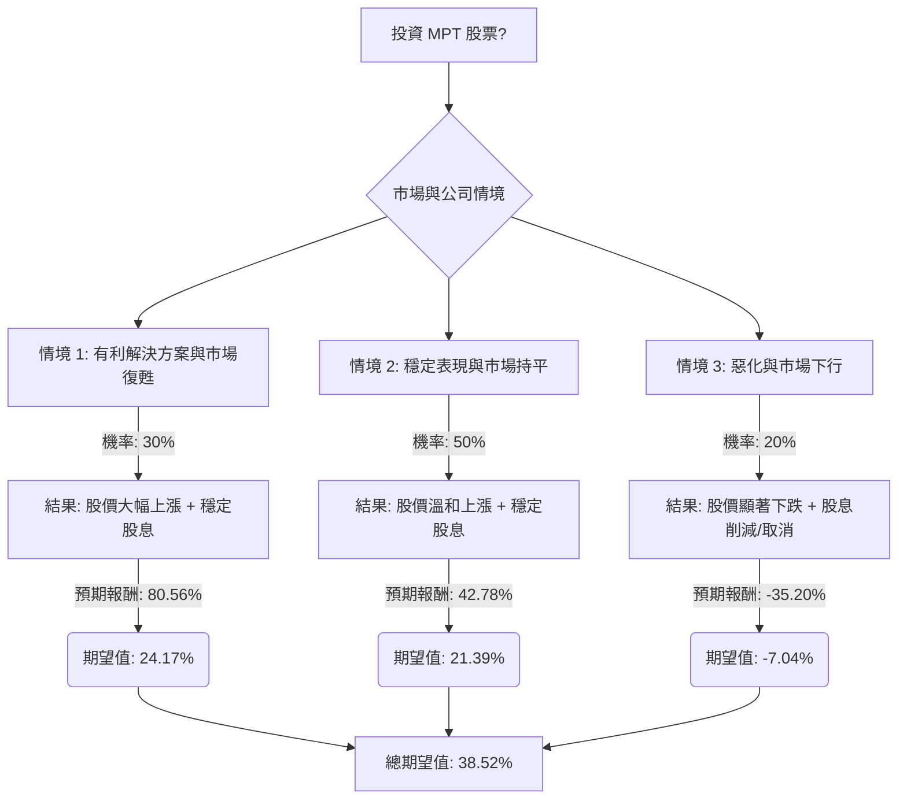

根據對美股公司 Medical Properties Trust (MPT) 的基本面數據、最新市場資訊、產業趨勢以及決策樹分析與期望值分析，以下是評估 MPT 目前是否適合投資的詳細報告。

### **MPT 基本面數據概覽 (截至 2026 年 4 月 6 日)**

*   **收盤價 (Close):** $4.63
*   **市盈率 (P/E):** - (負值，表示公司虧損)
*   **市淨率 (P/B):** 0.6
*   **股息率 (Dividend %):** 7.34% (基於舊數據，最新年化股息率約 7.78%)
*   **52 週高點 (52W High):** $6.47
*   **52 週低點 (52W Low):** $3.95
*   **市值 (Market Cap):** $2.77 億
*   **股東權益報酬率 (ROE):** -0.0589
*   **資產報酬率 (ROA):** -0.019
*   **投資報酬率 (ROI):** -0.0211
*   **分析師目標價 (Target Price):** 平均 $6.25 - $6.29 (範圍 $5.00 - $9.00)
*   **遠期市盈率 (Forward P/E):** 30.52
*   **本年度每股盈餘 (EPS this Y):** 1.2211
*   **下年度每股盈餘成長率 (EPS next Y_%):** 0.4918
*   **負債權益比 (Debt/Eq):** 2.12
*   **長期負債權益比 (LT Debt/Eq):** 1.85
*   **淨利率 (Profit Margin):** -0.2859 (-28.5%)
*   **分析師建議 (Recom):** 2.89 (接近「持有」)

### **最新市場資訊與產業趨勢**

1.  **近期財報與股息:** MPT 在 2026 年 2 月 19 日公布的 2025 年第四季度財報超出分析師預期。公司宣布將季度股息提高 12.5% 至每股 $0.09，並於 2026 年 4 月 9 日支付。這項股息上調被視為管理層對公司未來轉型成功的信心訊號。
2.  **股權回購計畫:** MPT 在 2025 年第三季度宣布了 $1.5 億的股票回購計畫，並在第四季度回購了 450 萬股股票，價值 $2340 萬。
3.  **租戶與債務問題:** MPT 面臨租戶違約和法律調查的審查。公司存在高槓桿 (9.6 倍) 和租戶信用質量問題。到 2027 年，有 $27 億的債務將到期。
4.  **流動性與再融資:** MPT 擁有強勁的流動性，並成功發行債券，有助於覆蓋債務到期，降低再融資風險並改善淨利潤。
5.  **商業房地產 (CRE) 市場展望:** 2024 年美國商業房地產市場前景複雜。多戶住宅和社區零售業表現強勁，而工業和辦公室領域則面臨逆風。辦公室空置率預計在 2024 年達到 19.8% 的峰值。
6.  **利率環境影響:** 商業抵押貸款 REIT (mREITs) 對利率變化高度敏感。預計 2024 年利率可能下降，這將降低 REITs 的借貸成本，並使其股息相對於債券更具吸引力。然而，貸款標準收緊、貸款機構減少和借貸成本上升，預計將在 2024 年持續對 CRE 投資者構成挑戰。
7.  **分析師評級:** 分析師對 MPT 的共識評級為「持有」，但也有部分「賣出」評級。平均目標價顯示有約 35% 的上漲潛力。

### **核心假設**

1.  **利率趨勢:** 假設聯準會將在 2024 年下半年開始降息，並在 2025 年持續，這將有利於 REITs 的融資成本和資產估值。
2.  **商業房地產市場:** 雖然整體 CRE 市場面臨挑戰，但醫療保健設施 REITs 可能相對穩定，但 MPT 自身的租戶問題仍是關鍵風險。
3.  **MPT 營運與財務:** 假設 MPT 管理層能夠有效應對租戶違約問題，並成功再融資到期債務，避免大規模資產減值或股息進一步削減。
4.  **股息可持續性:** 儘管過去一年 EPS 為負導致股息支付率不可持續，但近期股息上調和回購計畫表明管理層對未來現金流有信心。

### **決策樹分析 (Decision Tree Analysis)**

**決策點：投資 MPT 股票**

*   **當前股價:** $4.63
*   **最新年化股息:** $0.09/股 \* 4 = $0.36/股
*   **當前股息率:** $0.36 / $4.63 = 7.78%

#### **計算過程**

**1. 情境定義與機率分配：**

*   **情境 1: 有利解決方案與市場復甦 (Favorable Resolution & Market Recovery)**
    *   **描述:** MPT 成功解決主要租戶問題，有效管理債務到期，且商業房地產市場 (特別是醫療保健領域) 在利率下降的幫助下，復甦強於預期。分析師情緒轉為更積極。
    *   **機率 (P1): 30%**
        *   *理由:* 儘管存在風險，但管理層的股息上調和回購計畫顯示信心。利率下降的預期對 REITs 有利。
    *   **預期報酬計算:**
        *   假設股價達到分析師目標價的高端 (例如 $8.00)。
        *   股價上漲: ($8.00 - $4.63) / $4.63 = 0.7278 = 72.78%
        *   加上年化股息率: 7.78%
        *   **總預期報酬:** 72.78% + 7.78% = **80.56%**
    *   **期望值:** 0.30 \* 80.56% = **24.17%**

*   **情境 2: 穩定表現與市場持平 (Stable Performance & Mixed Market)**
    *   **描述:** MPT 繼續應對挑戰，但沒有出現新的重大負面事件。租戶問題得到控制但未完全解決。商業房地產市場保持混合態勢，部分領域改善，部分領域掙扎。利率適度下降，提供一定程度的緩解。MPT 維持當前股息。
    *   **機率 (P2): 50%**
        *   *理由:* 這與當前分析師普遍「持有」的共識相符，反映了持續的挑戰與潛在的穩定性。
    *   **預期報酬計算:**
        *   假設股價達到分析師平均目標價 (例如 $6.25)。
        *   股價上漲: ($6.25 - $4.63) / $4.63 = 0.3500 = 35.00%
        *   加上年化股息率: 7.78%
        *   **總預期報酬:** 35.00% + 7.78% = **42.78%**
    *   **期望值:** 0.50 \* 42.78% = **21.39%**

*   **情境 3: 惡化與市場下行 (Deterioration & Market Downturn)**
    *   **描述:** 租戶違約情況顯著惡化，MPT 難以再融資其將於 2027 年到期的大量債務，導致進一步的資產減值或股息削減。更廣泛的商業房地產市場經歷更深層次的低迷，或利率意外維持高位/上升，加劇 MPT 的財務壓力。
    *   **機率 (P3): 20%**
        *   *理由:* 負的 EPS、高槓桿、租戶信用質量問題 以及部分「賣出」評級 表明存在不可忽視的重大下行風險。
    *   **預期報酬計算:**
        *   假設股價跌至 $3.00 (低於 52 週低點 $3.95)。
        *   股價下跌: ($3.00 - $4.63) / $4.63 = -0.3520 = -35.20%
        *   假設股息削減或取消: 0%
        *   **總預期報酬:** -35.20% + 0% = **-35.20%**
    *   **期望值:** 0.20 \* -35.20% = **-7.04%**

**2. 總期望值計算：**

總期望值 = (情境 1 期望值) + (情境 2 期望值) + (情境 3 期望值)
總期望值 = 24.17% + 21.39% - 7.04% = **38.52%**

### **最終結論**

根據決策樹分析和期望值計算，投資 MPT 股票的**總期望值為 38.52%**。

**判斷：適合投資 (但帶有較高風險)**

**理由：**
儘管 MPT 面臨高槓桿、租戶信用質量問題以及商業房地產市場的整體逆風，但其最新的股息上調和股票回購計畫顯示管理層對公司轉型和未來表現的信心。分析師的平均目標價也預示著可觀的上漲空間。在預期利率可能下降的環境下，REITs 的融資成本有望降低，這對 MPT 這樣的抵押貸款 REIT 而言是利好。

然而，投資者應充分認識到 MPT 固有的高風險性質，包括其負的淨利率、不可持續的股息支付率 (基於過去的負 EPS) 以及潛在的租戶違約風險。38.52% 的高期望值在很大程度上依賴於「有利解決方案與市場復甦」情境的實現。因此，這項投資更適合風險承受能力較高，並願意承擔潛在波動以換取高回報的投資者。在做出投資決策前，建議密切關注 MPT 即將發布的財報 (預計 2026 年 4 月 23 日) 以及商業房地產市場和利率政策的最新動態。