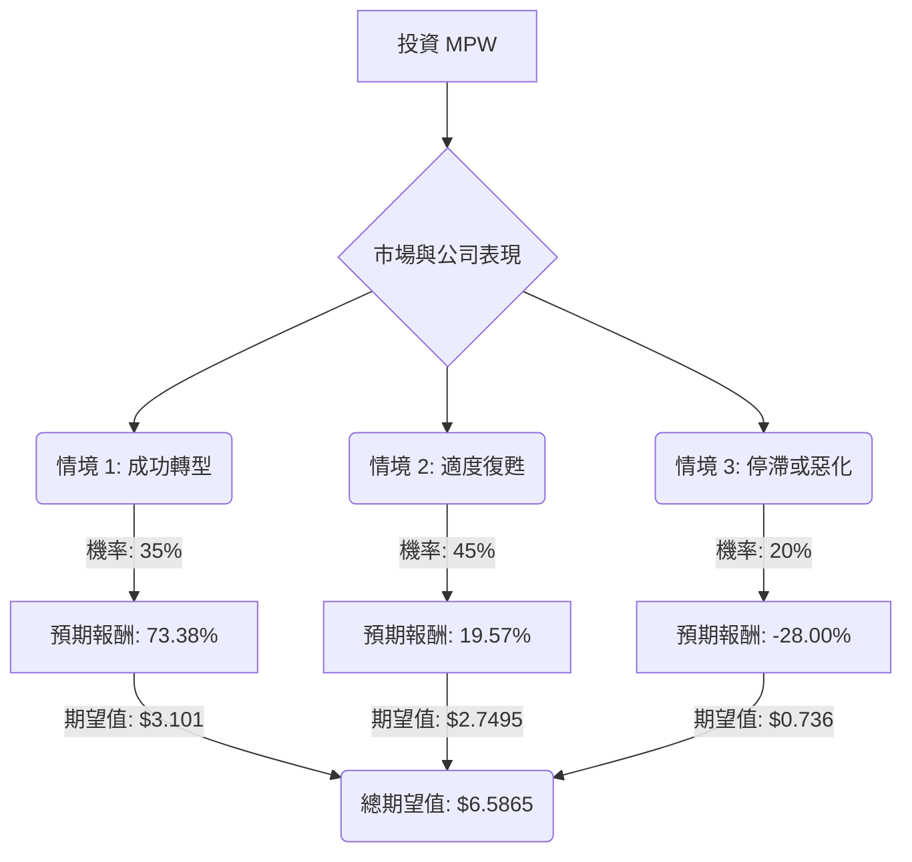

根據對 Medical Properties Trust (MPW) 的基本面數據和最新市場資訊的綜合分析，以下是基於決策樹分析和期望值分析的投資評估。

### **MPW 公司概況與最新動態**

Medical Properties Trust (MPW) 是一家專注於醫療保健設施的房地產投資信託 (REIT)，其商業模式是透過售後回租 (sale/leaseback) 策略，收購醫院設施並將其長期租賃給營運商，從而產生穩定的租金收入。

**最新基本面數據摘要：**

*   **股價 (Close):** $5.11
*   **市淨率 (P/B):** 0.66 (可能暗示被低估或存在重大問題)
*   **股息率 (Dividend %):** 約 6.45% - 7.04% (年化股息 $0.36，每季 $0.09)
*   **盈利能力 (ROE, ROA, ROI, Profit Margin):** 均為負值，顯示公司目前處於虧損狀態，且過去五年虧損加速。
*   **負債權益比 (Debt/Eq):** 2.06 (高槓桿，對 REIT 而言風險較高)
*   **遠期本益比 (Forward P/E):** 44.77 (高估值，但分析師預期未來盈利將顯著改善)
*   **分析師評級 (Recom):** 共識評級為「減持」或「持有」，平均目標價介於 $5.00 至 $7.10 之間。
*   **空頭持倉 (Short Float):** 0.3053 (高空頭興趣，市場存在疑慮)
*   **近期業績:** 2025 年第三季度淨虧損為每股 ($0.13)，調整後營運資金 (NFFO) 為每股 $0.13。營收年增 5.2%，但未達共識預期。
*   **租戶問題:** 過去曾面臨主要租戶 Steward Health Care 的破產問題和 Prospect Medical 的租金支付問題。目前，租戶問題已「大致解決」，管理層正專注於恢復增長，新營運商的現金租金收入預計將在 2026 年達到每年 10 億美元以上。
*   **股息可持續性:** 儘管近期股息有所增加 (2025 年 11 月增至每股 $0.09)，但公司在 2023 和 2024 年曾兩次削減股息，且持續存在現金消耗和高負債問題，股息可持續性仍受質疑。
*   **行業趨勢:** 醫療保健 REIT 行業受益於有利的供需動態、人口結構紅利 (老齡化人口) 和行業的抗衰退性質。預計美國醫療保健房地產市場在 2025 年至 2030 年間將以 7.5% 的複合年增長率增長。

### **決策樹分析 (Decision Tree Analysis)**

我們將建立一個決策樹來評估投資 MPW 的潛在結果。

**核心假設：**

*   **市場環境：** 醫療保健房地產市場的長期增長趨勢將持續，受人口老齡化和醫療支出增加的推動。
*   **公司財務：** MPW 管理層將繼續努力解決租戶問題、優化資產組合並管理其高額債務。
*   **利率環境：** 利率將保持穩定或適度下降，以減輕再融資成本壓力。

**決策樹結構：**

**節點說明與計算：**

*   **起始節點 (A): 投資 MPW**
    *   當前股價：$5.11

*   **決策節點 (B): 市場與公司表現**
    *   此節點代表未來一年內 MPW 可能面臨的不同市場和公司營運情境。

*   **情境 1: 成功轉型 (Successful Turnaround)**
    *   **預測情境名稱:** MPW 成功解決剩餘租戶問題，以有利條件重新出租物業，顯著提高盈利能力，並有效管理債務。市場對其業務模式和股息可持續性重拾信心。
    *   **機率 (Probability):** 35%
        *   理由：基於租戶問題「大致解決」、新營運商租金收入預期增長、以及醫療保健 REIT 行業的長期利好趨勢。然而，考慮到過去的挑戰和高負債，成功轉型仍存在不確定性。
    *   **預期報酬 / 期望值 (Expected Value) 計算：**
        *   假設未來一年股價 (Future Stock Price): $8.50 (反映顯著復甦，可能達到或超過部分分析師的樂觀目標)
        *   假設未來一年股息 (Dividends): $0.36 (基於當前年化股息 $0.09/季)
        *   總未來價值 (Total Future Value per share): $8.50 + $0.36 = $8.86
        *   預期報酬率 (Expected Return Rate): ($8.86 - $5.11) / $5.11 = 73.38%
        *   **期望值 (EV1):** 0.35 * $8.86 = **$3.101**

*   **情境 2: 適度復甦 (Moderate Recovery)**
    *   **預測情境名稱:** MPW 繼續穩定營運和租戶基礎，但盈利能力改善速度慢於預期，高額債務仍是主要負擔。股價在當前水平附近波動，股息得以維持但增長有限。
    *   **機率 (Probability):** 45%
        *   理由：這是最可能的情境，因為公司正在積極解決問題，但轉型需要時間，且高負債和利率成本仍是挑戰。分析師的共識目標價也多數落在這個區間。
    *   **預期報酬 / 期望值 (Expected Value) 計算：**
        *   假設未來一年股價 (Future Stock Price): $5.75 (略高於當前股價，符合分析師共識區間)
        *   假設未來一年股息 (Dividends): $0.36
        *   總未來價值 (Total Future Value per share): $5.75 + $0.36 = $6.11
        *   預期報酬率 (Expected Return Rate): ($6.11 - $5.11) / $5.11 = 19.57%
        *   **期望值 (EV2):** 0.45 * $6.11 = **$2.7495**

*   **情境 3: 停滯或惡化 (Stagnation/Further Deterioration)**
    *   **預測情境名稱:** 租戶問題再次浮現或出現新的問題，債務再融資變得更加困難和昂貴，公司未能實現盈利。這可能導致進一步的股息削減、資產以不利價格出售或股價大幅下跌。
    *   **機率 (Probability):** 20%
        *   理由：儘管有積極跡象，但 MPW 仍面臨高負債、持續虧損和過去租戶問題的風險。高空頭持倉也反映了市場對此風險的擔憂。
    *   **預期報酬 / 期望值 (Expected Value) 計算：**
        *   假設未來一年股價 (Future Stock Price): $3.50 (顯著下跌，接近分析師最低目標價或更低)
        *   假設未來一年股息 (Dividends): $0.18 (假設進一步削減股息，例如減半)
        *   總未來價值 (Total Future Value per share): $3.50 + $0.18 = $3.68
        *   預期報酬率 (Expected Return Rate): ($3.68 - $5.11) / $5.11 = -28.00%
        *   **期望值 (EV3):** 0.20 * $3.68 = **$0.736**

*   **總期望值 (Overall Expected Value):**
    *   總期望值 = EV1 + EV2 + EV3 = $3.101 + $2.7495 + $0.736 = **$6.5865**

### **最終結論**

根據決策樹分析和期望值計算，MPW 股票的整體期望值約為 **$6.59**。

由於計算出的整體期望值 ($6.59) 高於當前股價 ($5.11)，這表明從期望值的角度來看，**MPW 目前適合投資**。

**簡短理由：**

儘管 MPW 過去面臨挑戰且目前仍處於虧損狀態，但最新的市場資訊顯示，公司在解決租戶問題和增加現金租金收入方面取得了進展。醫療保健 REIT 行業的長期增長趨勢也為其提供了有利的宏觀環境。雖然存在高負債和盈利能力恢復速度的風險，但成功轉型和適度復甦的情境具有較高的機率和潛在回報，使得整體期望值呈現正向。投資者應意識到其固有的高風險性質，但目前的股價可能尚未完全反映其潛在的復甦價值。