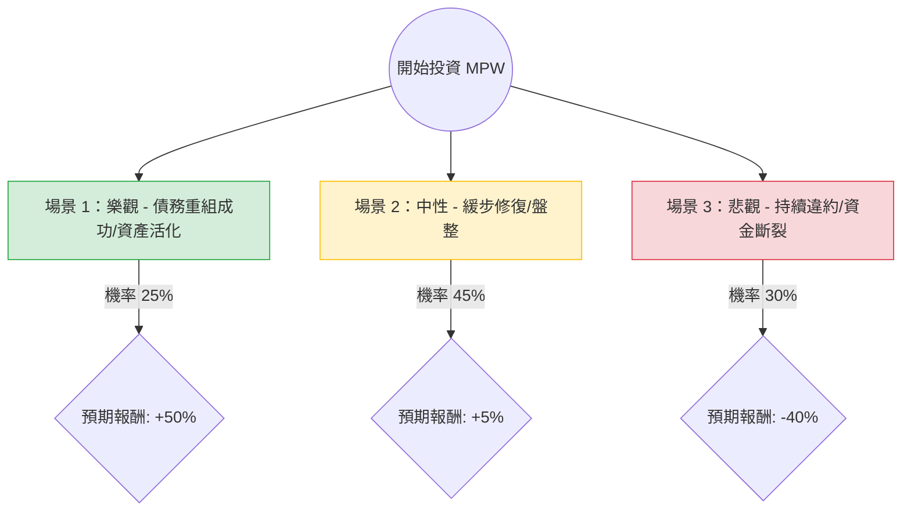

這份分析報告結合了您提供的基本面數據以及針對 **Medical Properties Trust (MPW)** 的最新市場動態（包含 Steward Health Care 破產進展、資產處置進度及利率環境）進行綜合評估。

---

### 一、 市場現況與最新動態分析 (Web Search Summary)

在進入決策樹前，我們先整理影響 MPW 的關鍵變數：
1.  **最大租戶問題**：Steward Health Care 已申請破產。最新進展顯示 MPW 已達成協議，收回其醫院經營權並與新運營商合作，這有助於恢復租金收入，但短期內仍有整合成本。
2.  **流動性與債務**：MPW 持續透過出售資產（如英國醫院資產、猶他州合資案）來償還債務。目前現金流狀況有所改善，但債務股本比（Debt/Eq 2.06）依然處於高位。
3.  **做空壓力**：空單餘額（Short Float）高達 30.78%，代表市場看空情緒極強，但也存在「軋空（Short Squeeze）」的潛在動力。
4.  **宏觀環境**：聯準會進入降息週期對 REITs（房地產投資信託）是重大利多，能降低再融資成本並提升資產估值。

---

### 二、 決策樹分析 (Decision Tree)

以下為 MPW 未來一年的投資決策路徑：

#### 節點詳細資訊：

| 預測情境 | 機率 (P) | 預期報酬 (R) | 說明 |
| :--- | :--- | :--- | :--- |
| **樂觀情境** | 25% | +50% | Steward 問題完全解決，新租戶順利接手，且 Fed 降息超預期。股價重回 $7.5 - $8。 |
| **中性情境** | 45% | +5% | 資產處置進度緩慢但足以覆蓋債務，股利維持現狀。股價在 $5 - $5.5 震盪。 |
| **悲觀情境** | 30% | -40% | 其他租戶出現連鎖違約，或資產出售價格遠低於帳面價值。股價回測 $3 以下。 |

---

### 三、 期望值分析 (Expected Value Analysis)

#### 1. 核心假設
*   **基準價格**：$5.14 (現價)
*   **持有期限**：12 個月
*   **股息收益**：預計 6.42% (假設不進一步減息)
*   **下行風險**：考慮到其 P/B 僅 0.66，帳面價值提供了一定支撐，但高槓桿可能導致破產風險。

#### 2. 期望值計算 (Expected Value, EV)
期望值計算公式：$EV = \sum (P_i \times R_i)$

*   **樂觀部分**：$0.25 \times 50\% = +12.5\%$
*   **中性部分**：$0.45 \times 5\% = +2.25\%$
*   **悲觀部分**：$0.30 \times (-40\%) = -12\%$

**總預期報酬率 (EV) = 12.5% + 2.25% - 12% = 2.75%**

#### 3. 納入股息後的總期望回報：
$2.75\% (\text{資本利得 EV}) + 6.42\% (\text{股息}) = 9.17\%$

---

### 四、 綜合評估與最終結論

#### 1. 基本面缺失與風險警示
*   **負利潤率**：Profit Margin 為 -75.84%，ROE 為 -14.02%，顯示目前公司處於嚴重虧損狀態。
*   **高做空比率**：30.78% 的空單代表機構法人極度不看好其基本面改善，投資者需承受極高波動。
*   **債務壓力**：2.06 的債務權益比在利率仍相對高位時，對現金流是極大考驗。

#### 2. 投資建議：**不適合投資 (或僅適合極小倉位投機)**

*   **判斷理由**：
    1.  **期望值吸引力不足**：雖然總期望回報為 9.17%，但這是建立在「承擔 30% 機率損失近半本金」的高風險之上。對於一般投資者而言，風險調整後的收益（Sharpe Ratio 概念）極低。
    2.  **基本面惡化尚未逆轉**：儘管 Steward 案有進展，但公司 ROE/ROA 均為負值，顯示核心獲利能力已受損。
    3.  **替代選擇多**：在目前降息預期下，市場上有許多資產負債表更健康（Debt/Eq < 1.0）且股息率在 4-5% 的優質 REITs，無需在 MPW 這種高度爭議且有破產風險的股票中博取回報。

*   **例外情況**：如果您是具備高風險承受能力的「逆向操作者」或「軋空交易者」，MPW 目前的低 P/B (0.66) 與高做空比率確實存在短線爆發可能，但這屬於**投機行為而非穩健投資**。

**結論：建議觀望，直到看到 Profit Margin 轉正或債務比率顯著下降。**