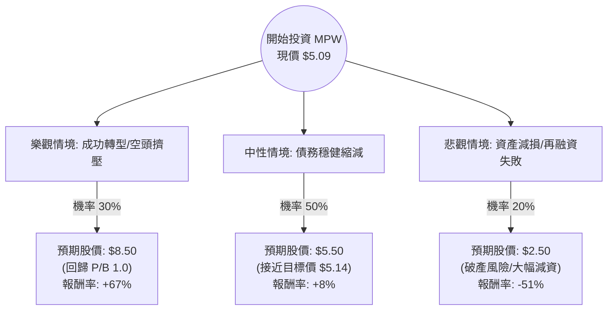

這份分析報告將結合您提供的基本面數據與最新的市場動態（特別是關於 Steward Health Care 的破產重組進展），利用**決策樹（Decision Tree）**與**期望值分析（Expected Value Analysis）**來評估 Medical Properties Trust (MPW) 的投資價值。

---

### 1. 核心背景與市場動態分析

在進入模型前，必須考慮以下關鍵即時資訊：
*   **Steward 問題解決：** MPW 最近與其最大租戶 Steward Health Care 達成和解，收回了醫院經營權並轉交給新運營商。這消除了長期以來最大的不確定性。
*   **債務壓力：** 數據顯示 Debt/Eq 高達 2.06，負債比重極高。公司正透過出售資產（如英國醫院）來償還債務。
*   **空頭部位：** Short Float 高達 31.34%，這意味著市場極度看空，但也存在「空頭擠壓（Short Squeeze）」的爆發潛力。
*   **利率環境：** 聯準會進入降息週期對 REITs 是利多，能減輕融資成本。

---

### 2. 決策樹分析 (Decision Tree)

我們將未來一年的情境分為三種：**樂觀（成功轉型）**、**中性（緩步修復）**、**悲觀（流動性危機）**。

---

### 3. 期望值計算過程 (Expected Value Calculation)

#### A. 核心假設
1.  **樂觀情境 (30%)**：Steward 醫院順利交接給新租戶且租金回收率高於預期；聯準會大幅降息；高空頭比例引發擠壓。目標價參考 P/B 接近 1.0 的水準。
2.  **中性情境 (50%)**：資產處置進度符合預期，債務緩步下降，股息維持在目前 0.08/季（年化約 6.3%）。股價維持在分析師平均目標價 $5.14 附近微升。
3.  **悲觀情境 (20%)**：新租戶支付能力出問題；高利率持續時間超預期導致再融資困難；資產賤賣導致帳面價值進一步崩跌。

#### B. 計算公式
$EV = \sum (機率 \times 預期股價)$

*   **樂觀節點：** $0.30 \times \$8.50 = \$2.55$
*   **中性節點：** $0.50 \times \$5.50 = \$2.75$
*   **悲觀節點：** $0.20 \times \$2.50 = \$0.50$

**總期望股價 (Expected Price) = $2.55 + 2.75 + 0.50 = \$5.80**

#### C. 預期報酬率
*   **預期總報酬 =** $[(\$5.80 - \$5.09) / \$5.09] + 6.49\% (\text{股息}) \approx 13.95\% + 6.49\% = \mathbf{20.44\%}$

---

### 4. 綜合評估與基本面數據解讀

*   **價值面 (P/B 0.66)：** 股價低於帳面價值 34%，顯示市場已計入大量資產減損風險。若資產品質穩定，這具備極高安全邊際。
*   **財務風險 (Debt/Eq 2.06)：** 這是 MPW 的致命傷。雖然 Quick Ratio 2.68 顯示短期流動性尚可，但長期債務壓力巨大。
*   **獲利能力 (Profit Margin -75.84%)：** 這是受 Steward 相關的一次性減損影響，不代表常態經營現金流，但反映了資產負債表的脆弱性。
*   **技術面 (SMA200 0.0336)：** 股價目前站上 200 日均線，顯示長期趨勢有築底回升跡象。

---

### 5. 最終結論

**判斷：適合投資 (Speculative Buy / 投機性買入)**

#### 理由：
1.  **期望值為正：** 經過加權計算，預期總報酬率約為 **20.44%**，顯著高於市場平均水平。
2.  **最壞情況已過：** 與 Steward 的和解是重大的轉折點，解決了過去兩年壓制股價的核心問題。
3.  **空頭擠壓潛力：** 31% 的空頭部位在利多消息刺激下，可能導致股價短線暴漲。
4.  **降息利多：** 作為高槓桿 REITs，MPW 對利率下行極為敏感。

**⚠️ 風險提示：**
MPW 仍屬於**高風險**標的。雖然期望值為正，但其「悲觀情境」有 20% 的機率導致 50% 以上的本金虧損。建議投資者僅以**少量倉位**參與，或將其視為高收益組合的一部分，而非核心持股。

**建議操作：**
*   若股價回測 $4.8 - $5.0 區間可分批布局。
*   停損位設在 $3.5 (52W Low 附近)。
*   首個獲利了結目標設在 $6.3 (52W High)。