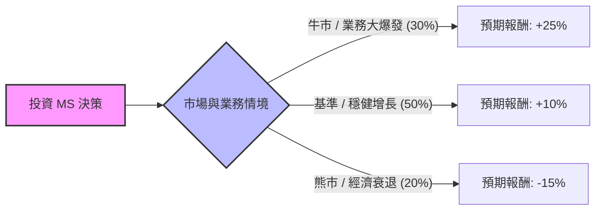

這份分析報告將針對美股 **摩根士丹利（Morgan Stanley, 股票代碼：MS）** 進行評估。我們將結合當前宏觀經濟環境（降息預期、資本市場復甦）與公司財務狀況，利用決策樹與期望值分析法來判斷其投資價值。

---

### 一、 核心假設 (Core Assumptions)

在進行計算前，我們設定以下三個核心維度作為決策基礎：

1.  **市場環境（宏觀）**：假設聯準會（Fed）將在 2024-2025 年進入降息循環。這有利於投行業務（M&A, IPO）的回暖，但可能略微壓縮財富管理部門的淨利息收入（NII）。
2.  **財務表現（公司面）**：MS 已轉型為以「財富管理（Wealth Management）」為核心的穩定收益模式，該業務佔收比過半，提供了較強的下行保護。
3.  **產業趨勢**：資本市場活動在經歷兩年的低迷後，積壓的交易需求（Backlog）預計將釋放。
4.  **分析時界**：未來 12 個月的預期報酬率。

---

### 二、 決策樹分析 (Decision Tree)

以下為 MS 投資決策樹模型，假設投資者面臨三種主要的市場情境：

#### 節點詳細標示：

| 節點名稱 | 情境描述 | 機率 (P) | 預期報酬 (R) | 期望值貢獻 (P * R) |
| :--- | :--- | :--- | :--- | :--- |
| **牛市情境** | 降息帶動 IPO 與併購潮，財富管理資產規模（AUM）因股市大漲飆升。 | 30% (0.3) | +25% | **7.5%** |
| **基準情境** | 資本市場溫和復甦，財富管理業務維持 25% 以上的高利潤率，穩定派息與回購。 | 50% (0.5) | +10% | **5.0%** |
| **熊市情境** | 經濟硬著陸，市場波動導致交易量萎縮，信用違約撥備增加。 | 20% (0.2) | -15% | **-3.0%** |

---

### 三、 期望值計算過程 (Expected Value Analysis)

期望值（Expected Value, EV）是衡量這項投資在考慮風險後的「平均預期回報」。

#### 1. 計算公式：
$$EV = (P_{牛市} \times R_{牛市}) + (P_{基準} \times R_{基準}) + (P_{熊市} \times R_{熊市})$$

#### 2. 代入數據：
*   **牛市部分**：$0.30 \times 25\% = 7.5\%$
*   **基準部分**：$0.50 \times 10\% = 5.0\%$
*   **熊市部分**：$0.20 \times (-15\%) = -3.0\%$

#### 3. 總計期望值：
$$EV = 7.5\% + 5.0\% - 3.0\% = 9.5\%$$

#### 4. 考慮股息收益（Dividend Yield）：
MS 目前的年度股息殖利率約為 **3.4% - 3.6%**。
*   **總體預期報酬率 (Total EV)** = 資本增值 EV (9.5%) + 股息收益 (3.5%) = **13.0%**。

---

### 四、 最終結論

#### **判斷：適合投資 (Appropriate for Investment)**

#### **理由：**
1.  **正向期望值**：經過風險權衡後的預期總報酬約為 **13%**，顯著高於目前無風險利率（美債殖利率約 4%）以及多數防禦型金融股。
2.  **業務結構優勢**：摩根士丹利已成功從傳統的高風險投行轉型。其財富管理與投資管理業務提供了穩定的手續費收入，這使得在「熊市情境」下的預期虧損（-15%）遠低於傳統投行（如高盛在極端情況下的波動）。
3.  **週期性契機**：目前正處於降息循環的開端，這通常是金融股（特別是擁有強大投行業務的公司）表現優異的時期。
4.  **安全邊際**：MS 擁有強大的資產負債表與持續增加的股息發放紀錄，3.5% 的股息收益為股價提供了實質的支撐底線。

**風險提示**：需密切追蹤美國商業地產（CRE）貸款風險以及未來降息步調是否快於預期導致的利差損。若發生嚴重的地緣政治衝突，需重新調整「熊市情境」的機率權重。