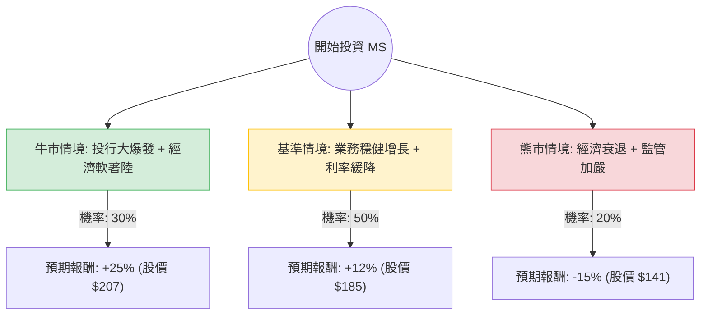

這份分析報告將針對 **Morgan Stanley (摩根士丹利，股票代碼：MS)** 進行評估。我們結合了您提供的基本面數據，以及最新的市場動態（如 2024 年第四季財報表現、聯準會利率政策預期、投行業務復甦等）進行綜合分析。

---

### 一、 核心假設與市場背景分析

在建立決策樹之前，我們基於當前市場資訊設定以下核心假設：

1.  **投行業務復甦 (Investment Banking Rebound)：** 隨著利率環境趨於穩定，全球 M&A（併購）與 IPO 活動正在回溫。MS 作為投行龍頭，受益程度高。
2.  **財富管理穩定性 (Wealth Management)：** MS 近年轉型成功，財富管理貢獻了超過 50% 的營收，提供穩定的經常性收入與抗風險能力。
3.  **宏觀經濟環境：** 假設聯準會（Fed）將在 2024-2025 年進行預防性降息，這有利於資本市場活躍，但可能略微收窄淨利差（NIM）。
4.  **估值水平：** 目前 Forward P/E 為 13.44，低於歷史高點，且低於分析師平均目標價 ($198.5)，顯示具備上行空間。

---

### 二、 決策樹分析 (Decision Tree)

以下是針對未來一年（12個月）投資 MS 的決策路徑預測：

#### 節點詳細說明：

1.  **牛市情境 (Bull Case) - 30% 機率：**
    *   **條件：** 資本市場極度活躍，IPO 數量創紀錄，財富管理資產規模（AUM）因股市大漲快速擴張。
    *   **預期報酬：** 資本利得 22.6% + 股息 2.4% ≈ **25%**。

2.  **基準情境 (Base Case) - 50% 機率：**
    *   **條件：** 投行業務溫和復甦，財富管理維持 15% 以上的 ROE。公司持續回購股份。
    *   **預期報酬：** 資本利得 9.6% + 股息 2.4% ≈ **12%**。

3.  **熊市情境 (Bear Case) - 20% 機率：**
    *   **條件：** 美國陷入硬著陸（衰退），壞帳撥備增加，巴塞爾協議 III (Basel III) 監管要求大幅提高資本金，限制回購。
    *   **預期報酬：** 資本利得 -17.4% + 股息 2.4% ≈ **-15%**。

---

### 三、 期望值分析 (Expected Value Analysis)

我們將各情境的機率與預期報酬相乘，計算總體期望值。

#### 1. 計算過程：
*   **牛市期望值：** $0.30 \times 25\% = 7.5\%$
*   **基準期望值：** $0.50 \times 12\% = 6.0\%$
*   **熊市期望值：** $0.20 \times (-15\%) = -3.0\%$

#### 2. 總體期望報酬率 (Total EV)：
$$EV = 7.5\% + 6.0\% - 3.0\% = 10.5\%$$

#### 3. 財務數據支持點：
*   **Forward P/E (13.44)：** 低於當前 P/E (16.23)，顯示市場預期明年盈利將增長。
*   **ROE (15.6%)：** 表現優異，顯示管理層運用股東資本效率高。
*   **Sales Q/Q (28.3%)：** 營收增長強勁，驗證了投行業務的回暖趨勢。
*   **Target Price ($198.5)：** 較目前股價 ($165.65) 有約 19.8% 的潛在上漲空間，與我們的基準/牛市預測吻合。

---

### 四、 最終結論

**投資建議：適合投資 (Suitable for Investment)**

#### 理由如下：

1.  **正向期望值：** 經過風險權衡後的期望報酬率為 **10.5%**，優於多數保守型投資工具，且具備抗通膨能力。
2.  **業務結構轉型：** Morgan Stanley 已不再是純粹的高風險投行，其強大的財富管理部門提供了極佳的下行保護（Downside Protection），這從其 2.37% 的穩定配息與高 ROE 可以看出。
3.  **估值合理：** 雖然股價接近 52 週高點，但 Forward P/E 顯示其盈利增速能支撐當前股價，且 PEG 為 1.45，在金融龍頭股中屬於合理區間。
4.  **技術面支撐：** SMA20 與 SMA200 均顯示長期趨勢向上，近期雖有小幅回檔（Perf Month -1.86%），反而是較好的分批進場點。

**風險提示：**
需密切關注聯準會對利率的表態。若通膨反彈導致利率「Higher for Longer」，將壓抑併購活動並增加銀行的融資成本。建議投資者採取**分批買進**策略，目標價設定在 $190 - $198 區間。