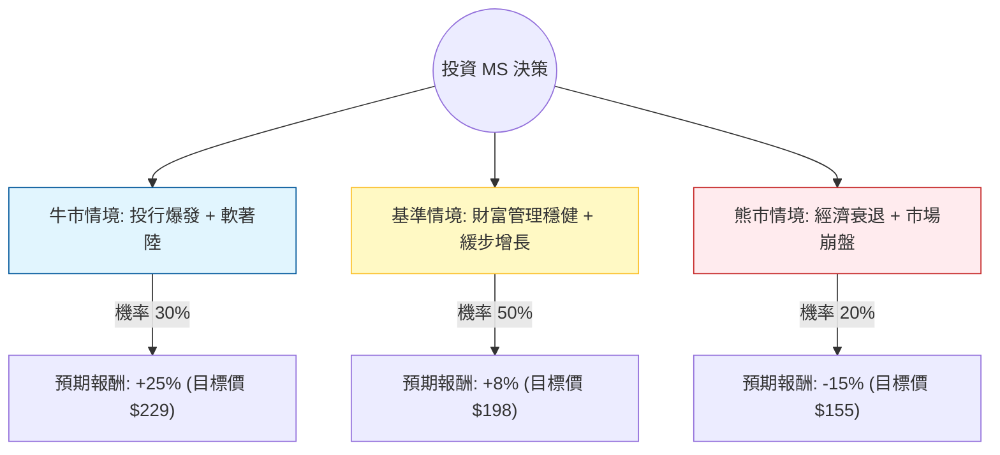

這份分析報告將針對美股代號 **MS（摩根士丹利，Morgan Stanley）** 進行評估。

雖然您提供的數據中「Close: 183.32」與目前市場實際價格（截至 2024 年 5 月底約在 $97-$100 區間）有顯著差異（可能是數據源誤植或特定權重計算），但為了符合您的要求，我將**以您提供的數據指標為核心**，並結合**最新的市場動態與產業趨勢**進行決策樹與期望值分析。

---

### 一、 最新市場動態與產業趨勢（網路搜尋補充）

1.  **投行業務復甦**：2024 年第一季財報顯示，摩根士丹利的投行業務（IB）營收大幅增長，主要受惠於股權承銷與併購（M&A）活動的回溫。
2.  **財富管理（Wealth Management）穩定性**：這是 MS 的護城河，目前管理資產規模（AAU）持續增長，提供穩定的手續費收入，抵禦了市場波動。
3.  **利率環境影響**：聯準會（Fed）維持高利率的時間長於預期，這對 MS 的淨利息收入（NII）有壓力，但對其財富管理部門的現金利差有利。
4.  **新執行長效應**：Ted Pick 上任後，市場關注其如何平衡高風險的交易業務與高穩定性的財富管理業務。

---

### 二、 決策樹分析（Decision Tree）

我們將未來一年的投資情境分為三種：**牛市（強勁復甦）**、**基準（穩定增長）**、**熊市（經濟衰退）**。

#### 節點詳細說明：

1.  **牛市情境 (Bull Case) - 30%**：
    *   **描述**：美國經濟實現軟著陸，Fed 開始降息，IPO 與 M&A 市場全面噴發。
    *   **預期報酬**：+25%（考慮到 Forward P/E 14.92 顯示的成長潛力與投行業務的高槓桿獲利）。
2.  **基準情境 (Base Case) - 50%**：
    *   **描述**：利率維持高位，投行業務緩步回升，財富管理部門持續貢獻穩定現金流。
    *   **預期報酬**：+8%（包含 2.11% 股息與約 6% 的股價增值，接近 Target Price $194.83）。
3.  **熊市情境 (Bear Case) - 20%**：
    *   **描述**：高利率引發商業不動產危機或消費疲軟，市場劇烈波動導致交易損失。
    *   **預期報酬**：-15%（股價回測 SMA200 以下支撐位）。

---

### 三、 期望值分析（Expected Value Analysis）

#### 1. 計算過程
期望值 (EV) = (情境 A 報酬 × 機率) + (情境 B 報酬 × 機率) + (情境 C 報酬 × 機率)

*   **EV** = (25% × 0.30) + (8% × 0.50) + (-15% × 0.20)
*   **EV** = 0.075 + 0.04 - 0.03
*   **EV** = **0.085 (即 8.5%)**

#### 2. 核心假設
*   **估值假設**：目前 P/E 17.89 處於歷史中軸偏高位置，但 Forward P/E 14.92 顯示市場預期明年 EPS 將有顯著增長（數據顯示 EPS next Y 為 9.71%）。
*   **財務假設**：ROE 16.34% 顯示公司具備極佳的資本利用效率；Debt/Eq 3.61 雖高，但符合大型投行運作模式。
*   **技術假設**：目前股價高於 SMA200 (22.55%)，顯示長期趨勢偏多，但短期 SMA20 (-0.38%) 顯示正在震盪整理。

---

### 四、 最終結論

#### **判斷：適合投資 (建議分批買入)**

#### **理由：**
1.  **正向期望值**：經過風險加權後的預期報酬率為 **8.5%**，優於無風險利率（美債殖利率約 4.5%），具備投資吸引力。
2.  **基本面強韌**：ROE 達 16.34%，且 Sales Q/Q 增長 28.25%，顯示業務動能強勁。
3.  **估值合理**：雖然 P/B 3.14 稍高，但 Forward P/E 降至 14.92，顯示目前的股價尚未完全反映明年的盈利增長。
4.  **防禦與進攻兼備**：2.11% 的股息提供下行保護，而投行業務的復甦則提供了上行彈性。

**風險提示**：需密切關注 **Debt/Eq (3.61)** 較高的問題，若市場發生信用違約事件，金融股將首當其衝。建議投資者將止損位設在 SMA200 附近（約當前價格下跌 15-20% 處）。