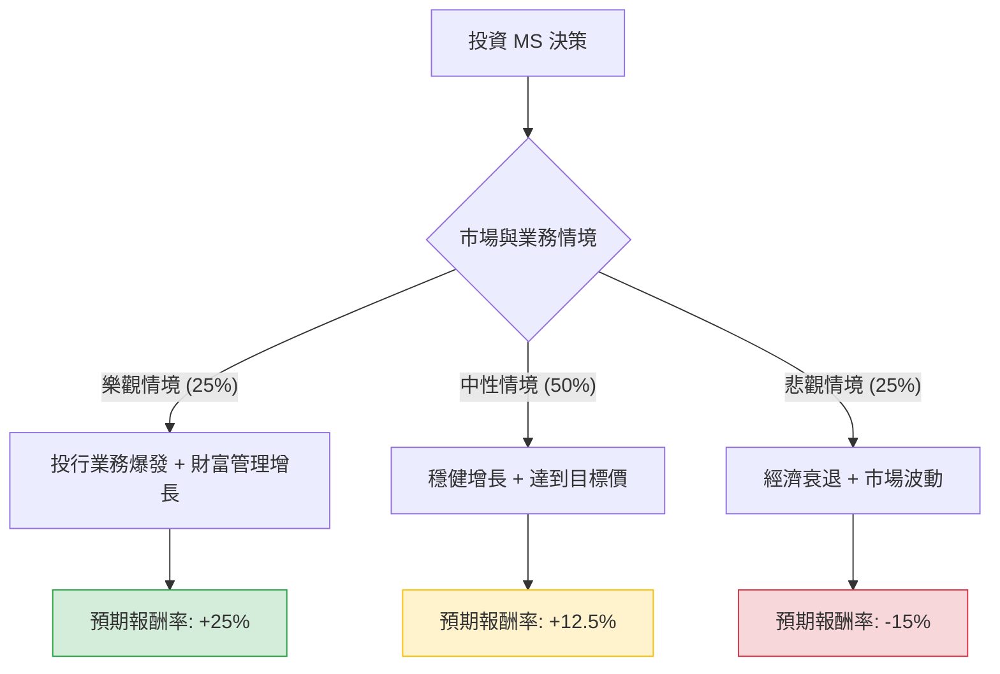

這份分析報告將針對 **Morgan Stanley (MS)** 摩根士丹利進行評估。我們結合了您提供的基本面數據，以及最新的市場動態（如：投資銀行業務復甦、財富管理資產規模、聯準會利率政策影響等），透過**決策樹分析**與**期望值分析**來判斷其投資價值。

---

### 一、 核心假設與市場背景分析

在建立模型前，我們先設定以下核心假設：

1.  **投資銀行業務復甦（Bull/Base Case）**：隨著 2024 年底至 2025 年市場環境趨穩，IPO 與 M&A（併購）活動預計將顯著回升，這對 MS 的機構證券部門是重大利多。
2.  **財富管理穩定性（Base Case）**：MS 目前管理資產規模（AUA）持續增長，目標是達到 10 兆美元。這提供了穩定的手續費收入，降低了市場波動風險。
3.  **利率環境（Macro Risk）**：聯準會（Fed）若降息，雖可能縮減淨利息收益（NIM），但會刺激資本市場活躍度，對 MS 而言利大於弊。
4.  **估值參考**：目前 P/E 17.19 倍，略高於歷史平均，但 Forward P/E 14.25 倍顯示市場預期明年盈利將增長。

---

### 二、 決策樹分析圖 (Decision Tree)

我們將未來一年的表現分為三種情境：**樂觀（Bull）**、**中性（Base）**、**悲觀（Bear）**。

---

### 三、 期望值分析與計算過程

#### 1. 情境參數設定
*   **現價 (Current Price)**: $175.41
*   **分析師目標價 (Target Price)**: $197.39 (隱含漲幅約 **+12.5%**)
*   **股息收益率 (Dividend Yield)**: **2.24%** (計算總報酬時需計入)

#### 2. 各情境報酬率預估
*   **樂觀情境 (Bull Case) - 25% 機率**：
    *   假設：資本市場全面復甦，EPS 超出預期，P/E 擴張至 20 倍。
    *   預估股價：$219 (漲幅 +25%)
    *   總報酬 = 25% + 2.24% = **27.24%**
*   **中性情境 (Base Case) - 50% 機率**：
    *   假設：符合分析師預期，財富管理業務穩定，投行業務溫和回升。
    *   預估股價：$197.39 (漲幅 +12.5%)
    *   總報酬 = 12.5% + 2.24% = **14.74%**
*   **悲觀情境 (Bear Case) - 25% 機率**：
    *   假設：美國經濟陷入硬著陸，市場交易量萎縮，壞帳撥備增加。
    *   預估股價：$149 (跌幅 -15%，接近 52 週中位數支撐)
    *   總報酬 = -15% + 2.24% = **-12.76%**

#### 3. 期望值 (Expected Value, EV) 計算
$$EV = (P_{Bull} \times R_{Bull}) + (P_{Base} \times R_{Base}) + (P_{Bear} \times R_{Bear})$$

*   $EV = (0.25 \times 27.24\%) + (0.50 \times 14.74\%) + (0.25 \times -12.76\%)$
*   $EV = 6.81\% + 7.37\% - 3.19\%$
*   **$EV = 10.99\%$**

---

### 四、 綜合評估與數據解讀

1.  **財務健康度**：
    *   **ROE (15.6%)**：表現優異，顯示公司利用股東資本創造利潤的能力強。
    *   **Debt/Eq (4.22)**：雖然負債比看似很高，但對於金融業（銀行）而言，這屬於正常槓桿運作範圍，且其 **Current Ratio (1.4)** 顯示流動性無虞。
    *   **Sales Q/Q (28.3%)**：營收增長強勁，驗證了業務復甦的趨勢。
2.  **技術面與動能**：
    *   **SMA200 (+12.34%)**：股價位於長天期均線之上，長期趨勢偏多。
    *   **短期波動**：SMA20 與 SMA50 略微負值，顯示近期股價處於高檔震盪或小幅回檔，這反而提供了較佳的進場點。
3.  **估值**：
    *   **PEG (1.58)**：略高於 1，顯示目前股價已部分反映增長預期，並非極度便宜，但考慮到其品牌護城河，尚屬合理。

---

### 五、 最終結論

**判斷：適合投資 (Buy / Overweight)**

#### 理由：
1.  **正向期望值**：經過風險權衡後的預期報酬率約為 **10.99%**，優於多數保守型投資工具，且具備 2.24% 的股息墊高安全邊際。
2.  **業務轉型成功**：MS 已成功從純投行轉型為「財富管理」驅動的公司，這使其在市場波動時比高盛（GS）等競爭對手更具韌性。
3.  **資本市場回暖**：數據顯示 Sales Q/Q 大增 28.3%，預示著投行業務的「小陽春」已經開始，Forward P/E 14.25 倍顯示未來一年盈利具備上修空間。
4.  **風險控管**：雖然悲觀情境下有 15% 的下行風險，但考慮到其強大的資產負債表與機構持股穩定性，下行空間相對受限。

**建議操作：**
由於短期均線（SMA20/50）顯示近期有微幅回檔，建議採取**分批進場**策略，在 $170 - $175 區間佈局，長期持有以獲取資本利得與穩定股息。