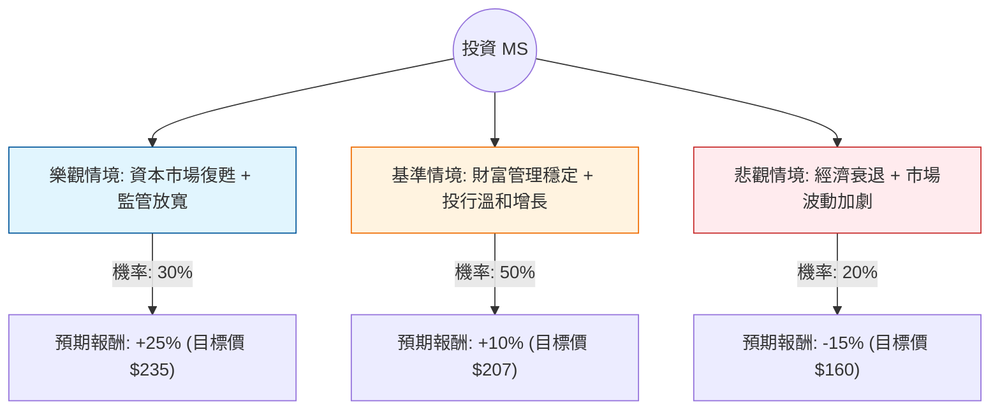

這份報告針對 **摩根士丹利（Morgan Stanley, 股票代碼：MS）** 進行投資評估。我們將結合您提供的基本面數據，以及最新的市場動態（如 2024 年第三季財報、美國大選後的政策預期、聯準會利率路徑）進行分析。

---

### 一、 決策樹分析圖 (Decision Tree)

我們將未來一年的投資表現分為三種主要情境：**樂觀（Bull）**、**基準（Base）**、**悲觀（Bear）**。

---

### 二、 核心假設與計算過程

#### 1. 核心假設 (Core Assumptions)

*   **市場環境 (Market Context)：**
    *   **川普勝選效應：** 市場預期未來四年金融監管將放寬（如巴塞爾協議 III 終局方案可能放寬），有利於銀行釋放資本進行回購或擴張。
    *   **利率環境：** 聯準會進入降息週期。雖然淨利差（NIM）可能受壓，但降息將刺激併購（M&A）與 IPO 活動，這對 MS 的投行部門（Institutional Securities）是重大利多。
*   **財務表現 (Financial Performance)：**
    *   **財富管理 (Wealth Management)：** 這是 MS 的護城河，資產管理規模（AUM）持續增長，提供穩定的手續費收入，抵禦市場波動。
    *   **投行業務：** 2024 Q3 財報顯示投行收入同比增長 56%，顯示交易活動已明顯回溫。
*   **估值參考：**
    *   目前 P/E 約 17x，Forward P/E 14.7x，相較於歷史平均略高，但考慮到 ROE (16.38%) 與 EPS 增長預期 (明年 +7.66%)，估值尚屬合理。

#### 2. 期望值計算 (Expected Value Analysis)

我們以當前股價 **$188.07** 為基準，計算一年後的預期總報酬（含股息）：

| 情境 | 發生機率 | 預期股價 | 資本利得 | 股息收益 (2.09%) | 總報酬率 (Ri) | Pi * Ri |
| :--- | :--- | :--- | :--- | :--- | :--- | :--- |
| **樂觀 (Bull)** | 30% | $235 | +24.9% | +2.09% | +26.99% | 8.10% |
| **基準 (Base)** | 50% | $207 | +10.1% | +2.09% | +12.19% | 6.10% |
| **悲觀 (Bear)** | 20% | $160 | -14.9% | +2.09% | -12.81% | -2.56% |
| **合計** | **100%** | - | - | - | **期望值 (EV)** | **11.64%** |

**計算公式：**
$EV = (0.3 \times 26.99\%) + (0.5 \times 12.19\%) + (0.2 \times -12.81\%) = 11.64\%$

---

### 三、 即時資訊補充 (網路搜尋與市場動態)

1.  **2024 Q3 財報亮眼：** 摩根士丹利最近一季營收與利潤均超預期，主要受惠於股票交易業務的強勁表現以及投行業務的復甦。
2.  **財富管理引擎：** 該部門稅前利潤率維持在 28% 以上，且新資金流入穩定，這讓 MS 在面對市場下行時比高盛（GS）更具韌性。
3.  **政策紅利：** 隨著美國政局變動，市場預期併購審查將變寬鬆，這將直接帶動 MS 的諮詢費收入。
4.  **技術面：** 股價目前高於 SMA20, 50, 200，顯示強勢多頭排列，但 52 週高點附近（$194.59）存在心理壓力。

---

### 四、 最終結論

#### **判斷：適合投資 (Buy / Overweight)**

#### **理由：**
1.  **正向期望值：** 經過風險加權後的預期報酬率為 **11.64%**，優於長期市場平均水準，且具備 2.09% 的股息支撐。
2.  **投行業務復甦：** 隨著降息週期開啟，壓抑已久的 IPO 與併購需求將釋放，MS 作為頂級投行將是主要受益者。
3.  **防禦與成長兼備：** 財富管理業務提供了極高的收入穩定性（ROE 16.38%），而投行業務則提供了向上的彈性。
4.  **估值合理：** Forward P/E 14.71x 顯示市場尚未完全反映明年投行業務爆發的潛力。

**風險提示：**
*   若美國經濟陷入「硬著陸」，市場交易量萎縮，將衝擊其手續費收入。
*   目前股價接近歷史高點，短期內可能因獲利了結出現小幅回檔，建議採**分批進場**策略。

---
*免責聲明：本分析僅供參考，不構成投資建議。投資者應自行承擔風險。*