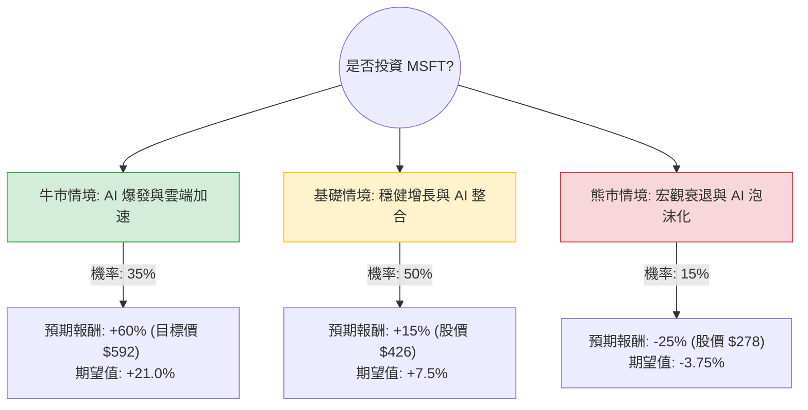

這份分析報告結合了您提供的基本面數據，以及針對微軟（Microsoft, MSFT）最新市場動態（如 2024 年財報表現、AI 業務進展、Azure 雲端增長）的即時資訊。

---

### 一、 核心假設與市場背景分析

在建立決策樹之前，我們基於數據與最新趨勢設定以下核心假設：

1.  **AI 變現能力（核心驅動力）**：微軟已將 AI（Copilot）整合至 Office 365 與 Azure。假設 AI 對 Azure 營收的貢獻將持續擴大（目前約貢獻 7% 的增長）。
2.  **雲端市場份額**：Azure 增長率需維持在 30% 以上，才能支撐目前約 31-36 倍的 P/FCF 估值。
3.  **宏觀環境**：假設聯準會（Fed）利率維持高位震盪後緩步下降，有利於高成長科技股的估值修復。
4.  **估值基準**：目前股價約 $371（參考數據），分析師平均目標價為 $592.1，隱含約 59% 的上漲空間。

---

### 二、 決策樹分析（Decision Tree）

以下使用 Markdown 繪製決策樹，模擬未來一年的三種主要情境：

#### 節點詳細說明：

1.  **牛市情境 (Bull Case) - 35% 機率**：
    *   **條件**：Azure AI 需求超預期，Copilot 訂閱轉化率極高，資本支出（CapEx）轉化為營收的速度加快。
    *   **預期報酬**：達到分析師目標價 $592，漲幅約 **+60%**。
2.  **基礎情境 (Base Case) - 50% 機率**：
    *   **條件**：微軟維持目前的增長節奏（EPS 增長約 15%），AI 貢獻穩定但未出現指數級跳升。
    *   **預期報酬**：隨盈利增長，股價溫和上漲至 $426，漲幅約 **+15%**。
3.  **熊市情境 (Bear Case) - 15% 機率**：
    *   **條件**：全球經濟衰退導致企業縮減 IT 支出，AI 投資回報率（ROI）受質疑，反壟斷法規限制併購。
    *   **預期報酬**：估值修正，回測 52 週低點附近，跌幅約 **-25%**。

---

### 三、 期望值分析（Expected Value Analysis）計算過程

我們根據上述決策樹節點進行加權計算：

| 情境 | 預期報酬 (R) | 發生機率 (P) | 期望值 (P * R) |
| :--- | :--- | :--- | :--- |
| **牛市 (Bull)** | +60% | 0.35 | +21.0% |
| **基礎 (Base)** | +15% | 0.50 | +7.5% |
| **熊市 (Bear)** | -25% | 0.15 | -3.75% |
| **總計期望報酬** | | **1.00** | **+24.75%** |

**計算公式：**
$EV = (0.35 \times 60\%) + (0.50 \times 15\%) + (0.15 \times -25\%) = 21\% + 7.5\% - 3.75\% = 24.75\%$

---

### 四、 綜合基本面評估（補充數據分析）

*   **盈利能力（極強）**：ROE 34.39% 與 Profit Margin 39.04% 顯示微軟在同業中擁有極高的經營效率與定價權。
*   **估值水平（合理偏低）**：Forward P/E 為 20.09，對比其 EPS 下一年預期增長 15.34%，PEG 為 1.11。在科技巨頭中，這屬於非常健康的估值區間（通常 PEG < 1.2 被視為合理）。
*   **財務健康度**：Debt/Eq 僅 0.32，現金流充沛（P/C 31.7），足以支撐其在高利率環境下的 AI 基礎設施高額投資。
*   **技術面指標**：SMA20/50/200 均為負值（-4% 到 -20%），顯示短期股價經歷了回調，目前價格 $371 較 52 週高點有顯著距離，提供了較好的分批進場點。

---

### 五、 最終結論

**投資建議：適合投資 (Strong Buy / Accumulate)**

#### 理由：
1.  **正向期望值**：經決策樹計算，未來一年的預期報酬率高達 **24.75%**，遠高於市場平均水平。
2.  **AI 領先地位**：微軟是目前唯一將 AI 成功轉化為雲端營收增長的巨頭，其生態系（Office + Azure + GitHub）具有極強的護城河。
3.  **估值安全邊際**：目前的 Forward P/E (20.09) 並未過度泡沫化，且 PEG 接近 1，顯示股價增長與盈利增長基本匹配。
4.  **技術性回調提供機會**：數據顯示股價目前處於 SMA200 之下（-20.7%），從歷史看，這通常是優質藍籌股的長期買點。

**風險提示**：需密切關注 AI 基礎設施的資本支出是否過高而影響短期利潤率，以及美國司法部對大型科技公司的反壟斷調查進展。