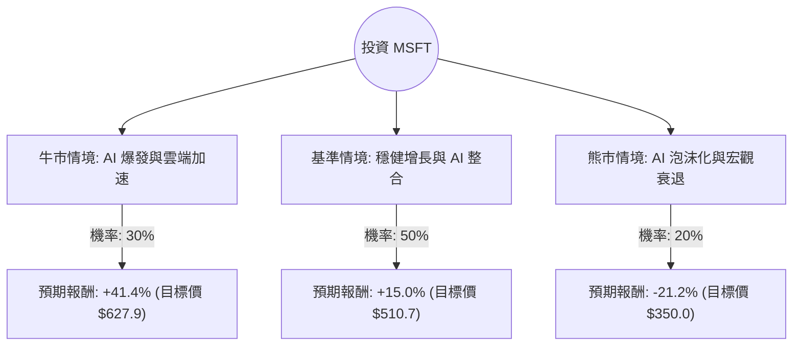

這份分析報告結合了您提供的基本面數據，以及最新的市場動態（包含 2024 年 Q3/Q4 財報表現、AI 資本支出趨勢及宏觀環境），利用**決策樹（Decision Tree）**與**期望值（Expected Value）**進行評估。

---

### 一、 核心假設與市場現況分析

在建立決策樹之前，我們先釐清影響 MSFT 股價的三大核心變數：

1.  **AI 與 Azure 增長動能**：微軟目前是 AI 領域的領頭羊，Azure 的增長中有相當比例來自 AI 貢獻（約 12%）。市場關注其 AI 投資何時能轉化為更高的利潤率。
2.  **資本支出（CapEx）壓力**：微軟為了擴張 AI 基礎設施，資本支出大幅增加。若營收增長無法跟上支出速度，短期利潤將受壓。
3.  **宏觀環境與估值**：目前 Forward P/E 為 23.6，相較於歷史高點已有所回落，且低於當前 P/E (31.57)，顯示市場預期未來盈利將增長。

---

### 二、 決策樹分析 (Decision Tree)

以下決策樹模擬了未來 12 個月內 MSFT 可能面臨的三種主要情境：

#### 節點詳細說明：

1.  **牛市情境 (Bull Case) - 30% 機率**：
    *   **描述**：Azure AI 需求超預期，Copilot 企業滲透率快速提升，且供應鏈限制解除。
    *   **預期報酬**：參考分析師平均目標價 **$627.93**。
    *   **計算**：($627.93 - $444.11) / $444.11 = **+41.39%**

2.  **基準情境 (Base Case) - 50% 機率**：
    *   **描述**：微軟維持雙位數增長，AI 貢獻穩定但受限於高額資本支出，估值維持在 Forward P/E 28-30 倍。
    *   **預期報酬**：預估股價約為 **$510.7**。
    *   **計算**：($510.7 - $444.11) / $444.11 = **+15.0%**

3.  **熊市情境 (Bear Case) - 20% 機率**：
    *   **描述**：AI 投資回報率（ROI）低於預期導致估值修正，或美國經濟陷入衰退。
    *   **預期報酬**：回測至 52 週低點附近約 **$350.0**。
    *   **計算**：($350.0 - $444.11) / $444.11 = **-21.19%**

---

### 三、 期望值分析 (Expected Value Analysis)

#### 1. 計算過程
期望值 (EV) = Σ (情境機率 × 情境報酬率)

*   **EV** = (0.30 × 41.39%) + (0.50 × 15.00%) + (0.20 × -21.19%)
*   **EV** = 12.417% + 7.50% - 4.238%
*   **EV = 15.679%**

#### 2. 核心數據支持
*   **盈利能力**：ROE 32.24% 與 Profit Margin 35.71% 顯示極強的護城河。
*   **估值合理性**：PEG 為 1.32，對於一家年增長預期超過 15% 的科技巨頭來說，並未過度泡沫化。
*   **技術面修正**：近期 Perf Month (-8.31%) 與 SMA200 (-8.12%) 顯示股價已從高點回落，提供了較好的分批進場點。

---

### 四、 最終結論

**判斷：適合投資 (Buy / Overweight)**

#### 理由：
1.  **正向期望值**：計算出的年度預期報酬率約為 **15.68%**，遠高於無風險利率（美債收益率）及標普 500 的歷史平均回報。
2.  **AI 領先地位明確**：儘管短期資本支出高昂，但微軟在軟體（Copilot）與基礎設施（Azure）的雙重佈局使其在 AI 變現能力上優於同業。
3.  **財務結構極其穩健**：Debt/Eq 僅 0.33，且擁有強大的自由現金流（P/FCF 42.28 雖高，但考慮到其增長性仍屬可接受範圍），足以支撐其在經濟波動中的生存能力。
4.  **近期回調提供機會**：目前股價低於 SMA20、SMA50 與 SMA200，且距離分析師目標價有顯著空間，技術面上屬於「超跌後的價值區間」。

**投資建議：**
建議採取**分批進場**策略。雖然期望值為正，但短期內市場對 AI 資本支出的擔憂可能導致股價持續震盪。若股價進一步回落至 $420-$430 區間，將具備更高的安全邊際。