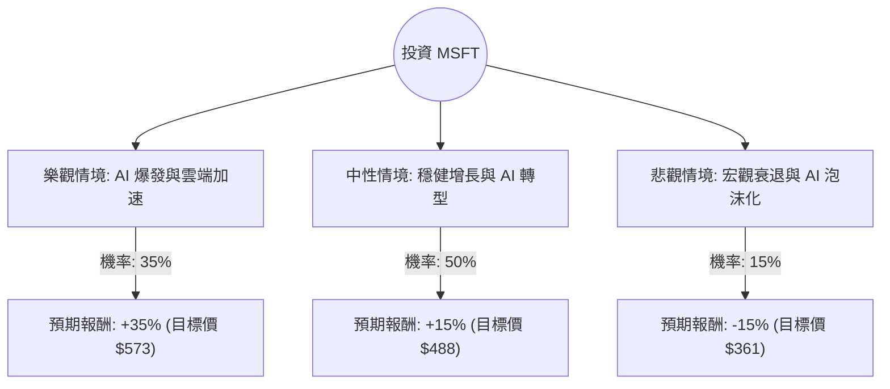

這份分析報告將結合您提供的基本面數據與最新的市場動態（包含 2024 年 Q1/Q2 財報表現、AI 資本支出趨勢及雲端市場競爭），利用**決策樹（Decision Tree）**與**期望值分析（Expected Value Analysis）**評估微軟（MSFT）的投資價值。

---

### 一、 核心假設與市場動態分析

在建立決策樹之前，我們基於數據與最新資訊設定以下核心假設：

1.  **AI 與雲端增長（核心動能）：** Azure 雲端營收增長維持在 30% 以上，且 AI 貢獻度持續增加。
2.  **資本支出（風險因素）：** 微軟為了 AI 基礎設施投入巨大（CapEx），短期內可能壓低自由現金流（FCF），市場關注其投資回報率（ROI）。
3.  **估值水平：** 目前 P/E 約 26.57，Forward P/E 為 22.42，相較於歷史高點並不昂貴，且 PEG 1.24 顯示增長與估值相對匹配。
4.  **宏觀環境：** 聯準會降息預期有利於高成長科技股。

---

### 二、 決策樹分析圖 (Decision Tree)

我們將未來一年的表現分為三種情境：**樂觀（Bull）**、**中性（Base）**、**悲觀（Bear）**。

#### 節點詳細說明：

1.  **樂觀情境 (Bull Case) - 35% 機率：**
    *   **條件：** Azure 增長超預期（>33%），Copilot 企業滲透率大幅提升，AI 資本支出轉化為實際利潤的速度加快。
    *   **預期報酬：** 參考分析師目標價 $573.51，約 **+35%**。

2.  **中性情境 (Base Case) - 50% 機率：**
    *   **條件：** 業績符合預期，Azure 增長穩定在 28-30%，PC 市場緩步復甦。AI 投入持續但未見爆發性利潤。
    *   **預期報酬：** 根據 EPS next Y (14.64%) 加上股息，預估約 **+15%**。

3.  **悲觀情境 (Bear Case) - 15% 機率：**
    *   **條件：** 全球經濟衰退導致企業縮減 IT 支出，AI 投資回報不及預期導致估值下修（P/E 回落至 20 以下）。
    *   **預期報酬：** 參考 52W Low 與技術支撐位，預估約 **-15%**。

---

### 三、 期望值計算過程 (Expected Value Calculation)

我們計算未來一年持有 MSFT 的預期總報酬率（Expected Return）：

*   **計算公式：**
    $EV = (P_{Bull} \times R_{Bull}) + (P_{Base} \times R_{Base}) + (P_{Bear} \times R_{Bear})$

*   **數值帶入：**
    1.  樂觀：$0.35 \times 35\% = 12.25\%$
    2.  中性：$0.50 \times 15\% = 7.5\%$
    3.  悲觀：$0.15 \times (-15\%) = -2.25\%$

*   **總期望報酬率：**
    $12.25\% + 7.5\% - 2.25\% = \mathbf{17.5\%}$

*   **期望價格 (Expected Price)：**
    $424.62 \times (1 + 17.5\%) = \mathbf{\$498.93}$

---

### 四、 綜合基本面評估

1.  **盈利能力（極強）：** ROE 34.39% 與 Profit Margin 39.04% 顯示微軟擁有極高的護城河與定價權。
2.  **財務健康（穩健）：** Debt/Eq 僅 0.32，Quick Ratio 1.38，顯示其應對高利率環境與大規模投資的財務彈性極大。
3.  **技術面（反彈趨勢）：** SMA20 (8.33%) 與 SMA50 (7.76%) 均為正值，顯示短期股價已走出低迷，正處於上升通道。
4.  **估值（合理）：** PEG 1.24 對於一家年增長 15% 以上的巨頭來說，屬於合理偏低區間。

---

### 五、 最終結論

**判斷：適合投資 (Buy / Overweight)**

#### 理由：
1.  **正向期望值：** 經過決策樹分析，MSFT 的年度期望報酬率高達 **17.5%**，遠高於無風險利率與標普 500 的歷史平均回報。
2.  **AI 領先地位：** 微軟是目前少數能將 AI 技術轉化為雲端營收（Azure AI）與軟體訂閱（Copilot）實質增長的公司。
3.  **風險可控：** 即使在悲觀情境下（15% 機率），微軟強大的現金流與資產負債表也能提供極強的抗跌性。
4.  **估值吸引力：** 目前股價（$424.62）距離分析師平均目標價（$573.51）仍有顯著的上漲空間，且 Forward P/E 顯示未來一年盈利增長將進一步稀釋估值壓力。

**建議操作：**
目前股價處於 SMA20/50 之上，顯示動能轉強。建議可於目前價位分批布局，若遇到因 AI 資本支出過高導致的短期回調，應視為長期加碼機會。