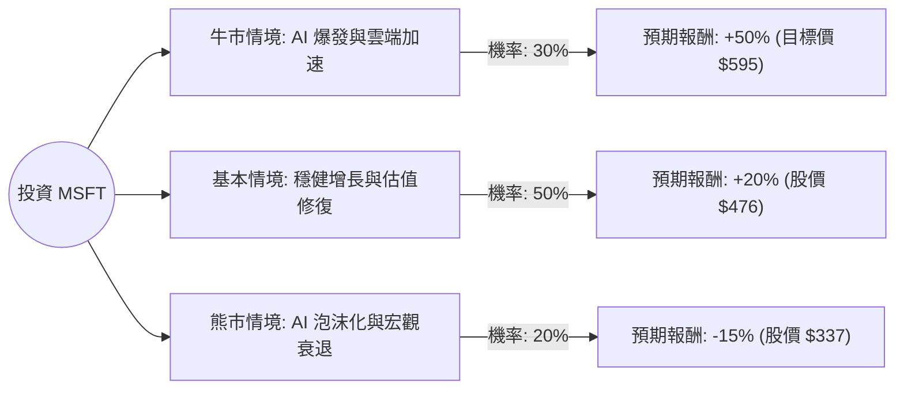

這份分析報告結合了您提供的基本面數據與最新的市場動態（包含 AI 資本支出、Azure 雲端增長及宏觀經濟環境），利用**決策樹（Decision Tree）**與**期望值分析（Expected Value Analysis）**評估微軟（MSFT）的投資價值。

---

### 一、 核心假設與市場背景分析

在構建決策樹前，我們設定以下核心假設：
1.  **AI 變現能力（核心驅動力）：** 市場目前高度關注微軟在 AI Copilot 的營收貢獻以及 Azure AI 服務的增長。
2.  **資本支出（CapEx）壓力：** 微軟為了維持 AI 領先地位，大幅增加基礎設施投入，這短期內會壓低自由現金流（P/FCF 目前為 38.22，偏高）。
3.  **估值修復：** 目前 P/E 為 24.93，遠低於其歷史高點及同業（如 NVIDIA），且 Forward P/E 僅 21.01，顯示市場對其未來獲利有期待。
4.  **技術面：** 股價目前處於 SMA200（-18.19%）之下，顯示短期處於超跌或修正區間。

---

### 二、 決策樹分析 (Decision Tree)

以下為 MSFT 未來一年的投資決策模型：

#### 節點詳細說明：

1.  **牛市情境 (Bull Case) - 30% 機率**
    *   **條件：** Azure AI 營收佔比顯著提升，Copilot 企業採用率突破 40%，聯準會降息帶動科技股估值擴張。
    *   **預期報酬：** 參考分析師目標價 $594.91，較目前 $397 約有 **+50%** 的空間。

2.  **基本情境 (Base Case) - 50% 機率**
    *   **條件：** 營收維持 15-17% 增長（符合 Sales Q/Q 16.72%），AI 投入與產出平衡，股價回歸歷史平均 P/E（約 30-32 倍）。
    *   **預期報酬：** 預估股價回升至 $470-$480 區間，報酬率約 **+20%**。

3.  **熊市情境 (Bear Case) - 20% 機率**
    *   **條件：** AI 投資回報率（ROI）低於預期導致利潤率萎縮，美國經濟陷入硬著陸，反壟斷法規限制擴張。
    *   **預期報酬：** 股價回測 52 週低點（$344）甚至更低，預估報酬率 **-15%**。

---

### 三、 期望值計算 (Expected Value Calculation)

我們將各情境的機率與預期報酬相乘，得出整體期望值：

| 情境 | 機率 (P) | 預期報酬 (R) | 期望值 (P * R) |
| :--- | :--- | :--- | :--- |
| **牛市情境** | 0.30 | +50% | +15.0% |
| **基本情境** | 0.50 | +20% | +10.0% |
| **熊市情境** | 0.20 | -15% | -3.0% |
| **總計期望報酬** | **1.00** | | **+22.0%** |

**計算公式：**
$EV = (0.30 \times 0.50) + (0.50 \times 0.20) + (0.20 \times -0.15) = 0.15 + 0.10 - 0.03 = 0.22$

---

### 四、 綜合評估與數據解讀

1.  **獲利能力極強：** ROE (34.39%) 與 Operating Margin (46.67%) 顯示微軟擁有極高的護城河與定價權。
2.  **估值具吸引力：** PEG 為 1.16，對於一家年增長 15% 以上的巨頭來說，目前的價格並未被過度高估。
3.  **短期技術面壓力：** 股價近期表現（Perf Month -12.33%, Perf Quarter -21.48%）顯示市場正在消化之前的漲幅或對 AI 支出感到擔憂。然而，這也為長期投資者創造了較低的成本位。
4.  **財務健康：** Debt/Eq 僅 0.32，現金流充沛，足以支撐高額的 AI 研發投入。

---

### 五、 最終結論

**判斷：適合投資 (Strong Buy on Dips)**

#### 理由：
1.  **正向期望值：** 經過決策樹分析，MSFT 的年度預期報酬率高達 **22%**，遠高於市場平均水平。
2.  **風險回報比優異：** 即使在最差的熊市情境下（-15%），其下行風險也遠小於牛市情境下的潛在收益（+50%）。
3.  **基本面支撐：** 微軟不僅是 AI 概念股，更是擁有穩定現金流的軟體巨頭。目前的股價修正（低於 SMA200）提供了良好的安全邊際。
4.  **目標價空間：** 目前股價 $397 距離分析師平均目標價 $594 有極大的落後補漲空間。

**建議策略：**
由於目前技術面處於空頭排列（SMA20/50/200 皆為負值），建議採取**分批進場（Dollar Cost Averaging）**策略，在 $380 - $400 區間建立基礎部位，以應對短期可能的市場波動。