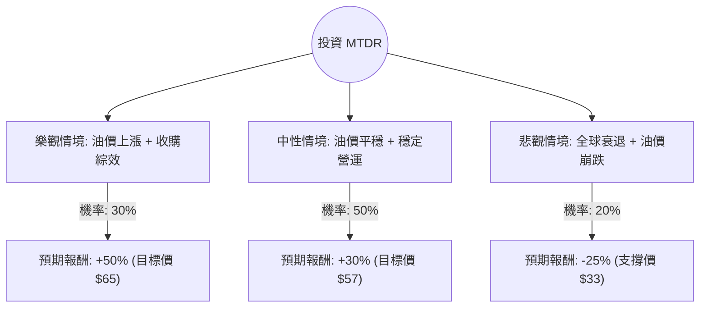

這份分析報告將結合您提供的基本面數據與最新的市場動態（包含 2024 年第三季財報表現、Ameredev 收購案進度及能源市場趨勢），利用**決策樹（Decision Tree）**與**期望值（Expected Value）**進行評估。

---

### 一、 最新市場動態與核心假設

在進行決策樹分析前，我們先整合最新的外部資訊：

1.  **收購與產能擴張**：MTDR 於 2024 年第三季完成了對 Ameredev II 的收購，這顯著增加了其在德拉瓦盆地（Delaware Basin）的庫存與產量。公司已上調 2024 全年產量指引。
2.  **財務表現**：最新財報顯示其自由現金流（FCF）表現強勁，且公司持續增加股息（目前殖利率約 3%）。雖然 EPS 成長率在數據中顯示為負，但這主要受油價波動與收購成本影響，營運利潤率（35.3%）依然優於同業。
3.  **宏觀環境**：WTI 原油價格目前在 70-75 美元區間震盪。地緣政治風險（中東）提供支撐，但全球經濟放緩擔憂限制了漲幅。
4.  **估值分析**：目前 P/E 僅 6.98，P/B 0.98（低於帳面價值），且分析師平均目標價為 $59.14，隱含約 **35%** 的上漲空間。

---

### 二、 決策樹分析 (Decision Tree)

我們將未來一年的投資情境分為三種：**樂觀（Bull）**、**中性（Base）**、**悲觀（Bear）**。

#### 決策樹節點詳細說明：

| 節點 (情境) | 機率 (P) | 預期報酬 (R) | 說明 |
| :--- | :--- | :--- | :--- |
| **樂觀 (Bull)** | 30% | +50% | 油價回升至 $85+，Ameredev 收購案產生的協同效應超乎預期，債務快速下降。 |
| **中性 (Base)** | 50% | +30% | 油價維持在 $70-$75，公司按計畫達成產量目標，估值回歸至 P/E 9-10 倍。 |
| **悲觀 (Bear)** | 20% | -25% | 全球經濟衰退導致油價跌破 $60，高槓桿（收購產生）導致財務壓力增加。 |

---

### 三、 期望值計算過程 (Expected Value Calculation)

期望值（EV）的計算公式為：
$$EV = \sum (機率 \times 預期報酬)$$

**計算步驟：**

1.  **樂觀情境貢獻**：$0.30 \times 50\% = 15\%$
2.  **中性情境貢獻**：$0.50 \times 30\% = 15\%$
3.  **悲觀情境貢獻**：$0.20 \times (-25\%) = -5\%$

**總期望報酬率：**
$$15\% + 15\% - 5\% = 25\%$$

#### 核心假設：
*   **市場假設**：假設 WTI 原油價格不會長期低於 $60/桶（MTDR 的盈虧平衡點約在 $40 左右，具備抗壓性）。
*   **財務假設**：P/B 0.98 顯示目前股價已被低估，下行風險受資產價值支撐。
*   **產業趨勢**：頁岩油產業進入整合期，MTDR 作為中型龍頭，具備被大型油企收購的潛力（溢價空間）。

---

### 四、 最終結論

#### **評估結果：適合投資 (Buy / Overweight)**

#### **理由：**
1.  **期望值極具吸引力**：計算出的預期報酬率為 **25%**，遠高於市場平均水準，且勝率（樂觀+中性）高達 80%。
2.  **估值安全邊際高**：P/B 0.98 意味著你正以低於公司淨資產的價格買入。P/E 6.98 在能源板塊中亦屬於偏低水準。
3.  **強勁的現金流與股息**：3% 的殖利率加上強勁的自由現金流，提供了下行保護。
4.  **技術面支撐**：股價目前接近 52 週低點（$35.19）與現價（$43.76）之間，且 SMA20/SMA50 已開始轉正，顯示短期動能正在築底回升。
5.  **分析師共識**：Recom 1.28（強烈建議買進）與目標價 $59.14 與我們的中性情境預測吻合。

**風險提示：**
需密切關注 **Debt/Eq (0.58)** 的變化。雖然目前尚屬健康，但若油價長期低迷，收購 Ameredev 帶來的債務壓力將是主要風險來源。建議分批進場，並將停損點設在 52 週低點 $35 附近。